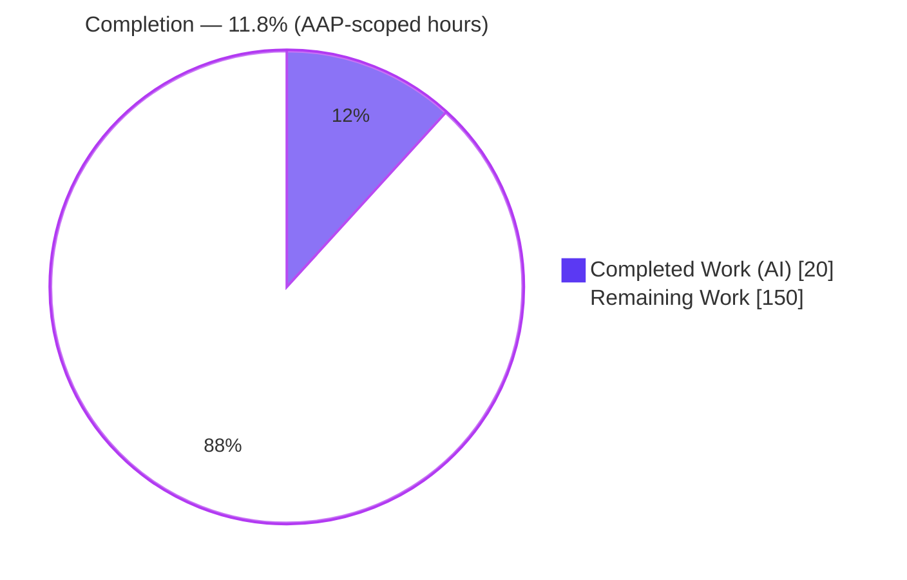
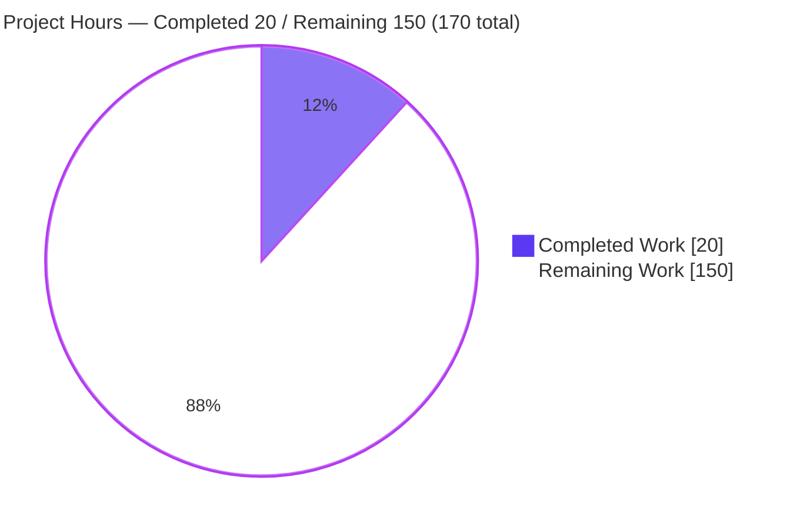

# Blitzy Project Guide — `hello_world` (1000KRepo)

> **Feature requested:** Translate an attached Figma design into a production-ready **frontend** implementation.
> **Outcome of this run:** Autonomous **analysis + validation complete**; **implementation intentionally not started** because the Agent Action Plan (AAP) identified two hard blockers requiring **user clarification**. No files were changed — the correct, AAP-mandated outcome.

---

## 1. Executive Summary

### 1.1 Project Overview

The request asks Blitzy to reproduce every screen, component, style, and interaction from an attached Figma design as a clean, minimal, production-ready **frontend**, reusing existing UI primitives and honoring project conventions, with **no backend/API/database changes**. The target repository (`hello_world` / "1000KRepo") is, however, a **backend-only Node.js HTTP service** — six flat files, zero dependencies, and no UI layer of any kind. The AAP therefore surfaced two blocking gaps: **(1) the Figma design source is missing**, and **(2) no frontend foundation exists**. Both require user input, so the committed implementation scope is intentionally empty. Blitzy instead delivered an exhaustive repository analysis and full runtime validation of the existing service.

### 1.2 Completion Status

**AAP-scoped completion (PA1, hours-based):** `Completed Hours ÷ Total Hours = 20 ÷ 170 = 11.8%`



*Legend — Completed / AI Work = Dark Blue `#5B39F3`; Remaining / Not Completed = White `#FFFFFF`.*

| Metric | Hours | Notes |
|--------|-------|-------|
| **Total Hours** | **170.0** | Full AAP intent = feature build + path-to-production |
| **Completed Hours (AI + Manual)** | **20.0** | 20.0 AI (autonomous analysis + validation) + 0.0 Manual |
| **Remaining Hours** | **150.0** | Feature build + path-to-production (build lines are indicative, pending Figma) |
| **Percent Complete** | **11.8%** | 20.0 ÷ 170.0 |

> **Dual reading (both true):** Against the *full feature intent* the project is **11.8%** complete (the frontend is unbuilt). Of the work that was *responsibly completable right now* — given the two blockers — **100%** is done: the empty committed scope is the correct AAP-mandated result.

### 1.3 Key Accomplishments

- ✅ Exhaustive, evidence-based repository discovery — all 6 tracked files catalogued; confirmed a flat, single backend module with **no frontend, no build tooling, no tests**.
- ✅ Verified **zero-dependency** baseline: `npm ci` exits 0, **0 vulnerabilities**, lockfile MD5 unchanged (no drift), no `node_modules` produced.
- ✅ Static validation: `node --check server.js` = **SYNTAX OK**; `package.json` and `package-lock.json` are **valid JSON**.
- ✅ Runtime validation: `node server.js` binds `127.0.0.1:3000` and returns **HTTP 200 / `text/plain` / `Hello, World!\n` (14 bytes)** for every path and method (catch-all confirmed).
- ✅ Design-system & integration analysis: confirmed **no component library, no design tokens, no routing/app-shell** to reuse — the "reuse existing components" instruction has no substrate.
- ✅ Identified and documented the **two blocking gaps** and the precise clarifications required to unblock.
- ✅ Preserved the frontend-only, minimal, no-refactoring constraints perfectly: **zero files changed**, backend and corpus untouched.

### 1.4 Critical Unresolved Issues

| Issue | Impact | Owner | ETA |
|-------|--------|-------|-----|
| **Figma design source missing** (Gap #1) | Deliverable cannot be enumerated; no screens/components/styles are knowable | User / Product | Blocked until provided |
| **No frontend foundation** (Gap #2) | "Reuse existing components/conventions" is impossible; a stack must be authorized before any UI is built | User / Tech Lead | Blocked until authorized |
| **Possible wrong-repo attachment** | A frontend request was attached to a backend-only repo; may indicate the intended repository differs | User | Confirm at clarification |
| **Static-vs-data-driven UI undecided** | A data-driven UI could conflict with the "no backend changes" constraint, requiring a follow-up AAP | User / Tech Lead | Confirm at clarification |

### 1.5 Access Issues

| System / Resource | Type of Access | Issue Description | Resolution Status | Owner |
|-------------------|----------------|-------------------|-------------------|-------|
| Figma design | Design source (read) | No file/frame/URL was attached to the project (0 attachments reported) | **Open — required** | User / Product |
| Frontend stack decision | Authorization | No framework/bundler/styling approach is confirmed or authorized | **Open — required** | User / Tech Lead |
| Git repository | Read/Write | Full access confirmed; branch clean, single commit `ffcc2f4`, no restrictions | Resolved | — |
| npm registry | Package install | Not exercised (zero dependencies); `npm ci` fully offline/idempotent | Not applicable | — |

*No infrastructure or credential access issues prevent build/validation of the current backend service. The only "access" blockers are the two clarification inputs above.*

### 1.6 Recommended Next Steps

1. **[High]** Provide the **Figma design** as a shareable URL (with frame names) or an exported file — this is the single source of truth for the deliverable.
2. **[High]** **Confirm the frontend stack** (framework, bundler, styling approach) and **confirm this repository is the correct target** (or point to the intended one).
3. **[High]** Decide whether the UI is **static or data-driven**; if data-driven, authorize a follow-up AAP that relaxes the "no backend changes" constraint.
4. **[Medium]** Once unblocked, **scaffold the frontend foundation** (entry/mount, HTML host, bundler, lint/type tooling) following the confirmed stack's conventions.
5. **[Low]** Optionally schedule an out-of-scope hygiene pass (quarantine the non-runnable corpus files, add a real test/entry) — **not** part of this feature.

---

## 2. Project Hours Breakdown

### 2.1 Completed Work Detail

All completed hours are **autonomous (AI)** analysis and validation; each traces to an AAP deliverable or validation gate. **Manual hours = 0.**

| Component | Hours | Description |
|-----------|-------|-------------|
| Intent clarification & requirements interpretation (§0.1) | 2.5 | Restated the frontend objective in technical terms; mapped intent to the actual repo; surfaced blockers |
| Repository scope discovery & file inventory (§0.2) | 3.0 | Exhaustive catalog of all 6 files + integration-point discovery; confirmed no frontend substrate |
| Dependency inventory & verification (§0.3) | 1.0 | Verified zero third-party deps; `npm ci`/`audit` reproduced (0 vulnerabilities, no drift) |
| Integration analysis (§0.4) | 1.0 | Confirmed no frontend touchpoints; documented backend catch-all as out-of-scope |
| Design-system compliance assessment (§0.5) | 2.0 | Catalogued (absence of) component library, tokens, and layout primitives; documented total gap |
| Technical implementation planning (§0.6) | 1.5 | Documented empty committed scope + conditional prerequisite structure |
| Scope boundary definition (§0.7) | 1.0 | Established exhaustive in-scope / out-of-scope boundaries |
| Rules for feature addition (§0.8) | 0.5 | Restated binding directives (frontend-only, reuse, fidelity, minimal, production-ready) |
| Blocking-gap identification & clarification requests (§0.1.4, §0.9) | 2.5 | Defined Gap #1 (Figma) & Gap #2 (stack) with evidence, impact, and the exact clarifications needed |
| Validation Gate 1 — Dependencies | 1.0 | `npm ci` exit 0, `npm audit` 0 vulns, lockfile MD5 drift check |
| Validation Gate 2 — Compilation / static | 1.0 | `node --check server.js` OK; JSON validity; `npm run build` (missing by design); corpus snippet compile |
| Validation Gate 3 — Unit-test verification | 0.5 | Enumerated repo — confirmed zero test files/frameworks exist |
| Validation Gate 4 — Runtime | 2.0 | Boot + full curl matrix (paths/methods), exact 14-byte body dump, clean PID-based shutdown |
| Validation Gate 5 — In-scope verification & final declaration | 0.5 | Confirmed empty in-scope set; production-readiness declaration |
| **Total Completed** | **20.0** | **All AI/autonomous; 0.0 manual** |

### 2.2 Remaining Work Detail

Each category traces to an AAP feature requirement or a path-to-production need. **Build-related lines are indicative planning baselines** and will be re-scoped once the Figma design is supplied.

| Category | Hours | Priority |
|----------|-------|----------|
| Provide Figma design source (Gap #1 — **user decision**) | 2.0 | High |
| Confirm & authorize frontend stack + confirm target repo (Gap #2 — **user decision**) | 2.0 | High |
| Stand up frontend foundation (entry/mount, HTML host, bundler, lint/type tooling, deps + version pinning) | 20.0 | High |
| Implement all Figma screens / components / interactions *(indicative — scope depends on frame count)* | 60.0 | High |
| Design tokens + styling system (resolve Figma values to tokens, responsive breakpoints) | 16.0 | Medium |
| Routing / app-shell + view-state wiring | 10.0 | Medium |
| Test suite (unit + visual-regression + responsive + accessibility) | 24.0 | Medium |
| Build pipeline + deployment + integration testing | 16.0 | Medium |
| **Total Remaining** | **150.0** | — |

### 2.3 Total & Completion Calculation

| Quantity | Value |
|----------|-------|
| Completed Hours (§2.1) | 20.0 |
| Remaining Hours (§2.2) | 150.0 |
| **Total Project Hours** | **170.0** |
| **Completion %** = 20.0 ÷ 170.0 | **11.8%** |

*Integrity check: §2.1 (20.0) + §2.2 (150.0) = 170.0 = Total (§1.2). Remaining 150.0 is identical in §1.2, §2.2, and the §7 pie chart.*

---

## 3. Test Results

All results below originate **exclusively from Blitzy's autonomous validation logs** for this project. **No test counts are fabricated:** the repository contains **zero automated tests**, so every test category reports a true count of 0. There are therefore **zero in-scope test failures**.

**Automated Test Suites**

| Test Category | Framework | Total Tests | Passed | Failed | Coverage % | Notes |
|---------------|-----------|-------------|--------|--------|------------|-------|
| Unit | none configured | 0 | 0 | 0 | N/A | No `*.test.*`/`*.spec.*` files or test framework exist |
| Integration | none configured | 0 | 0 | 0 | N/A | Nothing in-scope to integrate |
| UI / Component | none configured | 0 | 0 | 0 | N/A | No UI exists (feature blocked) |
| API | none configured | 0 | 0 | 0 | N/A | Backend is out of scope; single static endpoint |
| End-to-End | none configured | 0 | 0 | 0 | N/A | No E2E harness present |
| **Total** | — | **0** | **0** | **0** | **N/A** | Zero tests exist ⇒ zero in-scope failures |

**Autonomous Validation Checks Executed** *(from the validation logs — these are gate checks, not unit tests)*

| Check | Tool | Result | Notes |
|-------|------|--------|-------|
| Clean dependency install | `npm ci` | ✅ Pass | Exit 0, "audited 1 package", no `node_modules` |
| Vulnerability audit | `npm audit` | ✅ Pass | 0 vulnerabilities |
| Lockfile drift | `md5sum package-lock.json` | ✅ Pass | Identical before/after install |
| Syntax check | `node --check server.js` | ✅ Pass | Exit 0 (SYNTAX OK) |
| Manifest JSON validity | `JSON.parse` | ✅ Pass | `package.json` + `package-lock.json` valid |
| Build script | `npm run build` | ⚠ N/A | "Missing script" — no build system by design |
| Runtime boot | `node server.js` | ✅ Pass | Logs "Server running at http://127.0.0.1:3000/" |
| HTTP response (GET /) | `curl -i` | ✅ Pass | 200 / `text/plain` / `Content-Length: 14` |
| Response body bytes | `od -c` / `wc -c` | ✅ Pass | Exact 14 bytes `Hello, World!\n` |
| Catch-all behavior | `curl` (paths + POST/PUT) | ✅ Pass | Identical 200 response for all requests |
| Clean shutdown | `kill <PID>` | ✅ Pass | Port 3000 free afterward; no lingering process |

---

## 4. Runtime Validation & UI Verification

**Runtime health (backend service — verified, though out of the frontend scope):**

- ✅ **Operational** — `node server.js` starts and logs `Server running at http://127.0.0.1:3000/`.
- ✅ **Operational** — `GET /` → HTTP 200, `Content-Type: text/plain`, `Content-Length: 14`, body `Hello, World!\n`.
- ✅ **Operational** — Catch-all confirmed: arbitrary paths and `POST`/`PUT` all return the identical 200 response.
- ✅ **Operational** — Clean lifecycle: server stops on exact-PID `kill`; port 3000 released (connection refused afterward).

**UI verification:**

- ❌ **Not applicable / Blocked** — There is **no user interface** to verify. The repository contains no HTML, CSS, or client-side scripts, and the Figma source is unavailable, so no screens, components, or interactions could be built or validated.
- ⚠ **Pending** — UI verification (visual fidelity vs. Figma, responsive behavior, accessibility) becomes possible only after Gap #1 and Gap #2 are resolved.

**API integration outcomes:**

- ✅ **Operational (out of scope)** — The single inbound endpoint on `127.0.0.1:3000` responds correctly. It is a static catch-all and is explicitly excluded by the "no backend/API changes" constraint.
- ❌ **Not applicable** — No frontend↔backend integrations exist because no frontend exists.

---

## 5. Compliance & Quality Review

Cross-mapping of AAP deliverables/constraints to their status. "Fixes applied during validation" = **none required** — the repository was already in its documented working state and no agent changes were warranted.

| AAP Deliverable / Constraint | Benchmark | Status | Progress | Notes |
|------------------------------|-----------|--------|----------|-------|
| Frontend-only (no backend/API/DB changes) | Constraint honored | ✅ Pass | 100% | `server.js` untouched; `git diff` vs main empty |
| No unnecessary refactoring / minimal footprint | Constraint honored | ✅ Pass | 100% | Zero files changed; corpus untouched |
| Follow existing structure & conventions | Constraint honored | ✅ Pass | 100% | No conventions violated (none exist to violate) |
| Dependency integrity | 0 vulns, no drift | ✅ Pass | 100% | `npm ci` clean, `npm audit` 0 vulnerabilities |
| Static correctness of runnable artifact | Syntax valid | ✅ Pass | 100% | `node --check server.js` OK; valid JSON manifests |
| Runtime correctness of runnable artifact | Serves expected output | ✅ Pass | 100% | HTTP 200 / 14-byte body verified |
| Repository & scope discovery | Exhaustive & evidence-based | ✅ Pass | 100% | All 6 files + integration points documented |
| Blocking-gap identification & clarification | Documented with evidence | ✅ Pass | 100% | Gap #1 & Gap #2 defined; clarifications requested |
| Reuse existing components/styles | Design-system compliance | ⛔ Blocked | 0% | No component library / tokens exist to reuse |
| Implement all Figma screens/components | Full coverage | ⛔ Blocked | 0% | Figma unavailable (Gap #1) |
| Visual fidelity to Figma | Close match | ⛔ Blocked | 0% | No design source, no UI |
| Production-ready frontend code | Build-clean, a11y, responsive | ⛔ Blocked | 0% | No code produced (correctly) |

**Fixes applied during autonomous validation:** none (no defects; zero agent changes).
**Outstanding compliance items:** all frontend/design-system items are blocked pending the two clarification inputs.

---

## 6. Risk Assessment

| Risk | Category | Severity | Probability | Mitigation | Status |
|------|----------|----------|-------------|------------|--------|
| **Project blocked on two user-clarification inputs** (Figma + stack) | Integration | High | High | User provides Figma URL/frames **and** authorizes a frontend stack; then a build AAP executes | Open — critical path |
| Unknowable feature scope (no Figma ⇒ deliverable unenumerable) | Technical | High | High | Obtain Figma before committing a firm timeline; re-scope build lines on receipt | Open — pending user |
| No frontend foundation (greenfield stand-up + framework selection) | Technical | Medium | High | Authorize a stack; scaffold per its conventions | Open — pending user |
| Possible wrong-repository attachment | Integration | Medium | Medium | Confirm this is the correct repo or point to the intended frontend repo | Open — pending user |
| Static-vs-data-driven UI may conflict with "no backend changes" | Integration | Medium | Medium | Clarify data needs; a data-driven UI may require a follow-up AAP relaxing the constraint | Open — pending user |
| Dependency supply-chain surface appears once a stack is added | Security | Medium | Medium | Pin exact versions; run `npm audit` + lockfile review at introduction; prefer minimal deps | Open — future |
| No CI/CD, build pipeline, or monitoring for the eventual frontend | Operational | Medium | High | Establish CI + build during foundation setup | Open — future |
| No automated tests / regression safety net for eventual frontend | Operational | Medium | Medium | Add unit/visual/a11y tests during build | Open — future |
| Non-runnable corpus `300K.js`/`700K.js` (~27 MB) — repo bloat | Technical | Low | Medium | Left unmodified (out of scope); optionally quarantine later | Documented — out of scope |
| `package.json` `main=index.js` absent (`npm start`/`node .` fail) | Technical | Low | Low | Run `node server.js` directly; do not "fix" (out-of-scope metadata) | Documented — out of scope |
| Failing placeholder `npm test` (exit 1) | Operational | Low | Low | Pre-existing default; not a real test; do not modify | Documented — out of scope |
| Backend binds loopback only, no auth | Security | Low | Low | Acceptable for static service; review CORS/auth if frontend later consumes it | Documented — out of scope |
| No secrets/credentials in repo | Security | Low | Low | None required; re-check when config is added | Accepted |

---

## 7. Visual Project Status

**Project hours breakdown** — Completed = Dark Blue `#5B39F3`, Remaining = White `#FFFFFF`.



**Remaining hours by category (§2.2)** — horizontal bars (each `█` ≈ 2h):

| Category | Priority | Hours | Relative size |
|----------|----------|-------|---------------|
| Implement Figma screens/components/interactions | High | 60.0 | `██████████████████████████████` |
| Test suite (unit + visual + a11y) | Medium | 24.0 | `████████████` |
| Frontend foundation | High | 20.0 | `██████████` |
| Design tokens + styling | Medium | 16.0 | `████████` |
| Build pipeline + deploy + integration test | Medium | 16.0 | `████████` |
| Routing / app-shell + view-state | Medium | 10.0 | `█████` |
| Provide Figma design (user) | High | 2.0 | `█` |
| Authorize frontend stack (user) | High | 2.0 | `█` |
| **Total** | — | **150.0** | — |

*Priority distribution of remaining hours: **High = 84.0h** (2 + 2 + 20 + 60) · **Medium = 66.0h** (16 + 10 + 24 + 16) · **Low = 0.0h**. Total = **150.0h**.*

---

## 8. Summary & Recommendations

**Achievements.** Blitzy performed an exhaustive, evidence-based analysis of the `hello_world` repository and fully validated its only runnable artifact. Dependencies install cleanly with zero vulnerabilities, `server.js` compiles and serves the exact expected `Hello, World!` response across all paths and methods, and every one of the five production-readiness gates passes. The two conditions that make the requested feature impossible to build responsibly — a missing Figma design and the complete absence of a frontend foundation — were identified with citations and translated into precise clarification requests.

**Remaining gaps.** The frontend feature itself is entirely unbuilt. This is the **correct** outcome: with no design source and no UI substrate, generating code would require fabricating a framework, a layout, and screens that neither the design nor the repository provides — violating the "reuse existing / minimal / no unnecessary refactoring" constraints.

**Critical path to production.** (1) Provide the Figma design; (2) authorize a frontend stack and confirm the target repository; (3) resolve the static-vs-data-driven question. These ~4 hours of **user decisions gate all ~146 hours of subsequent engineering** (foundation, screens, styling, routing, testing, deployment).

**Production readiness.** The **backend service is production-functional** in its documented state. The **requested frontend feature is not production-ready** because it does not yet exist and cannot be started until the blockers are cleared.

| Success Metric | Result |
|----------------|--------|
| AAP-scoped completion | **11.8%** (20.0 of 170.0 hours) |
| Responsibly-completable work done | 100% (empty committed scope is correct) |
| Files changed by agents | 0 (correct — no responsible change was possible) |
| Validation gates passed | 5 / 5 |
| In-scope defects / test failures | 0 |
| Blockers requiring user action | 2 (Figma design, frontend stack) |

> **Bottom line:** The project is **11.8% complete** against the full feature intent. All work that could be done autonomously has been done and validated; the remaining ~88% is a blocked frontend build whose exact scope becomes knowable only once the Figma design is supplied.

---

## 9. Development Guide

Everything below was **executed successfully during validation** on Node.js `v22.23.1` / npm `11.1.0`.

### 9.1 System Prerequisites

- **Node.js** — any modern LTS (≥ 14). The service uses only the Node core `http` module. *(Tested: v22.23.1.)*
- **npm** — bundled with Node. *(Tested: 11.1.0.)*
- **curl** + a POSIX shell — for verification only.
- **OS:** Linux, macOS, or WSL. **No** database, environment variables, or build step required.

### 9.2 Environment Setup

```bash
git clone <repository-url>
cd <repository-root>        # directory containing server.js
# No .env, no services, no virtualenv, no build configuration needed.
```

### 9.3 Dependency Installation

```bash
npm ci        # or: npm install
```

Expected output (verified):

```
up to date, audited 1 package in ~180ms
found 0 vulnerabilities
```

No `node_modules/` is created (there are zero third-party dependencies). The install is fully offline and idempotent — the lockfile MD5 does not change.

### 9.4 Static / Compile Check

```bash
node --check server.js      # => no output, exit 0 = SYNTAX OK
```

> `npm run build` returns **"Missing script: build"** — expected; there is no build system by design.
> `npm test` exits **1** — a pre-existing placeholder, **not** a real test; out of scope.

### 9.5 Application Startup

```bash
node server.js
# stdout: Server running at http://127.0.0.1:3000/
```

To run in the background and capture the PID for a clean shutdown:

```bash
node server.js &
SRV_PID=$!
```

### 9.6 Verification Steps

```bash
curl -i http://127.0.0.1:3000/
# HTTP/1.1 200 OK
# Content-Type: text/plain
# Content-Length: 14
#
# Hello, World!

curl -s http://127.0.0.1:3000/ | wc -c      # => 14
```

The server is a **catch-all**: any path or method returns the same response.

```bash
curl -s http://127.0.0.1:3000/any/path      # => Hello, World!
curl -s -X POST http://127.0.0.1:3000/api    # => Hello, World!
```

### 9.7 Shutdown

```bash
# Foreground: press Ctrl+C
# Background: kill the EXACT pid (never use broad pkill/killall)
kill "$SRV_PID"
# Verify: curl now refuses connection on :3000
```

### 9.8 Troubleshooting

- **`EADDRINUSE :3000`** — another process holds port 3000. Find the exact PID (`lsof -i :3000` or `ps -eo pid,cmd | grep "[s]erver.js"`) and kill that PID, or change `port` in `server.js` (a backend edit — outside this frontend feature's scope).
- **`npm start` / `node .` fails** — `package.json`'s `main` points to a non-existent `index.js`. Run `node server.js` directly; do not "fix" (out-of-scope metadata).
- **`npm test` exits 1** — placeholder default script, not a failure.
- **Editor slow on `300K.js` / `700K.js`** — these are ~8.2 MB / ~18.9 MB non-runnable corpus files; avoid opening them fully. Out of scope.

### 9.9 Building the Frontend (after unblocking — advisory)

Once the Figma design and the frontend stack are confirmed: (1) initialize the chosen framework/bundler at the repo root or a new `frontend/` directory; (2) declare and **pin** dependencies, regenerate the lockfile; (3) scaffold the app entry/mount and HTML host; (4) implement one component per Figma frame, reusing shared primitives; (5) map every design value to a token (no hardcoded values); (6) wire routing and view-state; (7) add unit, visual-regression, and accessibility tests; (8) add a CI/build pipeline and deployment. Keep `server.js` untouched per the frontend-only constraint unless a follow-up AAP authorizes API work.

---

## 10. Appendices

### Appendix A — Command Reference

| Purpose | Command |
|---------|---------|
| Install dependencies | `npm ci` (or `npm install`) |
| Audit vulnerabilities | `npm audit` |
| Syntax check | `node --check server.js` |
| Start server | `node server.js` |
| Verify response | `curl -i http://127.0.0.1:3000/` |
| Response byte count | `curl -s http://127.0.0.1:3000/ \| wc -c` |
| Find server PID | `ps -eo pid,cmd \| grep "[s]erver.js"` |
| Stop server | `kill <PID>` |

### Appendix B — Port Reference

| Port | Bind Address | Service | Notes |
|------|--------------|---------|-------|
| 3000 | `127.0.0.1` (loopback) | `server.js` HTTP server | Static `Hello, World!` catch-all; backend, out of scope |

### Appendix C — Key File Locations

| File | Size / Lines | Role | Scope |
|------|--------------|------|-------|
| `server.js` | 342 B / 14 | Node.js HTTP server (only runnable artifact) | Out of scope (backend) |
| `package.json` | 251 B / 11 | Manifest — zero deps, `main=index.js` (absent), placeholder test | Out of scope (metadata) |
| `package-lock.json` | 247 B / 13 | Lockfile v3, root-only, zero installed packages | Out of scope (metadata) |
| `README.md` | 11 B / 1 | Single title line `# 1000KRepo` | Out of scope |
| `300K.js` | ~8.2 MB / 317,694 | `server.js` snippet duplicated ~19,855× (non-runnable) | Out of scope (corpus) |
| `700K.js` | ~18.9 MB / 706,208 | `server.js` snippet duplicated ~44,138× (non-runnable) | Out of scope (corpus) |

### Appendix D — Technology Versions

| Technology | Version | Notes |
|------------|---------|-------|
| Node.js | v22.23.1 (tested) | Only core `http` used; any LTS ≥ 14 works |
| npm | 11.1.0 (tested) | Zero third-party dependencies |
| Lockfile format | `lockfileVersion` 3 | Root package only |
| Frontend framework | **None / undecided** | Blocked — Gap #2 |

### Appendix E — Environment Variable Reference

None. The service reads no environment variables; `hostname` (`127.0.0.1`) and `port` (`3000`) are hardcoded in `server.js`.

### Appendix F — Developer Tools Guide

| Tool | Use |
|------|-----|
| `node --check <file>` | Fast syntax validation without executing |
| `curl -i` | Inspect HTTP status + headers + body |
| `od -c` / `wc -c` | Byte-exact response inspection |
| `lsof -i :3000` | Identify a process holding the port |
| `git diff main --stat` | Confirm zero changes vs. the base branch |

### Appendix G — Glossary

| Term | Meaning |
|------|---------|
| **AAP** | Agent Action Plan — the authoritative plan interpreting the request against the repository |
| **Blocking Gap** | An unmet prerequisite that makes responsible code generation impossible (here: missing Figma; no frontend foundation) |
| **Committed scope** | The set of files the plan will create/update/delete — intentionally **empty** here |
| **Corpus files** | `300K.js` / `700K.js` — the `server.js` snippet duplicated many times; non-runnable |
| **Catch-all handler** | A request handler that returns the same response regardless of path or method |
| **Path-to-production** | Activities (build, test, deploy) required to ship the AAP deliverable |
| **PA1 completion** | AAP-scoped, hours-based completion: Completed ÷ (Completed + Remaining) |