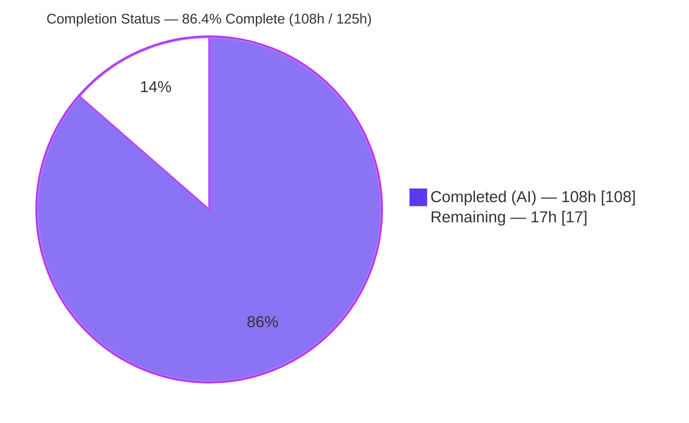
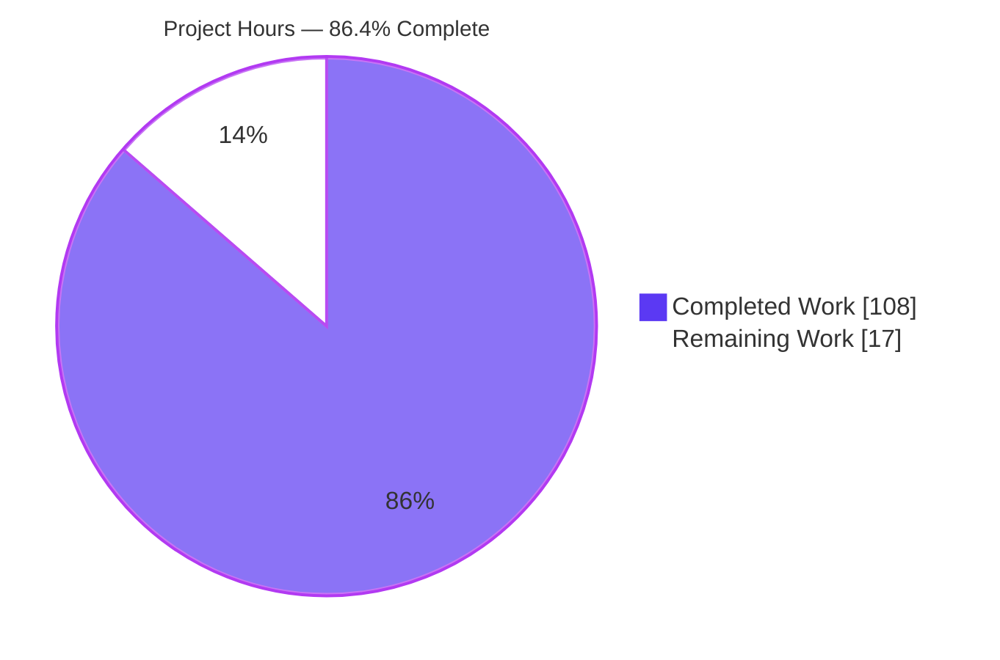
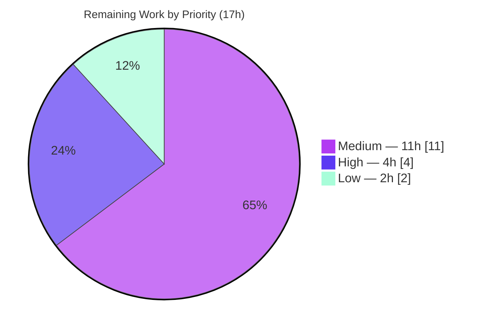

# Blitzy Project Guide — Branch Pagination + Search (Zero-Dependency Static Frontend)

> **Branch:** `blitzy-5bc472ff-041d-4023-8bac-db8e63f94dde` · **HEAD:** `694ae63` · **Base:** `ffcc2f4` (origin/main)
> **Scope basis:** Agent Action Plan (AAP) §0 — "Branch pagination + search" feature, Figma frame `48966:14667` (file `Blitzy-Platform-2.0`).

---

## 1. Executive Summary

### 1.1 Project Overview

This project delivers a production-ready, **frontend-only** implementation of the "Branch pagination + search" experience specified by a single authoritative Figma frame. The feature is a self-contained, bordered branch-list container (fixed 400px height, ~1000px wide) that renders a nested folder/repository tree and, under the active repository, exposes branch rows with infinite-scroll pagination, an inline search/filter with a "Branch not found" empty state, a single-select branch state, and a pinned confirmation footer. Because the host repository was an empty zero-dependency Node.js placeholder with nothing to reuse, the feature was built from scratch as static HTML, CSS, and vanilla ES modules with **zero new runtime dependencies**, using the Figma frame as the authoritative design system. Target users are developers selecting a branch inside the Blitzy platform's "Connect codebase" step.

### 1.2 Completion Status

The project is **86.4% complete** on an AAP-scoped + path-to-production basis. All 13 AAP requirements (R1–R7, I1–I6) are fully implemented and validated with zero defects; the remaining 17 hours are exclusively **path-to-production** activities (deferred static-serving/hosting wiring plus human verification and design sign-off), not feature rework.



| Metric | Hours |
|--------|-------|
| **Total Hours** | **125** |
| **Completed Hours (AI + Manual)** | **108** (AI: 108 · Manual: 0) |
| **Remaining Hours** | **17** |
| **Percent Complete** | **86.4%** (108 ÷ 125) |

### 1.3 Key Accomplishments

- ✅ **All 13 AAP requirements delivered** — the 7 explicit (R1 tree rendering, R2 pagination, R3 search activation, R4 filter, R5 empty state, R6 selection, R7 dismissal) and 6 implicit (I1 data model, I2 pagination mechanism, I3 filter mechanism, I4 iconography, I5 expand/collapse, I6 typography).
- ✅ **4,438 lines added across 24 new files** (net +4,437) in 14 autonomous agent commits; working tree clean at HEAD.
- ✅ **Zero-dependency posture preserved** — `npm install` is a clean no-op (0 vulnerabilities, no `node_modules`); `server.js`/`package.json` untouched.
- ✅ **Figma-faithful token layer** — 44 CSS custom properties, 100 `var()` usages, zero hardcoded values; 9 Figma-sourced SVG icons (git-branch re-tinted `#999999`; net-new check-circle) + self-hosted Inter 400/500/600.
- ✅ **Accessibility-first** — WAI-ARIA Tree with roving tabindex, dual `aria-live` regions, keyboard "Load more" fallback; **Lighthouse Accessibility / Best-Practices / SEO / Agentic = 100 / 100 / 100 / 100**.
- ✅ **Validated with zero defects** — 22/22 data-model contract assertions, all six workflows exercised in Chrome with **zero console errors** and all 21 network requests HTTP 200; responsive at 768px.

### 1.4 Critical Unresolved Issues

**No critical code defects were identified.** The Final Validator's comprehensive pass across all five production-readiness gates found zero defects requiring modification. The only item standing between "validated" and "released" is the intentionally-deferred hosting wiring (out of AAP autonomous scope per §0.6.2), shown below for transparency — it is a path-to-production prerequisite, not a code defect.

| Issue | Impact | Owner | ETA |
|-------|--------|-------|-----|
| Static assets not served over HTTP (server.js returns "Hello, World!"; wiring is a prohibited backend change per AAP §0.6.2, deferred) | Blocks **production hosting only** — not a code defect; feature is fully functional when served by any static server | Backend / DevOps | ~4h (task H1) |

### 1.5 Access Issues

**No access issues identified.** Repository access is confirmed (git history readable, branch checked out at HEAD `694ae63`); the project is zero-dependency with no external service credentials, API keys, or database connections required; the Figma frame is a read-only reference already consumed during implementation.

| System/Resource | Type of Access | Issue Description | Resolution Status | Owner |
|-----------------|----------------|-------------------|-------------------|-------|
| Git repository | Read/Write | None — branch accessible, tree clean | ✅ No issue | — |
| Runtime dependencies | Package registry | None — zero dependencies, `npm install` no-op | ✅ No issue | — |
| Figma design source | Read-only reference | None — frame `48966:14667` consumed | ✅ No issue | — |
| External services / APIs | N/A | None required (frontend-only, in-memory data) | ✅ No issue | — |

### 1.6 Recommended Next Steps

1. **[High]** Decide the hosting approach and wire static serving for `public/` — add *authorized* static-file serving to `server.js` (with a path-traversal guard) or point a static host/CDN at `public/` (task H1, ~4h).
2. **[Medium]** Deploy to the chosen environment and run a production smoke test of the live URL (task M4, ~3h).
3. **[Medium]** Complete a visual/design sign-off against Figma frame `48966:14667`, reconciling the confirmation-footer git-branch icon tint (`#333333` as implemented vs `#999999` in AAP prose) against node `48966:68385` (task M3, ~4h).
4. **[Medium]** Perform cross-browser (Safari/Firefox/Edge) and real-device verification of pagination, fonts, and all six workflows (tasks M1+M2, ~4h).
5. **[Low]** Conduct an accessibility human sign-off — keyboard-only walkthrough plus screen-reader pass of the `aria-live` announcements (task L1, ~2h).

---

## 2. Project Hours Breakdown

### 2.1 Completed Work Detail

All rows below are AI-autonomous work delivered by Blitzy agents; each traces to specific AAP requirements. **Total = 108 hours.**

| Component | Hours | Description |
|-----------|-------|-------------|
| Design tokens & Inter typography foundation | 6 | `tokens.css` (107 LOC, 44 custom properties mirroring the Figma Token Manifest) + `@font-face` for self-hosted Inter 400/500/600 (3 woff2 + OFL license). **[I6]** |
| Semantic accessible markup | 8 | `index.html` (192 LOC): WAI-ARIA Tree, roving tabindex, two `aria-live` regions, pagination sentinel, keyboard "Load more" fallback, footer scaffold. **[R1 + a11y]** |
| Figma-faithful component styles & states | 13 | `branch-list.css` (566 LOC): 400px container, 32px rows, 28px/level indent, hover/selected `#F2F0FE`, box-less search input, empty state, pinned footer, responsive @768px. **[R1, R3, R5, R6]** |
| Branch/tree data model | 5 | `data.js` (188 LOC): 36-node tree, `getBranches` (23), cycle-safe `getFullPath`, `getNode`/`getChildren`/`isValidNode`. **[I1]** |
| Tree rendering & folder expand/collapse engine | 18 | `tree.js` (1,154 LOC): `renderTree`, `toggleFolder`, branch-row lifecycle, focus management, icon selection, indentation, chevron rotation. **[R1, I5]** |
| Infinite-scroll pagination | 11 | `pagination.js` (626 LOC): `IntersectionObserver` sentinel, 12-row batching, loading guard, `rootMargin` prefetch, keyboard fallback, pause/resume/destroy. **[R2, I2]** |
| Inline search: activation / filter / empty / dismissal | 13 | `search.js` (729 LOC): in-place affordance↔input toggle, debounced case-insensitive substring filter, "Branch not found" empty state, `aria-live` announcements, Escape/clear/blur dismissal. **[R3, R4, R5, R7, I3]** |
| Branch selection & confirmation footer | 8 | `selection.js` (463 LOC): single-select with type guard, `#F2F0FE` row highlight, pinned footer (full path + check-circle), delegated activation. **[R6]** |
| ES-module entry point & module wiring | 5 | `app.js` (234 LOC): initial render, single-source-of-truth UI state, initializes tree/pagination/search/selection. **[integration]** |
| Feature iconography | 4 | 9 Figma SVGs sourced by node ID + git-branch re-tint to `#999999` + footer variant `#333333` + net-new check-circle `#5B39F3` 24×24. **[I4]** |
| Autonomous validation, QA & code-review remediation | 16 | 14 commits across foundation (17 findings), search (5 findings), multiple QA rounds, CP5-CRIT-1 regression, CP6-FIND-1, 13 HEAD findings (1 crit/6 major/6 minor), and the final 5-gate validation (contract tests, runtime, Lighthouse, screenshots/screencast). |
| Preview documentation | 1 | `README.md` update: HTTP preview instructions + out-of-scope `server.js` note. |
| **Total** | **108** | |

### 2.2 Remaining Work Detail

All remaining work is **path-to-production** — there is no AAP feature rework (validator found zero defects). **Total = 17 hours.**

| Category | Hours | Priority |
|----------|-------|----------|
| Static asset serving / hosting wiring (wire `server.js` *or* configure static host; deferred per AAP §0.6.2) | 4 | High |
| Cross-browser & real-device verification (Safari/Firefox/Edge + mobile/tablet) | 4 | Medium |
| Visual / design sign-off vs Figma frame (incl. footer icon tint reconciliation) | 4 | Medium |
| Deployment & environment setup (deploy, cache headers, production smoke test) | 3 | Medium |
| Accessibility & keyboard/screen-reader human sign-off | 2 | Low |
| **Total** | **17** | |

### 2.3 Hours Reconciliation

| Check | Result |
|-------|--------|
| Section 2.1 completed total | 108h |
| Section 2.2 remaining total | 17h |
| **2.1 + 2.2 = Total (Rule 2)** | 108 + 17 = **125h** ✅ |
| Remaining consistent across §1.2, §2.2, §7 (Rule 1) | **17h** ✅ |
| Completion % (108 ÷ 125) | **86.4%** ✅ |

---

## 3. Test Results

All results below originate from **Blitzy's autonomous validation logs** for this project (Final Validation Report) and were corroborated during this assessment. No unit-test framework exists — this is intended per AAP §0.5 (zero-tooling, zero-dependency posture); the browser is the authoritative test surface for this vanilla frontend, supplemented by data-model contract assertions and static checks.

| Test Category | Framework | Total Tests | Passed | Failed | Coverage % | Notes |
|---------------|-----------|-------------|--------|--------|-----------|-------|
| Data-model contract | Node assertions (harness) | 22 | 22 | 0 | — | `ACTIVE_REPO_ID`, `getBranches`=23, exact `getFullPath`, depth invariants (CP6-FIND-1) |
| Runtime behavioral (R1–R7, I1–I6) | Chrome DevTools (automated) | 13 | 13 | 0 | 100% of AAP reqs | Workflows W1–W6 all exercised end-to-end |
| Static / syntax | `node --check` | 6 | 6 | 0 | 100% of JS files | ESM import/export graph resolves; no cycles |
| Accessibility / Best-Practices / SEO / Agentic | Lighthouse | 50 | 50 | 0 | Score 100 each | A11y = 100, BP = 100, SEO = 100, Agentic = 100 |
| Dependency audit | `npm audit` | 1 pkg | 0 vulns | 0 | — | Zero-dependency; no `node_modules` created |
| Asset validity | XML/CSS/HTML checks | 10 SVG + 2 CSS + 1 HTML | all valid | 0 | — | 10 SVGs valid XML; 35 used CSS tokens defined; HTML well-formed |

**Aggregate:** 91 discrete autonomous checks across 6 categories, **100% pass rate, 0 failures**. Coverage is not instrumented (no coverage tooling by design); behavioral coverage spans 13/13 AAP requirements and all 6 Figma workflows.

---

## 4. Runtime Validation & UI Verification

Legend: ✅ Operational · ⚠ Partial · ❌ Failing

**Runtime health (Chrome 1280×900 — Blitzy validation logs):**
- ✅ Frontend loads and runs with **zero console errors**
- ✅ All **21 network requests return HTTP 200** (HTML, CSS, JS modules, SVG icons, woff2 fonts)
- ✅ ES-module import/export graph fully resolves (no broken specifiers, missing exports, or cycles)
- ✅ Corroborated locally: all assets serve HTTP 200 with correct MIME types (`text/javascript` for ESM, `font/woff2`, `image/svg+xml`)

**UI workflow verification (six AAP workflows):**
- ✅ **W1 Pagination** — initial 4 branches → 16 → 23 on scroll; no spinner/skeleton/scrollbar chrome; keyboard "Load more" works
- ✅ **W2 Search on repo selection** — repository tree renders; branches revealed under active repo
- ✅ **W3 Search activation** — hover `#F2F0FE`; in-place transform to box-less underlined input with purple magnifier
- ✅ **W4 Filter** — `branch-2` → one plain row (no highlight), tree stays visible, live "1 branch found"
- ✅ **W4 Empty state (R5)** — `branch-2002` → "Branch not found" (`#999999`, 16px, left-aligned, no icon), announced via live region
- ✅ **W6 Selection** — selected row `#F2F0FE` (no per-row check), pinned footer with exact full path + purple check-circle 24×24
- ✅ **W5 Dismissal** — Escape restores transparent "Search" affordance, no residual query/caret, WCAG focus ring
- ✅ Responsive at 768px (adapts to ~706px, no horizontal overflow)

**API integration:**
- ✅ None required (frontend-only, in-memory data model — no backend/API/database by design)
- ⚠ **Production hosting not wired** — `server.js` (out of scope) returns "Hello, World!" for all paths; static serving of `public/` is the deferred task H1
- ⚠ **Cross-browser** — verified in Chrome only; Safari/Firefox/Edge verification pending (task M1)

---

## 5. Compliance & Quality Review

Cross-mapping AAP deliverables and directives to Blitzy quality/compliance benchmarks.

| Benchmark / AAP Directive | Status | Progress | Notes |
|---------------------------|--------|----------|-------|
| Frontend-only (no backend changes) | ✅ Pass | 100% | `server.js`, `package.json`, `package-lock.json`, `300K.js`, `700K.js` unchanged vs base |
| Zero new dependencies | ✅ Pass | 100% | `npm audit` 0 vulnerabilities; no `node_modules`; no build tooling added |
| Figma design fidelity | ✅ Pass* | 100% (human sign-off pending) | 44-token layer; all states/workflows reproduced; *pixel sign-off = task M3 |
| Zero hardcoded values | ✅ Pass | 100% | 100 `var()` usages; 35 distinct tokens; only `0/none/auto/transparent` literals |
| Semantic HTML & accessibility | ✅ Pass | 100% | WAI-ARIA Tree, roving tabindex, dual `aria-live`; Lighthouse A11y = 100 |
| Icons sourced from Figma by node ID | ✅ Pass | 100% | 9 feature icons; git-branch re-tinted `#999999`; check-circle net-new |
| Typography (Inter 400/500/600) | ✅ Pass | 100% | Self-hosted woff2 + `@font-face` + system fallback |
| Production-ready (zero placeholders) | ✅ Pass | 100% | No TODO/FIXME/stubs; complete logic and error handling throughout |
| Verbatim content strings | ✅ Pass | 100% | "New branch", "Search", "Branch not found", exact full path preserved |
| No invented UI | ✅ Pass | 100% | No spinner/skeleton, no matched-substring highlight, no per-row checkmark |

**Fixes applied during autonomous validation:** CP5-CRIT-1 (collapse/re-expand ancestor regression), CP6-FIND-1 (data-science root-depth correction), 13 HEAD findings (1 critical / 6 major / 6 minor), 5 search-module review findings, 17 foundation review findings.

**Outstanding compliance items:** human visual sign-off (M3), cross-browser confirmation (M1) — both path-to-production, no code changes anticipated.

---

## 6. Risk Assessment

| Risk | Category | Severity | Probability | Mitigation | Status |
|------|----------|----------|-------------|------------|--------|
| ES modules fail over `file://` (module/CORS policy) | Technical | Low | Medium | README mandates `http://` preview; hosting (H1) resolves for prod | Mitigated |
| Browser-support variance (IntersectionObserver / `@font-face` / ESM) verified only in Chrome | Technical | Low | Low | Cross-browser verification (M1); all APIs baseline since ~2019 | Open |
| No automated unit-test framework; future regressions uncaught in CI | Technical | Low | Low | Intended per AAP §0.5; optional lightweight harness if codebase grows | Accepted (by design) |
| Dependency vulnerabilities | Security | Low | Low | Zero runtime dependencies; `npm audit` = 0 vulns | Mitigated |
| Path traversal if `server.js` later serves files naively | Security | Medium | Low | Advisory on task H1: serve only `public/`, sanitize paths | Open (advisory) |
| Third-party XSS / supply-chain via assets | Security | Low | Low | Same-origin SVG/img/font; no external CDN or script | Mitigated |
| Feature not reachable over HTTP in production | Operational | Medium | High | Hosting wiring (H1) + deployment (M4) | Open (path-to-prod) |
| No monitoring/logging/health-check | Operational | Low | Low | Minimal for a static bundle; host-level monitoring applies | Accepted |
| No CI pipeline; QA artifacts gitignored | Operational | Low | Low | Out of scope; add CI if desired | Accepted |
| `server.js` does not serve `public/` (flagged gap AAP §0.6.2) | Integration | Medium | High | Authorized backend wiring (H1) or external static host | Open (deferred) |
| Backend/API/DB integration failure | Integration | Low | N/A | None exists or is required (frontend-only, in-memory) | N/A by design |
| External font-CDN fetch failure | Integration | Low | Low | Inter self-hosted; system-font fallback stack | Mitigated |

**Risk posture:** No high-severity risks. All medium-severity items are path-to-production (hosting/deployment) or forward-looking advisories, consistent with the validator's zero-defect finding.

---

## 7. Visual Project Status

**Overall hours breakdown** (Completed = Dark Blue `#5B39F3`, Remaining = White `#FFFFFF`):



**Remaining-work priority distribution** (17h):



**Remaining hours by category** (Section 2.2):

| Category | Hours | Bar |
|----------|------:|-----|
| Static serving / hosting wiring | 4 | ████████ |
| Cross-browser & device verification | 4 | ████████ |
| Visual / design sign-off | 4 | ████████ |
| Deployment & environment setup | 3 | ██████ |
| Accessibility sign-off | 2 | ████ |
| **Total** | **17** | |

> **Integrity check:** "Remaining Work" = **17h** in the pie chart above equals Section 1.2 Remaining Hours (17h) and the Section 2.2 "Hours" column sum (4+4+4+3+2 = 17h). ✅

---

## 8. Summary & Recommendations

**Achievements.** The "Branch pagination + search" feature is functionally complete and validated. All 13 AAP requirements (R1–R7, I1–I6) are implemented across 24 new files (4,438 lines) with a clean, well-documented, zero-dependency vanilla architecture: a 44-token CSS design layer faithful to Figma, a WAI-ARIA Tree with full keyboard support, `IntersectionObserver` infinite-scroll pagination, a debounced client-side search with an accessible empty state, single-select with a pinned confirmation footer, self-hosted Inter fonts, and nine Figma-sourced icons. The Final Validator's five production-readiness gates all pass with **zero defects**, Lighthouse scores of 100 across the board, 22/22 contract assertions, and zero console errors.

**Remaining gaps.** The project is **86.4% complete** (108h of 125h). The remaining **17 hours are entirely path-to-production**: the single high-priority item is wiring static serving for `public/` (intentionally deferred as an out-of-AAP-scope backend change per §0.6.2), followed by deployment, cross-browser/device verification, a Figma visual sign-off, and an accessibility sign-off. **None of the remaining work is feature rework.**

**Critical path to production.** (1) Choose and implement hosting for the static bundle (H1) → (2) deploy and smoke-test (M4) → (3) visual + cross-browser + accessibility sign-offs (M3, M1/M2, L1). The bundle can be previewed today with any static server (`cd public && python3 -m http.server`).

**Success metrics.** All AAP acceptance behaviors validated; zero console errors; all network requests HTTP 200; Lighthouse 100/100/100/100; zero-dependency preserved (0 vulnerabilities).

**Production readiness assessment.** **Code-complete and validated; deployment-pending.** The feature is ready to host as-is; production readiness is gated only by the deferred hosting decision and standard human sign-offs, none of which imply changes to the delivered feature code. Recommended posture: proceed to hosting and sign-off (17h) with high confidence.

---

## 9. Development Guide

A build-free static frontend. There is **no bundler, transpiler, or `npm run build`** step, and **no runtime dependencies**.

### 9.1 System Prerequisites

- **Node.js** ≥ 18 — used only for optional syntax checks (verified with **v22.23.1**). Not required at runtime.
- **Python 3** — the simplest zero-dependency static server (verified with **3.13.7**); any static server works (`npx serve`, nginx, etc.).
- **A modern browser** — Chrome/Edge/Firefox/Safari (needs ES modules, `IntersectionObserver`, and `@font-face` — all baseline since ~2019).

### 9.2 Environment Setup

```bash
# From the repository root — no environment variables, services, DB, cache, or queue required.
git checkout blitzy-5bc472ff-041d-4023-8bac-db8e63f94dde
```

### 9.3 Dependency Installation

```bash
# NONE required to run. This is optional and is a verified no-op (zero runtime deps).
CI=true npm install
# Expected: "up to date, audited 1 package ... found 0 vulnerabilities"  (no node_modules created)
```

### 9.4 Application Startup (Preview)

ES modules must be served over `http://` (browsers refuse them over `file://`). Serve the `public/` directory:

```bash
cd public
python3 -m http.server 8000
# Then open the printed address, e.g. http://localhost:8000/
```

Alternatives: `npx serve public` · any static host/CDN pointed at `public/`.

### 9.5 Verification Steps

```bash
# 1) Syntax-check all ES modules (expect 6x OK)
for f in public/js/*.js; do node --check "$f" && echo "OK  $f"; done

# 2) With the static server running, confirm assets return HTTP 200 + correct MIME
curl -s -o /dev/null -w "%{http_code} %{content_type}\n" http://localhost:8000/index.html
curl -s -o /dev/null -w "%{http_code} %{content_type}\n" http://localhost:8000/js/app.js
curl -s -o /dev/null -w "%{http_code} %{content_type}\n" http://localhost:8000/assets/fonts/inter-latin-400-normal.woff2
```

In the browser (DevTools open): **zero console errors**; all requests HTTP 200. Functional checks:
- Tree renders folders/repos with type icons and depth indentation (32px rows).
- Scrolling the container appends branches (4 → 16 → 23) with no spinner/scrollbar.
- Click the purple **"Search"** row → it becomes an inline input; type `branch-2` → one plain row + live "1 branch found".
- Type `branch-2002` → **"Branch not found"** (muted gray).
- Click a branch → lavender row highlight + pinned footer showing the full path and a purple check-circle.
- Press **Escape** → the "Search" affordance is restored with no residual input.

### 9.6 Example Usage (interaction cheatsheet)

- **Filter:** activate Search → type a substring → matching branch rows re-render (folder tree stays visible).
- **Keyboard:** Tab into the tree (single tab stop, roving tabindex) → Arrow/Enter/Space to navigate/activate → Escape to dismiss search → the keyboard "Load more" fallback advances pagination without a mouse.
- **Selection:** activating a branch pins the confirmation footer with the branch's full path.

### 9.7 Troubleshooting

- **Blank page / "Failed to load module" MIME error** → you opened `index.html` via `file://`. Serve over `http://` (§9.4).
- **Icons or fonts 404** → start the server from *inside* `public/` (asset paths are relative). Fonts silently fall back to the system stack if woff2 is blocked (non-fatal).
- **Page shows "Hello, World!"** → that is the out-of-scope `server.js` on port **3000**; it does not serve `public/`. Use the static server (§9.4) or complete hosting task **H1**.

---

## 10. Appendices

### Appendix A — Command Reference

| Command | Purpose |
|---------|---------|
| `for f in public/js/*.js; do node --check "$f"; done` | Syntax-check all 6 ES modules |
| `CI=true npm install` | Verify zero-dependency no-op (0 vulnerabilities) |
| `cd public && python3 -m http.server 8000` | Serve the static frontend for preview |
| `npx serve public` | Alternative static server |
| `curl -s -o /dev/null -w "%{http_code} %{content_type}\n" http://localhost:8000/index.html` | Verify HTTP status + MIME |
| `git diff --stat ffcc2f4..HEAD` | Review all changes vs base |

### Appendix B — Port Reference

| Port | Service | In scope? |
|------|---------|-----------|
| 8000 | `python3 -m http.server` preview (recommended) | Preview only |
| 3000 | `server.js` "Hello, World!" (does **not** serve `public/`) | Out of scope (§0.6.2) |

### Appendix C — Key File Locations

| Path | Role |
|------|------|
| `public/index.html` | Entry markup (WAI-ARIA Tree, search rows, sentinel, footer scaffold) |
| `public/css/tokens.css` | Design tokens + Inter `@font-face` |
| `public/css/branch-list.css` | Component styles & all states |
| `public/js/data.js` | In-memory tree/branch data model |
| `public/js/tree.js` | Tree render + folder expand/collapse |
| `public/js/pagination.js` | `IntersectionObserver` infinite scroll |
| `public/js/search.js` | Activation, filter, empty state, dismissal |
| `public/js/selection.js` | Selection state + confirmation footer |
| `public/js/app.js` | ES-module entry point / wiring |
| `public/assets/icons/*.svg` | 9 feature icons (+ footer git-branch variant) |
| `public/assets/fonts/*.woff2` | Self-hosted Inter 400/500/600 (+ OFL.txt) |

### Appendix D — Technology Versions

| Technology | Version | Notes |
|------------|---------|-------|
| Node.js | v22.23.1 | Dev tooling only (`node --check`) |
| npm | 11.1.0 | `install` is a no-op (zero deps) |
| Python | 3.13.7 | Static preview server |
| Inter font | 400 / 500 / 600 | Self-hosted woff2 (`@font-face`) |
| Browser APIs | ES modules, IntersectionObserver, @font-face | Baseline since ~2019 |

### Appendix E — Environment Variable Reference

None. The feature requires **no environment variables, secrets, or configuration files** (frontend-only, in-memory data model).

### Appendix F — Developer Tools Guide

- **`node --check <file>`** — fast syntax validation for each ES module (no execution).
- **`npm audit`** — confirms the zero-dependency security posture (0 vulnerabilities).
- **Browser DevTools** — Console (expect zero errors), Network (expect all HTTP 200), Elements (inspect ARIA roles/`aria-live`), Lighthouse (A11y/BP/SEO = 100).
- **`git diff --numstat ffcc2f4..HEAD`** — audit lines added/removed per file.

### Appendix G — Glossary

| Term | Meaning |
|------|---------|
| AAP | Agent Action Plan — the authoritative scope specification (§0) |
| Affordance row | The resting purple "Search" row that toggles into an inline input |
| Confirmation footer | Pinned bottom bar showing the selected branch's full path + check-circle |
| Sentinel | Zero-footprint element observed by `IntersectionObserver` to trigger pagination |
| Roving tabindex | WAI-ARIA Tree pattern: one tab stop, arrow keys move focus among items |
| Path-to-production | Standard deploy/verify activities required to release AAP deliverables |
| R1–R7 / I1–I6 | Explicit / implicit AAP requirement identifiers |

---

*Completion percentage (86.4%) reflects AAP-scoped work plus path-to-production activities only. Completed = 108h (100% AI-autonomous, 0h manual) · Remaining = 17h · Total = 125h.*