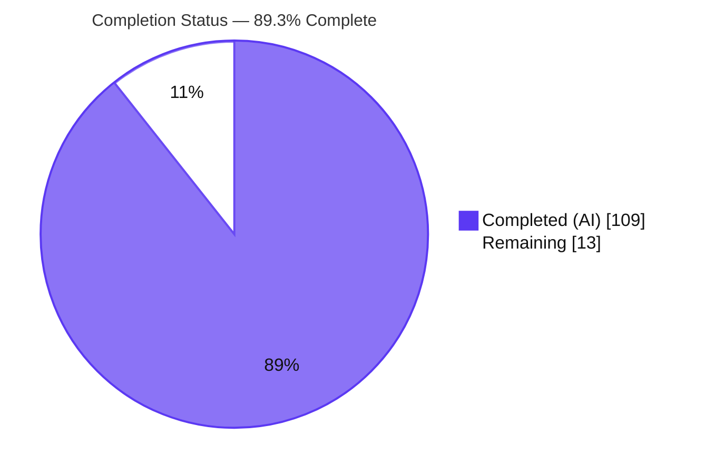
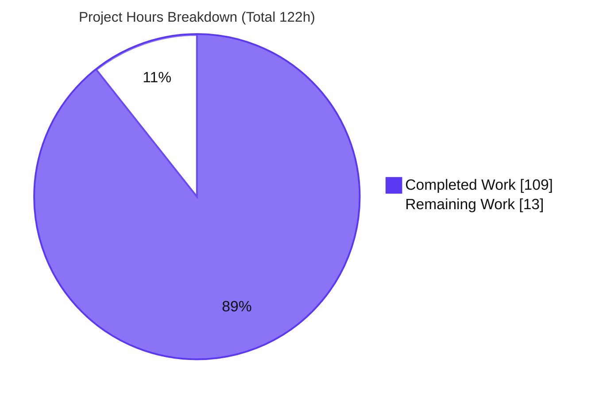
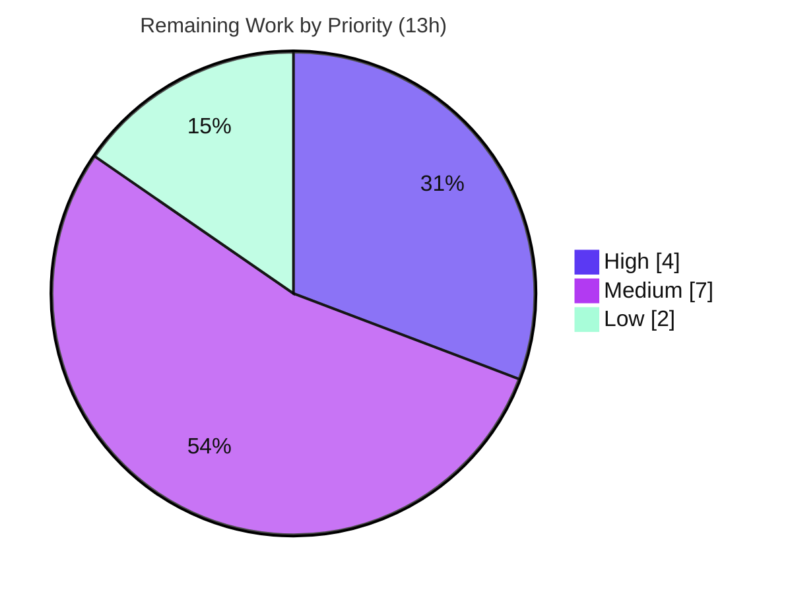

# Blitzy Project Guide
### Branch Pagination + Search — "Connect Codebase" Wizard (Blitzy Platform 2.0)

> **Brand legend** — <span style="color:#5B39F3">■</span> **Completed / AI Work** `#5B39F3` · <span style="color:#FFFFFF;background:#333;padding:0 4px">■</span> **Remaining** `#FFFFFF` · Headings/Accents `#B23AF2` · Highlight `#A8FDD9`

---

## 1. Executive Summary

### 1.1 Project Overview

This project implements the **"Branch pagination + search"** experience — a repository branch-selector panel embedded in the **"Connect codebase / Codebase context"** step of the Blitzy Platform 2.0 project-setup wizard. The sole authoritative source was a single Figma frame set (15 states @ 1440×1024). Because the repository contained **no pre-existing frontend** (only a Hello-World Node server and padding files), the work established a minimal, framework-agnostic **vanilla HTML/CSS/JS foundation with zero dependencies** and built all eight requirements (R1–R8) on top of it: a scroll-paginated branch tree, an activate-on-click debounced search, an empty state, a selection confirmation bar, and the full static page chrome. Target users are Blitzy Platform developers connecting a codebase; the change set is **purely additive and frontend-only**.

### 1.2 Completion Status



| Metric | Value |
|--------|-------|
| **Total Hours** | **122** |
| **Completed Hours (AI + Manual)** | **109** (109 AI + 0 Manual) |
| **Remaining Hours** | **13** |
| **Percent Complete** | **89.3%** |

> Completion is computed per PA1 (AAP-scoped, hours-based): `109 / (109 + 13) × 100 = 89.3%`. All AAP-scoped code is complete and validated; the remaining 13 hours are exclusively human-gated **path-to-production** activities.

### 1.3 Key Accomplishments

- ✅ All eight requirements **R1–R8** implemented and independently validated in a real browser (zero console errors).
- ✅ **Purely additive** change set — 28 files, **+3,440 / −0** lines; all 6 out-of-scope files byte-unchanged.
- ✅ **Zero-dependency** vanilla foundation (no framework, bundler, or transpiler) — honors "clean & minimal".
- ✅ **48 design tokens** extracted from Figma; 238 `var()` references all resolve (token-driven styling).
- ✅ **22 Figma assets** downloaded (21 SVG icons + 1 optimized PNG); 0 broken images across 60 image checks.
- ✅ **Accessibility**: ARIA tree semantics + polite live region + full keyboard operation; Lighthouse Accessibility **97**.
- ✅ **Security**: XSS payloads (script/img/svg) neutralized via safe DOM APIs.
- ✅ One genuine runtime defect (R2 jump-to-bottom pagination) found, fixed, and re-validated (commit `7052f14`).

### 1.4 Critical Unresolved Issues

| Issue | Impact | Owner | ETA |
|-------|--------|-------|-----|
| _None blocking._ All AAP-scoped code is complete, compiles clean, and has zero failing tests. | — | — | — |
| Production hosting decision (server.js does not serve assets by design, §0.5.2) | Cannot ship until a static host/CDN is chosen | DevOps/Frontend | 0.5 day |

### 1.5 Access Issues

| System/Resource | Type of Access | Issue Description | Resolution Status | Owner |
|-----------------|----------------|-------------------|-------------------|-------|
| Git repository | Read/Write | Branch `blitzy-e531c14b-…` accessible; HEAD `7052f14` committed by `agent@blitzy.com` | ✅ No issue | — |
| Figma (`91TpUu5OYVLFkPdcBCmOUu`) | Design read | Assets already downloaded; no further access needed | ✅ No issue | — |
| Production static host / CDN | Deploy | Not yet provisioned (deployment is a remaining path-to-production task) | ⏳ Pending human setup | DevOps |

> No blocking access issues identified. The only pending item is provisioning a production hosting target, which is a normal path-to-production step.

### 1.6 Recommended Next Steps

1. **[High]** Provision & configure production static hosting (host/CDN), preserving the relative directory structure; deploy and smoke-test. *(4h)*
2. **[Medium]** Run cross-browser verification (Firefox / Safari / Edge) of the R1–R8 flow. *(3h)*
3. **[Medium]** Obtain design-fidelity stakeholder sign-off against the Figma frames. *(2h)*
4. **[Medium]** Formalize the WCAG accessibility sign-off and close the SEO 91→100 delta; set static-host security headers. *(2h)*
5. **[Low]** Make a product decision on mobile/tablet responsive support (source is fixed 1440px desktop). *(2h)*

---

## 2. Project Hours Breakdown

### 2.1 Completed Work Detail

| Component | Hours | Description |
|-----------|-------|-------------|
| Project foundation + Figma asset acquisition | 8 | Established the vanilla HTML/CSS/JS foundation (no prior frontend); downloaded, verified, and optimized all **22 assets** (21 SVG icons + 1 PNG avatar) — AAP §0.3.4 |
| Design token system (`css/tokens.css`) | 5 | 48 design tokens (colors, typography, radii, spacing) extracted from Figma §0.3.2 |
| Semantic page shell (`index.html`, 247 L) | 7 | App bar, project header, 6-step stepper, section nav, repo select, branch-selector mount; ARIA roles + live region (R8, R1) |
| Layout & component styling (`css/styles.css`, 1,162 L) | 16 | Token-driven styles for all chrome + branch-selector components and per-state visuals (fixed panel, tree indent, search states, selection, confirmation bar) — R1–R8 |
| Client-side branch data seed (`js/data.js`, 170 L) | 4 | Static forest tree + 18 branches with full paths; `window.BranchData` contract (replaces absent backend) — R1 |
| **R1** — Branch list rendering + ARIA tree | 10 | Tree/chain/row rendering, depth indentation, `role=tree`/`treeitem`, levels & expansion |
| **R2** — Scroll pagination (+ defect fix) | 10 | IntersectionObserver + co-active scroll listener, `pumpPagination`/`isSentinelInView`; chrome-free append; jump-to-bottom fix (+94/−13) |
| **R3–R6** — Search activation / filter / dismiss / empty state | 12 | Action-row↔input toggle, debounced 300ms case-insensitive filter, text-only "Branch not found", clear-× + Escape dismissal |
| **R7** — Selection + confirmation bar | 6 | `#F2F0FE` highlight (only cue); pinned footer with full path + git-branch + check-circle icons |
| Accessibility (ARIA live region + keyboard) | 6 | Polite live-region announcements; Arrow/Home/End/Enter/Escape operation; focus management |
| Bootstrap & chrome wiring (`js/app.js`, 174 L) | 5 | Mount the selector; wire benign chrome interactions (R8) |
| Autonomous validation & QA | 20 | Static/compilation checks, full browser runtime validation of R1–R8, Lighthouse, XSS security, 5 responsive breakpoints, review cycles (checkpoint 2, code review, QA report 3), R2 defect root-cause analysis |
| **Total Completed** | **109** | Matches Completed Hours in §1.2 |

### 2.2 Remaining Work Detail

| Category | Hours | Priority |
|----------|-------|----------|
| Production static hosting & deployment (choose host/CDN, configure, security headers, deploy, smoke-test) | 4 | High |
| Cross-browser verification (Firefox / Safari / Edge) | 3 | Medium |
| Design-fidelity stakeholder sign-off vs Figma | 2 | Medium |
| Accessibility (WCAG) sign-off + SEO 91→100 polish | 2 | Medium |
| Responsive / mobile scope decision (source is fixed 1440px desktop, §0.6.3) | 2 | Low |
| **Total Remaining** | **13** | Matches Remaining Hours in §1.2 and §7 pie |

### 2.3 Hours Reconciliation

- Completed (§2.1) = **109** · Remaining (§2.2) = **13** · **Total = 122**
- Completion % = `109 / 122 × 100` = **89.3%**
- Cross-section integrity: §2.1 + §2.2 = §1.2 Total ✓ · §2.2 sum = §1.2 Remaining = §7 "Remaining Work" ✓

---

## 3. Test Results

> **Testing model.** There is **no unit/integration test framework** in this project, and the AAP (§0.4, §0.7.2) plus Constraints 4 & 7 **explicitly prohibit adding one**. Accordingly, verification for this static frontend consists of **Blitzy's autonomous static + runtime validation**, summarized below. All entries originate from Blitzy's autonomous validation logs. `npm test` is the out-of-scope `package.json` placeholder (exit 1) and is **not** a real test/failure. Traditional line-coverage instrumentation is **N/A** by mandate; "Coverage" below expresses the fraction of the relevant universe validated.

| Test Category | Framework / Method | Total | Passed | Failed | Coverage | Notes |
|---------------|--------------------|:-----:|:------:|:------:|----------|-------|
| JavaScript syntax | `node --check` (Node 22) | 3 | 3 | 0 | 100% of JS (3/3) | `data.js`, `branch-selector.js`, `app.js` |
| SVG well-formedness | XML parse | 21 | 21 | 0 | 100% of icons (21/21) | all icons valid XML |
| CSS token resolution | `var()` static resolver | 238 | 238 | 0 | 100% of refs; 48 tokens | braces balanced |
| Asset / network load | Browser + HTTP | 29 | 29 | 0 | 100% (29/29 HTTP 200) | 0/60 broken images; zero console errors |
| Requirement acceptance (R1–R8) | Chrome DevTools MCP | 8 | 8 | 0 | 100% of requirements (8/8) | incl. keyboard Arrow/Home/End/Enter/Escape |
| Security — XSS injection | Chrome DevTools MCP | 3 | 3 | 0 | script/img/svg neutralized | no injection, no execution |
| Responsive layout | Chrome DevTools MCP | 5 | 5 | 0 | 375/768/1280/1440/1920 | no overflow/break |
| Lighthouse (quality) | Lighthouse (desktop+mobile) | 4 | 4 | 0 | A11y 97 · BP 100 · SEO 91–100 · Agentic 100 | see §4 |
| **Aggregate autonomous checks** | — | **311** | **311** | **0** | **100% pass rate** | count dominated by static token-resolution refs |

**Pass rate: 100% (0 failures across every category).**

---

## 4. Runtime Validation & UI Verification

Served via `python3 -m http.server`, loaded in Chrome @ 1440×1024.

**Runtime health**
- ✅ **Operational** — 29/29 network requests HTTP 200; **zero** console messages/errors; 0/60 broken images.

**Requirement verification**
- ✅ **R1** Branch tree render (role=tree, ARIA levels/expanded/selectable, live region)
- ✅ **R2** Scroll pagination — all 18 branches reachable incl. jump-to-bottom (post-fix); no pager/Load-more/spinner
- ✅ **R3** Search activation (action row → focused input; purple magnifier; black clear-×; bottom divider; no focus box)
- ✅ **R4** Debounced (~300ms) case-insensitive substring filter; typed text `#000000`; **no** highlight
- ✅ **R5** Empty state — text-only "Branch not found" `#999999` 16px; no icon/illustration
- ✅ **R6** Dismissal via clear-× **and** Escape; restores unfiltered list
- ✅ **R7** Selection `#F2F0FE` (no border/weight change) + pinned confirmation bar (1px `#D9D9D9` top, radius 0/0/12/12, full path `#333333`, git-branch + check-circle)
- ✅ **R8** Static chrome (app bar, stepper active step 1, section nav, selects, usage pill, avatar; "Build tech spec" disabled)
- ✅ **Keyboard** Arrow/Home/End navigation + Enter folder toggle + Escape dismiss

**UI verification**
- ✅ Figma reconciliation screenshots captured for initial, scrolled, search-active, typing, filtered, empty, dismissed, and selection-confirmation states.
- ⚠ **Cross-browser**: verified in Chrome only — Firefox/Safari/Edge pass pending (see §2.2).

**API / data integration**
- ✅ **Operational (by design)** — client-side static seed (`js/data.js`); no live backend wired (Constraint 6). Chrome controls (workspace switch, GitLab auth, tech-spec build) are fidelity-only per §0.7.2.

---

## 5. Compliance & Quality Review

### 5.1 AAP Constraint & Requirement Compliance Matrix

| Benchmark / Constraint | Status | Evidence |
|------------------------|:------:|----------|
| C1 Frontend-only | ✅ Pass | No backend/route/DB code added |
| C2 Reuse existing / C5 follow conventions | ✅ Pass | None existed → minimal vanilla foundation established |
| C3 Match Figma closely | ✅ Pass | Token-exact styling; figma_* reconciliation screenshots |
| C4 Clean & minimal | ✅ Pass | Zero dependencies; no framework/bundler |
| C6 No backend/API/DB changes | ✅ Pass | `server.js`, manifests byte-unchanged |
| C7 No unnecessary refactoring | ✅ Pass | 100% additive; 0 lines removed |
| C8 Production-ready code | ✅ Pass | Zero placeholders/TODO/stubs; `node --check` clean |
| C9 Implement all screens/components/interactions | ✅ Pass | R1–R8 all validated |
| Token-driven styling (§0.3.2) | ✅ Pass | 48 tokens; 238 `var()` refs resolve |
| Assets from Figma (§0.3.4) | ✅ Pass | 22/22 assets; 0 broken |
| Accessibility baseline | ✅ Pass | ARIA tree + live region + keyboard; Lighthouse A11y 97 |
| No invented UI (spinner/pager/highlight/illustration) | ✅ Pass | Confirmed absent per design |
| Client-side data only | ✅ Pass | `window.BranchData` static seed |

### 5.2 Fixes Applied During Autonomous Validation

| Fix | Commit | Detail |
|-----|--------|--------|
| R2 jump-to-bottom pagination | `7052f14` | Co-active IntersectionObserver + scroll listener; bounded pump loop (+94/−13) |
| QA Report 3 findings | `bb41a4e` | Persistent sibling rows, keyboard nav, a11y/SEO |
| Avatar optimization | `fb03c2d` | Reduced PNG payload |
| Code-review findings | `af0d61a` | Connect-codebase wizard fixes |
| Checkpoint 2 findings | `2f81020` | Branch-selector a11y, R7, robustness; select visual state |

### 5.3 Outstanding Quality Items

- SEO score **91** on the acceptance Lighthouse run vs **100** on QA (minor, environmental — meta description already present); close in the WCAG/SEO sign-off task.
- Benign dangling anchor `#codebase-details` (fidelity-only chrome, §0.7.2) — cosmetic, documented.

---

## 6. Risk Assessment

| Risk | Category | Severity | Probability | Mitigation | Status |
|------|----------|:--------:|:-----------:|------------|--------|
| T1 Scroll-pagination dual-trigger could regress if row structure changes | Technical | Low | Low | Bounded do-while + multiple exit guards; re-validated | Resolved/Mitigated |
| T2 No automated test suite → no regression safety net | Technical | Medium | Medium | Manual QA checklist; add tests only if constraint lifted | Accepted (by constraint) |
| T3 Cross-browser unverified (Chrome-only) | Technical | Low | Low | Firefox/Safari/Edge QA pass (§2.2) | Open (path-to-production) |
| S1 Search input rendered to DOM (XSS surface) | Security | Low | Low | textContent-based; all payloads neutralized (verified) | Resolved/Verified |
| S2 Vulnerable/supply-chain dependencies | Security | Low | Very Low | Zero-dependency design | Mitigated |
| S3 Missing security headers (CSP, X-Content-Type-Options) | Security | Low | Medium | Configure at static host/CDN during deploy | Open (deferred to hosting) |
| O1 No client monitoring/error reporting | Operational | Low | Low | Add if product requires; minimal surface (static) | Accepted (out of scope) |
| O2 Deployment path undefined (server.js not serving assets, §0.5.2) | Operational | Medium | High | Provision static hosting (High-priority task) | Open (path-to-production) |
| O3 Benign dangling anchor `#codebase-details` | Operational | Very Low | Low | Leave as fidelity chrome or wire when real nav exists | Accepted (documented) |
| I1 Fidelity-only chrome not wired to live systems | Integration | Low | Low | Documented; future backend/integration story | Accepted (by design) |
| I2 Static data seed (no backend) | Integration | Low | Low | Stable `window.BranchData` contract; swap seed→API later | Accepted (by design) |
| I3 Static delivery boundary (relative paths, no CDN) | Integration | Low | Low | Preserve directory structure at deploy | Mitigated |

**Overall risk posture: LOW.** Most risks are resolved, accepted by AAP design/constraint, or deferred to the hosting step.

---

## 7. Visual Project Status

### 7.1 Project Hours Breakdown



### 7.2 Remaining Work by Priority



### 7.3 Remaining Hours per Category

| Category | Hours |
|----------|:-----:|
| Production static hosting & deployment | 4 |
| Cross-browser verification | 3 |
| Design-fidelity stakeholder sign-off | 2 |
| Accessibility (WCAG) + SEO sign-off | 2 |
| Responsive / mobile scope decision | 2 |
| **Total** | **13** |

> Integrity: §7 "Remaining Work" = **13** = §1.2 Remaining = Σ §2.2. §7 "Completed Work" = **109** = §1.2 Completed = Σ §2.1.

---

## 8. Summary & Recommendations

**Achievements.** The "Branch pagination + search" feature is **functionally complete and independently validated**. All eight requirements (R1–R8) pass in a real browser with zero console errors; the change set is purely additive (+3,440/−0), token-driven, dependency-free, accessible (Lighthouse A11y 97), and hardened against XSS. The one substantive runtime defect (R2 jump-to-bottom pagination) was diagnosed, fixed, and re-validated.

**Remaining gaps.** The project is **89.3% complete** (109 of 122 hours). The remaining **13 hours** contain **no code-fix work** — they are entirely human-gated path-to-production activities: production hosting/deployment, cross-browser verification, and design/accessibility sign-offs, plus a mobile-support product decision.

**Critical path to production.** (1) Provision static hosting and deploy → (2) cross-browser QA → (3) design + accessibility sign-offs → (4) responsive scope decision. The single hard dependency for shipping is choosing a hosting target, because `server.js` intentionally does not serve the assets (AAP §0.5.2).

**Production readiness assessment.** **Code-ready.** The implementation meets all AAP constraints and requirements and is production-grade. Final release is gated only on the standard deployment and sign-off steps above.

| Success Metric | Target | Actual |
|----------------|--------|--------|
| Requirements passing | 8/8 | ✅ 8/8 |
| Console errors | 0 | ✅ 0 |
| Broken assets | 0 | ✅ 0/60 |
| Out-of-scope files changed | 0 | ✅ 0 |
| Lighthouse Accessibility | ≥ 90 | ✅ 97 |
| Completion | — | **89.3%** |

---

## 9. Development Guide

### 9.1 System Prerequisites

- A modern web browser (validated in **Chrome**).
- To serve locally, **one** of: **Python 3** (validated 3.13.7) *or* **Node.js** (validated v22.23.1, npm 11.1.0).
- **No** build toolchain, framework, or dependencies required.

### 9.2 Environment Setup

No environment variables, virtual environment, or backing services (DB/cache/queue) are required. Branch data is supplied by a client-side static seed (`js/data.js`).

### 9.3 Dependency Installation (optional no-op)

```bash
# Zero dependencies by design — this is a no-op that exits 0
CI=true npm install --no-fund --no-audit
# → "up to date", 0 packages
```

### 9.4 Application Startup (choose one, run from the repository root)

```bash
# Option A — Python (validated)
python3 -m http.server 8080 --bind 127.0.0.1

# Option B — Node static server
npx http-server -p 8080

# Option C — open the file directly (self-contained, relative paths)
#   open index.html in your browser
```

> `server.js` (the Hello-World Node server on port 3000) **intentionally does not serve** these assets (AAP §0.5.2). Do not rely on it.

Then open: **http://127.0.0.1:8080/index.html**

### 9.5 Verification Steps

```bash
# 1) Syntax gate for all in-scope JS (expect three OK lines)
node --check js/data.js && node --check js/branch-selector.js && node --check js/app.js

# 2) Confirm the page and key assets serve (expect 200 for each)
for p in index.html css/tokens.css css/styles.css js/data.js \
         js/branch-selector.js js/app.js assets/icons/search.svg \
         assets/images/profile-picture.png; do
  printf "%s  " "$(curl -s -o /dev/null -w '%{http_code}' http://127.0.0.1:8080/$p)"; echo "$p";
done
```

Expected: browser console shows **zero errors**; all requests return **200**; no broken images.

### 9.6 Example Usage — the four workflows

1. **Pagination** — scroll the 400px branch panel; `branch-5 … branch-16` page in (no pager, no spinner).
2. **Search activation** — click **"Search"**; the row becomes a focused input (purple magnifier, black clear-×).
3. **Filter** — type `bran`; the list filters (debounced, case-insensitive, no highlight). Type `zzz` → **"Branch not found"**.
4. **Dismiss / Select** — click the clear-× or press **Escape** to restore the list; click a branch → `#F2F0FE` highlight + pinned confirmation bar with the full path and check-circle.

### 9.7 Troubleshooting

- **Stale JS after edits** — browsers cache aggressively; hard-reload (disable cache) and verify served bytes: `curl -s http://127.0.0.1:8080/js/branch-selector.js | head`.
- **`npm test` exits 1** — expected; it is the out-of-scope `package.json` placeholder, **not** a real test suite (adding one is prohibited by the AAP).
- **Assets 404** — serve from the repository **root** so `css/`, `js/`, `assets/` resolve relative to `index.html`; preserve the directory structure when deploying.
- **Port already in use** — change the port (e.g., `8081`) in the serve command.

---

## 10. Appendices

### A. Command Reference

| Purpose | Command |
|---------|---------|
| Dependency install (no-op) | `CI=true npm install --no-fund --no-audit` |
| JS syntax gate | `node --check js/<file>.js` |
| Serve (Python) | `python3 -m http.server 8080 --bind 127.0.0.1` |
| Serve (Node) | `npx http-server -p 8080` |
| HTTP status check | `curl -s -o /dev/null -w '%{http_code}' http://127.0.0.1:8080/index.html` |
| Diff vs base | `git diff --stat origin/main...HEAD` |

### B. Port Reference

| Port | Use | Notes |
|------|-----|-------|
| 8080 | Local static dev server (recommended) | Configurable |
| 3000 | `server.js` Hello-World server | **Out of scope**; not used to serve the frontend |

### C. Key File Locations

| Path | Role | Lines |
|------|------|:-----:|
| `index.html` | Semantic page shell (R1, R8) | 247 |
| `css/tokens.css` | 48 design tokens | 111 |
| `css/styles.css` | Layout & component styles | 1,162 |
| `js/data.js` | Static branch seed (18 branches) | 170 |
| `js/branch-selector.js` | Core feature module (R1–R7 + a11y) | 1,496 |
| `js/app.js` | Bootstrap + chrome wiring (R8) | 174 |
| `assets/icons/*.svg` | 21 Figma icons | — |
| `assets/images/profile-picture.png` | Account avatar | — |

### D. Technology Versions

| Technology | Version | Notes |
|------------|---------|-------|
| Node.js | v22.23.1 | Used only for `node --check` / optional static server |
| npm | 11.1.0 | `install` is a no-op (zero deps) |
| Python | 3.13.7 | `http.server` for local serving |
| Language | HTML5 / CSS3 / vanilla JS | Framework-agnostic, no build step |
| Typeface | Inter | Per Figma token manifest |

### E. Environment Variable Reference

None required. The application uses no environment variables, secrets, or runtime configuration. (`CI=true` is used only to keep npm non-interactive.)

### F. Developer Tools Guide

- **Browser DevTools** — Console (expect zero errors), Network (expect all 200), Elements (inspect `role=tree`, `aria-*`, `data-depth`/`data-path`).
- **Lighthouse** — run navigation audit (desktop & mobile); baseline: Accessibility 97, Best-Practices 100, SEO 91–100, Agentic 100.
- **Blitzy QA artifacts** (`blitzy/`, untracked — not committed): `screenshots/` (all R1–R8 + responsive + adversarial states), `screen_recordings/` (full flow, regression, keyboard), `lighthouse*/report.html`, plus accessibility/security/performance JSON.

### G. Glossary

| Term | Definition |
|------|------------|
| Branch selector | The fixed-height panel that renders the folder/repo tree and selectable branches |
| Tree row | A single indented row (folder, repo, branch, or action) with `role=treeitem` |
| Sentinel | An invisible element observed by IntersectionObserver to trigger pagination |
| `pumpPagination` | Bounded loop that appends branch pages while the sentinel remains in view (jump-to-bottom safety net) |
| Debounce | ~300 ms delay after typing before the filter runs (avoids per-keystroke work) |
| ARIA live region | `aria-live="polite"` region announcing filter/append results to assistive tech |
| `branchHost` | The single repo node (`customer-portal`) beneath which branches attach |
| Confirmation bar | Pinned footer showing the selected branch's full path + check-circle |
| Path-to-production | Standard deployment/QA/sign-off activities required to ship completed code |

---

*Completion measured per PA1 (AAP-scoped, hours-based): **109 / 122 = 89.3%**. All figures are consistent across §1.2, §2, §7, and §8. Completed = `#5B39F3`; Remaining = `#FFFFFF`.*