# Technical Specification

# 1. Introduction

## 1.1 Executive Summary

This repository is a deliberately minimal Node.js project. Its title in `README.md` is **`1000KRepo`**, while it is packaged under the npm name **`hello_world`**. The project's sole executable behavior is to run a single-file HTTP "Hello, World!" server: `server.js` uses only the Node.js built-in `http` module to bind to `127.0.0.1:3000` and return an HTTP `200` `text/plain` response with the body `Hello, World!` to every incoming request. Because the repository is intentionally minimal, it contains no product or business documentation — no narrative README beyond a single title line, no declared dependencies, no tests, no CI configuration, and no architecture notes. Accordingly, the business-oriented statements in this Introduction are derived strictly from observable code and metadata; where the repository provides no basis for a claim, that absence is stated explicitly rather than assumed.

**Project Overview.** Alongside the 342-byte reference server, the repository contains two very large, auto-generated JavaScript files — `300K.js` (~8.5 MB, 317,694 lines) and `700K.js` (~18.9 MB, 706,208 lines) — each of which is nothing more than the `server.js` snippet duplicated tens of thousands of times, separated by literal `*************************Repeat*************************************` marker lines. Together with `server.js`, these files total approximately 1,023,916 lines (~1.02 million), which explains the "1000K" in the repository title. The following table summarizes the project at a glance.

| Attribute | Value |
|---|---|
| Repository title (`README.md`) | `1000KRepo` |
| npm package / version (`package.json`) | `hello_world` / `1.0.0` |
| Stated description | "Hello world in Node.js" |
| Primary runtime | Node.js — core `http` module only; zero third-party dependencies |
| Runnable entry point | `server.js` (the `package.json` `main` field names `index.js`, which is absent) |
| Declared license | MIT (no `LICENSE` file present in the repository) |
| Repository volume | ~1,023,916 lines across three `.js` files (~27.4 MB combined) |
| Version-control state | Single commit ("Add files via upload") on branch `main` |

**Core Purpose and Problem Addressed.** The repository does not document a commercial problem, market need, or revenue objective. Based on its artifacts, its evident purpose is twofold: (1) to provide a canonical, dependency-free demonstration of how to stand up an HTTP server using Node.js core APIs — the classic instructional "Hello, World!" server; and (2) to provide a high-line-count source corpus, delivered through the repeated-boilerplate files `300K.js` and `700K.js`, consistent with the "1000K" naming. The second purpose yields a repository that is large in raw line count yet structurally trivial and uniform.

**Key Stakeholders and Users.** No stakeholder register exists in the repository; the roles below are those evidenced by, or reasonably inferred from, the code and metadata.

| Stakeholder / User | Relationship to the System | Evidence |
|---|---|---|
| Developer or learner | Runs `node server.js` locally and reads the source as a reference for launching a Node HTTP server | `server.js`, `README.md` |
| Local HTTP client (browser, `curl`) | Issues requests to `http://127.0.0.1:3000/` and receives the static greeting | `server.js` |
| Package author / maintainer (`hxu`) | Owns project metadata and licensing | `package.json` |
| Automated tooling (inferred) | Consumes the oversized `300K.js` / `700K.js` files as a large source corpus | `300K.js`, `700K.js` |

**Business Impact and Value Proposition.** The repository defines no financial targets, service-level agreements, or commercial KPIs, so no monetary impact can be reported from its contents. Its demonstrable value is instructional and illustrative: `server.js` is a clean, zero-dependency reference for the most fundamental Node.js server pattern, runnable immediately with a working Node.js runtime and no installation step. The `300K.js` and `700K.js` files add value only as a large, uniform body of code — useful as an input for scale-oriented exercises — rather than as functional application logic.


## 1.2 System Overview

This overview describes the context in which the project exists, a high-level description of its capabilities and components, and the criteria by which its correct operation can be judged. All statements are grounded in the repository's six files; the project has no subfolders and no additional modules.

### 1.2.1 Project Context

**Business context and market positioning.** The repository carries no market, competitive, or commercial framing in any of its files. The `server.js` implementation matches the canonical Node.js "Hello, World!" HTTP-server pattern, so the artifact functions as a reference/teaching sample and as a synthetic source corpus rather than as a marketed product. No prior, external, or third-party system is referenced anywhere in the codebase.

**Current implementation limitations.** Because the project does not replace or upgrade a named predecessor system, the relevant limitations are those of the current code as written:

| Limitation | Detail | Evidence |
|---|---|---|
| Loopback-only binding | Server binds `127.0.0.1:3000`, so it is not reachable from other hosts | `server.js` |
| Single static response | Every request yields the same `200` / `text/plain` / `Hello, World!` reply, with no routing, method handling, or content negotiation | `server.js` |
| Hard-coded configuration | Host and port are literals; no environment variables or config files exist | `server.js` |
| Missing declared entry point | `package.json` `main` names `index.js`, which is absent (the runnable file is `server.js`) | `package.json` |
| No usable test / CI | The `test` script intentionally prints an error and exits `1`; no test suite or CI config exists | `package.json` |
| Non-runnable corpus files | `300K.js` / `700K.js` repeat `server.listen(3000)` tens of thousands of times, so at most the first bind can succeed in one process (later binds would raise `EADDRINUSE`) | `300K.js`, `700K.js` |

**Integration with existing enterprise landscape.** The only integration surface is the host operating system's TCP/IP stack, which the Node.js `http` server uses to listen on port `3000`. There are no databases, external APIs or services, message brokers, authentication providers, environment-based configuration, or third-party libraries. The repository therefore integrates with no enterprise landscape.

### 1.2.2 High-Level Description

**Primary system capabilities.** The runnable capabilities are limited to those in `server.js`: (1) create and start an HTTP server using the Node.js core `http` module; (2) accept TCP connections on `127.0.0.1:3000`; (3) respond to every request with HTTP status `200`, header `Content-Type: text/plain`, and body `Hello, World!\n`; and (4) log the startup message `Server running at http://127.0.0.1:3000/` to the console.

**Major system components.** The repository comprises one runnable component, two large non-runnable corpus files, and three metadata/documentation files.

| Component | File | Size / Lines | Role |
|---|---|---|---|
| Reference HTTP server | `server.js` | 342 B / ~15 lines | Single-instance runnable "Hello, World!" server |
| Boilerplate corpus A | `300K.js` | ~8.5 MB / 317,694 lines | ~19,856 duplicated server blocks; non-runnable payload |
| Boilerplate corpus B | `700K.js` | ~18.9 MB / 706,208 lines | ~44,138 duplicated server blocks; non-runnable payload |
| npm manifest | `package.json` | 251 B / 10 lines | Project metadata, `test` script, license |
| Dependency lockfile | `package-lock.json` | 247 B / 13 lines | `lockfileVersion` 3; records no dependencies |
| Readme | `README.md` | 11 B / 1 line | Title only (`# 1000KRepo`) |

**Core technical approach.** The code uses the CommonJS module system (`require('http')`) and the Node.js event-driven, single-threaded runtime. A single synchronous, inline arrow-function callback handles every request, and `server.listen(port, hostname, callback)` starts the listener. There is no web framework, no build or transpile step, no asynchronous I/O beyond the HTTP server itself, and no exported API — the scripts execute purely for their side effect of starting a server. The request/response data flow of `server.js` is shown below.

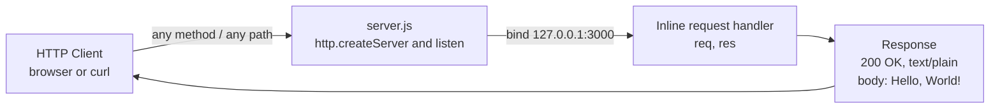

### 1.2.3 Success Criteria

The repository defines no business KPIs, service-level agreements, or numeric performance targets, so none can be reported. The success criteria below are functional and verifiable directly from the code; they describe correct operation of `server.js`.

| Objective | Observable Pass Criterion | Evidence |
|---|---|---|
| Server starts | `node server.js` binds `127.0.0.1:3000` and logs `Server running at http://127.0.0.1:3000/` | `server.js` (lines 12–14) |
| Correct response | Any request returns HTTP `200`, `Content-Type: text/plain`, body `Hello, World!\n` | `server.js` (lines 6–10) |
| Zero-dependency footprint | Runs using only Node.js core APIs; no `npm install` step is required | `package.json`, `package-lock.json` |

**Critical success factors.** Correct operation depends on (1) a working Node.js runtime capable of `require('http')`; (2) TCP port `3000` being free on the loopback interface; and (3) executing the reference file `server.js` rather than the corpus files `300K.js` / `700K.js`.

**Key performance indicators (KPIs).** No KPIs are defined anywhere in the repository. Note also that "passing automated tests" is *not* a success criterion here, because the `package.json` `test` script deliberately fails (`exit 1`) and no test suite is present.


## 1.3 Scope

This section delineates what the repository does and does not deliver, based solely on the files present. The scope is small: the only runtime behavior originates in `server.js`, while the remaining files are metadata, documentation, or large repeated-boilerplate content.

### 1.3.1 In-Scope

**Core features and functionalities.** The must-have, observable capabilities are the following.

| Capability | Description | Evidence |
|---|---|---|
| HTTP server startup | Create and start an HTTP server on `127.0.0.1:3000` using Node.js core `http` | `server.js` |
| Static greeting response | Return `200` / `text/plain` / `Hello, World!\n` for every request | `server.js` |
| Startup logging | Log `Server running at http://127.0.0.1:3000/` to the console on listen | `server.js` |
| Project metadata | Declare name, version, description, author, license, and `test` script | `package.json` |
| Dependency lock | Record an empty dependency graph (`lockfileVersion` 3, no dependencies) | `package-lock.json` |
| Repeated-boilerplate corpus | Provide `300K.js` / `700K.js` as repository content (not a runtime feature) | `300K.js`, `700K.js` |

**Primary user workflow.** The system supports a single workflow: a developer runs `node server.js`, then sends an HTTP request to `http://127.0.0.1:3000/` from a browser or `curl` and receives the static greeting. No other interaction path exists.

**Essential integrations.** The only integration in scope is the Node.js core `http` module operating over the host operating system's TCP/IP stack. There are no third-party integrations.

**Key technical requirements.** A functioning Node.js runtime capable of executing CommonJS and `require('http')`, plus availability of TCP port `3000` on the loopback interface.

**Implementation boundaries.** The boundaries below fix the extent of the system.

| Dimension | Coverage |
|---|---|
| System boundary | A single Node.js process exposing one TCP listener on `127.0.0.1:3000`; no other network, file, or IPC surface |
| User groups | Local developers/learners and local HTTP clients on the same machine |
| Geographic / market coverage | None — loopback-only, not network-exposed, with no deployment or hosting artifacts |
| Data domains | None — no persistent or user data; the only "data" is the constant greeting string and the startup log line |

### 1.3.2 Out-of-Scope

The following capabilities are absent from the codebase and are therefore out of scope.

| Excluded Area | Notes |
|---|---|
| Routing and request differentiation | No path routing, multiple endpoints, or HTTP-method handling; all requests receive `200` |
| Security features | No HTTPS/TLS, authentication, authorization, sessions, or cookies; only `Content-Type` is set |
| State and external data | No databases, persistence, external API calls, caching, or message queues |
| Configuration and observability | No environment variables, config files, structured logging, or custom error handling |
| Delivery pipeline | No tests, CI/CD, build/transpile, linting, containerization, or deployment manifests |
| Module packaging | Not exposed as an importable module — no exports, and the declared `index.js` entry point is absent |
| Corpus execution | Running `300K.js` / `700K.js` as functional applications is unsupported (repeated `listen` on one port) |

**Future phase considerations.** No roadmap, backlog, TODO markers, issues, or design notes exist anywhere in the repository, so no future phases are documented or implied by the code.

**Integration points not covered.** Databases, third-party or external APIs, authentication providers, external networks, and cloud/hosting services are neither present nor referenced.

**Unsupported use cases.** Production hosting, public or remote access, dynamic or multi-route content generation, secure transport, and serving multiple concurrent server instances on port `3000` within a single process are all unsupported by the current implementation.


## 1.4 References

The following repository artifacts were inspected as evidence for this Introduction. No external web sources were used.

**Files**

- `server.js` — Established the single runnable component: a Node.js core `http` server binding `127.0.0.1:3000` and returning `200` / `text/plain` / `Hello, World!\n` to every request, with a startup log message.
- `300K.js` — Established the first large boilerplate corpus (~8.5 MB, 317,694 lines, ~19,856 duplicated server blocks separated by `Repeat` markers); confirmed no exports, classes, or reusable APIs.
- `700K.js` — Established the second large boilerplate corpus (~18.9 MB, 706,208 lines, ~44,138 duplicated server blocks); same repeated structure, non-runnable payload.
- `package.json` — Established project metadata: name `hello_world`, version `1.0.0`, description "Hello world in Node.js", `main` `index.js` (absent), deliberately failing `test` script, author `hxu`, MIT license, and the absence of declared dependencies.
- `package-lock.json` — Established `lockfileVersion` 3 with only a root package entry and no external dependencies.
- `README.md` — Established the repository title (`# 1000KRepo`) and the absence of any further narrative documentation.

**Folders**

- `/` (repository root) — Established the flat structure: six files and no subfolders; no `LICENSE`, `index.js`, `.gitignore`, tests, CI, or configuration files.

**Repository metadata**

- Git repository state (branch `main`; single commit "Add files via upload") — Established that the repository is a single-snapshot sample and confirmed the total volume of ~1,023,916 lines (~1.02 million) across the three `.js` files.


# 2. Product Requirements

## 2.1 Feature Catalog

This catalog decomposes the repository into discrete, testable features derived **strictly** from the artifacts present in the codebase. The system is a deliberately minimal Node.js project (npm name `hello_world`, repository title `1000KRepo`) whose sole runnable component is `server.js`. Consequently, the feature set is small and every feature below is traced to specific file evidence. No features have been inferred beyond observable behavior; where the repository provides no basis for a business, performance, or security claim, that absence is stated explicitly.

The five features fall into three tiers: the runtime server behaviors implemented in `server.js` (F-001, F-002, F-003), the packaging/metadata layer (F-004), and the non-runtime source corpus (F-005). This decomposition aligns directly with the In-Scope capability table documented in Section 1.3.1 and the success criteria in Section 1.2.3.

**Feature Summary**

| Feature ID | Feature Name | Category | Priority |
|---|---|---|---|
| F-001 | HTTP Server Lifecycle Management | Core Runtime / Networking | Critical |
| F-002 | Static Greeting Response | Request Handling | Critical |
| F-003 | Server Startup Logging | Observability | Medium |
| F-004 | Project Packaging & Dependency Management | Build / Packaging Metadata | Medium |
| F-005 | High-Volume Source Corpus | Repository Content (Non-Runtime) | Low |

All five features carry **Status = Completed**, because each is fully present and (for the runtime features) functions per the success criteria in Section 1.2.3. Three implementation gaps are noted where relevant but do not change feature status: the `package.json` `main` field names an absent `index.js`, the `test` script deliberately exits `1`, and the corpus files (F-005) are non-runnable as applications. The status labels available to this specification (Proposed / Approved / In Development / Completed) reduce to **Completed** for every feature because the repository is a single-snapshot baseline (one commit, "Add files via upload") rather than an in-progress backlog.

### 2.1.1 F-001: HTTP Server Lifecycle Management

**Feature Metadata**

| Attribute | Value |
|---|---|
| Unique ID | F-001 |
| Feature Name | HTTP Server Lifecycle Management |
| Feature Category | Core Runtime / Networking |
| Priority Level | Critical |
| Status | Completed |

**Description**

- **Overview:** Creates a single HTTP server instance using the Node.js core `http` module and binds it to the loopback interface `127.0.0.1` on TCP port `3000`, then begins listening for inbound connections. This is the foundational feature on which all request handling depends. Evidence: `server.js` line 1 (`require('http')`), line 6 (`http.createServer(...)`), lines 3–4 (`hostname`/`port` literals), and lines 12–13 (`server.listen(port, hostname, ...)`).
- **Business Value:** Provides the network listener that makes the greeting reachable, serving as the canonical, zero-dependency reference for standing up a Node.js HTTP server. Its value is instructional/illustrative; the repository defines no commercial value (Section 1.1).
- **User Benefits:** A developer or learner can start a working server immediately via `node server.js` with no `npm install` step, then reach it at `http://127.0.0.1:3000/`.
- **Technical Context:** Uses the CommonJS module system and the Node.js event-driven, single-threaded runtime. Host and port are hard-coded literals with no environment-variable or config-file override. The listener is created once per process; there is no clustering, graceful-shutdown handling, or error listener registered on the server object.

**Dependencies**

| Dependency Type | Detail |
|---|---|
| Prerequisite Features | None — this is the root runtime feature. |
| System Dependencies | Node.js runtime capable of `require('http')` (verified available: v22.23.1); host OS TCP/IP stack; TCP port `3000` free on the loopback interface. |
| External Dependencies | None. `package.json` and `package-lock.json` declare zero third-party dependencies. |
| Integration Requirements | Integrates only with the operating system's TCP/IP stack. Supplies the server instance to which F-002 (request handler) is attached, and whose `listen` callback hosts F-003 (startup logging). |

### 2.1.2 F-002: Static Greeting Response

**Feature Metadata**

| Attribute | Value |
|---|---|
| Unique ID | F-002 |
| Feature Name | Static Greeting Response |
| Feature Category | Request Handling |
| Priority Level | Critical |
| Status | Completed |

**Description**

- **Overview:** For every inbound HTTP request — regardless of method or path — the inline request handler sets HTTP status `200`, sets the response header `Content-Type: text/plain`, and returns the body `Hello, World!\n`. Evidence: `server.js` lines 6–10 (`res.statusCode = 200`, `res.setHeader('Content-Type', 'text/plain')`, `res.end('Hello, World!\n')`).
- **Business Value:** Produces the actual observable output of the sample — the greeting — which is the entire purpose of a "Hello, World!" server. No monetary value is defined in the repository.
- **User Benefits:** A deterministic, easily verifiable response that any browser or `curl` request returns identically, making the sample trivial to validate.
- **Technical Context:** Implemented as a single synchronous, inline arrow-function callback passed to `http.createServer`. There is no routing, HTTP-method differentiation, content negotiation, request-body parsing, or error branching; the request object (`req`) is received but not inspected.

**Dependencies**

| Dependency Type | Detail |
|---|---|
| Prerequisite Features | F-001 — the handler is registered on the server instance created by `http.createServer` and only executes once that server is listening. |
| System Dependencies | Node.js `http` `ServerResponse` API (`statusCode`, `setHeader`, `end`). |
| External Dependencies | None. |
| Integration Requirements | Handler is bound at server-creation time (F-001). It consumes the `req` object and writes to the `res` object; no other component or data source is involved. |

### 2.1.3 F-003: Server Startup Logging

**Feature Metadata**

| Attribute | Value |
|---|---|
| Unique ID | F-003 |
| Feature Name | Server Startup Logging |
| Feature Category | Observability |
| Priority Level | Medium |
| Status | Completed |

**Description**

- **Overview:** Once the listener has successfully bound to the host and port, the `listen` callback writes the message `Server running at http://127.0.0.1:3000/` to the console. Evidence: `server.js` lines 12–14 (`console.log` with a template literal interpolating `hostname` and `port`).
- **Business Value:** Confirms successful startup and prints the exact reachable URL, supporting the developer's local workflow. No business/operational KPI is defined for this behavior.
- **User Benefits:** Immediate, human-readable confirmation that the server is listening and the address at which to reach it.
- **Technical Context:** A single `console.log` call using a template literal that interpolates the `hostname` and `port` literals. It executes only inside the `server.listen` callback and therefore fires once per successful bind. Output goes to standard output; there is no structured logging, log level, or log framework.

**Dependencies**

| Dependency Type | Detail |
|---|---|
| Prerequisite Features | F-001 — the log statement lives inside the `server.listen` callback and runs only after a successful bind. |
| System Dependencies | Node.js `console` (standard output stream). |
| External Dependencies | None. |
| Integration Requirements | Physically bundled within the F-001 `listen` callback; shares the `hostname` and `port` constants with F-001. |

### 2.1.4 F-004: Project Packaging & Dependency Management

**Feature Metadata**

| Attribute | Value |
|---|---|
| Unique ID | F-004 |
| Feature Name | Project Packaging & Dependency Management |
| Feature Category | Build / Packaging Metadata |
| Priority Level | Medium |
| Status | Completed (with documented gaps) |

**Description**

- **Overview:** Declares the project's identity, licensing, entry point, and script surface via `package.json`, and records a reproducible, empty dependency graph via `package-lock.json` (`lockfileVersion` 3). Evidence: `package.json` (name `hello_world`, version `1.0.0`, description "Hello world in Node.js", `main` `index.js`, `scripts.test`, author `hxu`, license MIT) and `package-lock.json` (root package entry only, no dependencies).
- **Business Value:** Establishes an npm-recognizable project identity, an explicit MIT license declaration, and a zero-install baseline so the runtime features require no external packages.
- **User Benefits:** Clarity about project name, version, license, and how to (attempt to) run scripts; guarantees `node server.js` needs no `npm install`.
- **Technical Context:** Two documented gaps: (1) `main` names `index.js`, which does not exist in the repository (the runnable file is `server.js`); (2) the `test` script is a placeholder that deliberately prints an error and exits `1`, so `npm test` always fails. No `dependencies` or `devDependencies` keys are present. No `LICENSE` file accompanies the MIT declaration.

**Dependencies**

| Dependency Type | Detail |
|---|---|
| Prerequisite Features | None. |
| System Dependencies | npm / Node package tooling to interpret the manifest and lockfile. |
| External Dependencies | None — the locked dependency graph is empty. |
| Integration Requirements | Consumed by npm and Node package tooling. It describes the project but does not itself invoke or import `server.js`; the `main`/`test` fields do not resolve to runnable targets. |

### 2.1.5 F-005: High-Volume Source Corpus

**Feature Metadata**

| Attribute | Value |
|---|---|
| Unique ID | F-005 |
| Feature Name | High-Volume Source Corpus |
| Feature Category | Repository Content (Non-Runtime Asset) |
| Priority Level | Low |
| Status | Completed |

**Description**

- **Overview:** Provides two very large JavaScript files, `300K.js` (~8.5 MB, 317,694 lines, ~19,856 duplicated server blocks) and `700K.js` (~18.9 MB, 706,208 lines, ~44,138 duplicated server blocks), each consisting of the `server.js` snippet repeated many times and separated by literal `*************************Repeat*************************************` marker lines. Together with `server.js`, the three `.js` files total ~1,023,916 lines, which accounts for the "1000K" in the repository title.
- **Business Value:** Serves purely as a large, uniform source corpus suited to scale-oriented exercises; it explains and justifies the `1000KRepo` naming. It carries no functional application value.
- **User Benefits:** A high-line-count, structurally uniform body of code usable as input for tooling or scale experiments.
- **Technical Context:** Non-runnable as an application: executing either file in one process would call `server.listen(3000)` tens of thousands of times, so only the first bind could succeed and subsequent binds would raise `EADDRINUSE`. The files contain no `module.exports`, classes, or reusable helper APIs.

**Dependencies**

| Dependency Type | Detail |
|---|---|
| Prerequisite Features | None at runtime. The content is textually derived from the same pattern as F-001/F-002 (it is that snippet duplicated), but no other file imports or executes it. |
| System Dependencies | None at rest — the files are inert text. Executing them (unsupported) would require the Node.js runtime. |
| External Dependencies | None. |
| Integration Requirements | None. The corpus files are not referenced, imported, or required by `server.js`, `package.json`, or any other artifact. |

## 2.2 Functional Requirements

This section expresses each feature as one or more testable functional requirements using the identifier format `F-XXX-RQ-YYY`. For every feature, four tables are provided: **Requirement Details** (ID, description, priority, complexity), **Acceptance Criteria** (the observable pass condition for each requirement), **Technical Specifications** (inputs, outputs, performance, data), and **Validation Rules** (business, data, security, compliance). Because the repository defines no performance SLAs, KPIs, security controls, or compliance obligations, those cells report the verified absence rather than inventing targets. All requirements trace to the baseline version `1.0.0` declared in `package.json`.

### 2.2.1 F-001 — HTTP Server Lifecycle Management

**Requirement Details**

| Requirement ID | Description | Priority | Complexity |
|---|---|---|---|
| F-001-RQ-001 | Instantiate an HTTP server using only the Node.js core `http` module | Must-Have | Low |
| F-001-RQ-002 | Bind the server and listen for connections on host `127.0.0.1`, TCP port `3000` | Must-Have | Low |

**Acceptance Criteria**

| Requirement ID | Acceptance Criteria |
|---|---|
| F-001-RQ-001 | Running `node server.js` completes `http.createServer(...)` without throwing and yields a server object; no `npm install` is required. |
| F-001-RQ-002 | After startup, a TCP client can establish a connection to `127.0.0.1:3000`; the process stays alive listening. |

**Technical Specifications**

| Aspect | Detail |
|---|---|
| Input Parameters | None at runtime — no CLI arguments or environment variables. Configuration is hard-coded: `hostname = '127.0.0.1'`, `port = 3000` (`server.js` lines 3–4). |
| Output / Response | A listening TCP socket bound to `127.0.0.1:3000`; the Node.js process remains resident. |
| Performance Criteria | None defined in the repository. Section 1.2.3 specifies only functional pass criteria (binds and logs); no latency, throughput, or concurrency target exists. |
| Data Requirements | None — no configuration store or persisted data; only the two literal constants. |

**Validation Rules**

| Aspect | Detail |
|---|---|
| Business Rules | The listener binds to the loopback address `127.0.0.1` only, so it is intentionally not reachable from other hosts (Section 1.2.1 limitation). |
| Data Validation | None — no request or configuration input is parsed or validated. |
| Security Requirements | None implemented — no TLS/HTTPS, authentication, authorization, or connection filtering (Section 1.3.2). |
| Compliance Requirements | None beyond the MIT license declared for the codebase (`package.json`). |

### 2.2.2 F-002 — Static Greeting Response

**Requirement Details**

| Requirement ID | Description | Priority | Complexity |
|---|---|---|---|
| F-002-RQ-001 | Return HTTP status `200` for every inbound request | Must-Have | Low |
| F-002-RQ-002 | Set the response header `Content-Type: text/plain` | Must-Have | Low |
| F-002-RQ-003 | Return the response body `Hello, World!\n` | Must-Have | Low |

**Acceptance Criteria**

| Requirement ID | Acceptance Criteria |
|---|---|
| F-002-RQ-001 | Any request (any HTTP method, any path) returns status code `200`. |
| F-002-RQ-002 | The response includes header `Content-Type` with value `text/plain`. |
| F-002-RQ-003 | The response body equals exactly `Hello, World!\n` (14 bytes including the trailing newline). |

**Technical Specifications**

| Aspect | Detail |
|---|---|
| Input Parameters | The `req` (`IncomingMessage`) object is received but not inspected — no query string, request body, or header is read. |
| Output / Response | HTTP `200`; header `Content-Type: text/plain`; body `Hello, World!\n`. Identical for every request. |
| Performance Criteria | None defined in the repository. |
| Data Requirements | A single constant greeting string; no dynamic or persisted data. |

**Validation Rules**

| Aspect | Detail |
|---|---|
| Business Rules | One uniform response for all requests — no routing, method handling, or content negotiation (Section 1.3.2). |
| Data Validation | None — request content is neither validated nor sanitized. |
| Security Requirements | None — only `Content-Type` is set; no security headers, cookies, CORS, or CSP are emitted. |
| Compliance Requirements | None defined. |

### 2.2.3 F-003 — Server Startup Logging

**Requirement Details**

| Requirement ID | Description | Priority | Complexity |
|---|---|---|---|
| F-003-RQ-001 | On successful bind, log the reachable server URL to the console | Should-Have | Low |

**Acceptance Criteria**

| Requirement ID | Acceptance Criteria |
|---|---|
| F-003-RQ-001 | After `node server.js`, standard output contains the line `Server running at http://127.0.0.1:3000/`, emitted exactly once, only after the listener binds. |

**Technical Specifications**

| Aspect | Detail |
|---|---|
| Input Parameters | The `hostname` and `port` constants, interpolated into the message template. |
| Output / Response | A single line written to standard output: `Server running at http://127.0.0.1:3000/`. |
| Performance Criteria | None defined in the repository. |
| Data Requirements | None beyond the shared `hostname`/`port` constants. |

**Validation Rules**

| Aspect | Detail |
|---|---|
| Business Rules | The message is emitted from inside the `server.listen` callback, so it appears only after a successful bind. |
| Data Validation | None. |
| Security Requirements | None — the logged URL contains no credentials or secrets; output is plain `stdout`. |
| Compliance Requirements | None. |

### 2.2.4 F-004 — Project Packaging & Dependency Management

**Requirement Details**

| Requirement ID | Description | Priority | Complexity |
|---|---|---|---|
| F-004-RQ-001 | Declare valid npm project metadata in `package.json` | Must-Have | Low |
| F-004-RQ-002 | Maintain a zero-dependency lockfile (`package-lock.json`, `lockfileVersion` 3) | Should-Have | Low |
| F-004-RQ-003 | Provide a `test` script entry in `package.json` | Could-Have | Low |

**Acceptance Criteria**

| Requirement ID | Acceptance Criteria |
|---|---|
| F-004-RQ-001 | `package.json` parses as valid JSON and contains `name`, `version`, `description`, `author`, and `license` fields (`hello_world`, `1.0.0`, "Hello world in Node.js", `hxu`, MIT). |
| F-004-RQ-002 | `package-lock.json` records only the root package entry and no external dependencies; an install adds no third-party packages. |
| F-004-RQ-003 | `npm test` invokes the declared script; as currently written it prints `Error: no test specified` and exits `1` (documented gap — no test suite exists). |

**Technical Specifications**

| Aspect | Detail |
|---|---|
| Input Parameters | None — these are static declarative files consumed by tooling. |
| Output / Response | Parsed project metadata and an empty dependency install graph. |
| Performance Criteria | None defined in the repository. |
| Data Requirements | The declarative metadata fields themselves (name, version, description, main, scripts, author, license). |

**Validation Rules**

| Aspect | Detail |
|---|---|
| Business Rules | Project identity is `hello_world` @ `1.0.0`; declared license is MIT. The `main` field (`index.js`) does not resolve to an existing file (documented gap). |
| Data Validation | Both `package.json` and `package-lock.json` must be valid JSON — verified to parse successfully. |
| Security Requirements | None required — no secrets in the manifests; the empty dependency graph eliminates third-party supply-chain surface. |
| Compliance Requirements | MIT license is declared in both manifests; no `LICENSE` file is present in the repository. |

### 2.2.5 F-005 — High-Volume Source Corpus

**Requirement Details**

| Requirement ID | Description | Priority | Complexity |
|---|---|---|---|
| F-005-RQ-001 | Provide high-line-count source files composed of repeated server blocks delimited by marker lines | Could-Have | Low |

**Acceptance Criteria**

| Requirement ID | Acceptance Criteria |
|---|---|
| F-005-RQ-001 | `300K.js` (317,694 lines) and `700K.js` (706,208 lines) exist; each is the `server.js` snippet repeated and separated by `*************************Repeat*************************************` marker lines, contributing to a ~1,023,916-line total across the three `.js` files. |

**Technical Specifications**

| Aspect | Detail |
|---|---|
| Input Parameters | None. |
| Output / Response | None at rest — the files are inert text. If executed (explicitly unsupported), only the first `server.listen(3000)` block could bind; subsequent blocks would raise `EADDRINUSE`. |
| Performance Criteria | None defined. File sizes are ~8.5 MB (`300K.js`) and ~18.9 MB (`700K.js`). |
| Data Requirements | The repeated source text itself is the data. |

**Validation Rules**

| Aspect | Detail |
|---|---|
| Business Rules | The files are repository content / a source corpus, not runnable applications (Section 1.3.2, "Corpus execution" out of scope). |
| Data Validation | None. |
| Security Requirements | None. |
| Compliance Requirements | None beyond the repository-level MIT license. |

## 2.3 Feature Relationships

This section documents only the relationships that are directly evident in the source code. Because all three runtime features live inside the single file `server.js`, their coupling is explicit and unambiguous; the packaging layer (F-004) and the source corpus (F-005) are effectively standalone.

### 2.3.1 Feature Dependency Map

The runtime features form a small dependency tree rooted at F-001: the request handler (F-002) is registered on the server object F-001 creates, and the startup log (F-003) executes inside F-001's `listen` callback. F-004 and F-005 have no runtime dependency on the others.

| Feature | Depends On | Relationship |
|---|---|---|
| F-001 | — | Root runtime feature; depends on no other feature. |
| F-002 | F-001 | Handler registered on the `server` object created by `http.createServer`. |
| F-003 | F-001 | Log statement runs inside F-001's `server.listen` callback. |
| F-004 | — | Independent packaging layer; does not invoke or import `server.js`. |
| F-005 | — | Textual copy of the F-001/F-002 pattern; no runtime linkage to any feature. |

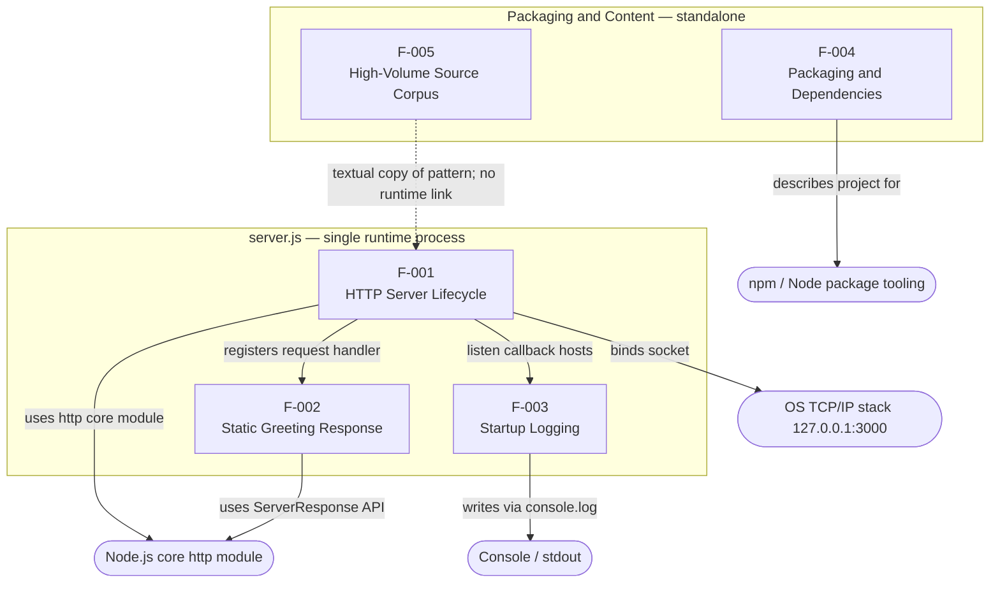

The request/response data flow through the running server (F-001 + F-002) is depicted in the flowchart in Section 1.2.2 and is not duplicated here.

### 2.3.2 Integration Points

The system's only integration surfaces are provided by the Node.js runtime and the host operating system. There are no databases, external APIs, message brokers, or authentication providers.

| Integration Point | Feature(s) | Nature of Integration |
|---|---|---|
| Host OS TCP/IP stack (`127.0.0.1:3000`) | F-001 | Server binds a TCP listener on the loopback interface. |
| Node.js core `http` module | F-001, F-002 | `createServer`/`listen` for the lifecycle; `ServerResponse` API for the response. |
| Standard output (console) | F-003 | Startup message written to `stdout`. |
| npm / Node package tooling | F-004 | Manifests consumed to resolve project metadata and an empty dependency graph. |
| (none) | F-005 | The corpus files are not imported or referenced by any other artifact. |

### 2.3.3 Shared Components

Shared components are limited to the single runtime file and the JavaScript symbols defined within it.

| Shared Component | Shared By | Notes |
|---|---|---|
| `server.js` (single file) | F-001, F-002, F-003 | All three runtime behaviors are implemented in this one 15-line file. |
| `server` object (from `http.createServer`) | F-001, F-002, F-003 | F-002's handler is attached at creation; F-003's log runs in its `listen` callback. |
| `hostname` / `port` constants | F-001, F-003 | The `127.0.0.1` and `3000` literals are reused in both the bind call and the log message. |

### 2.3.4 Common Services

The only common services are Node.js runtime primitives. There is no application-level shared service layer — no helper modules, exported utilities, dependency injection, configuration service, or logging framework exists anywhere in the repository.

| Common Service | Consumers | Provided By |
|---|---|---|
| Node.js core `http` module | F-001, F-002 | Node.js runtime (no third-party package) |
| Node.js `console` (`stdout`) | F-003 | Node.js runtime |
| Node.js CommonJS module loader (`require`) | F-001 | Node.js runtime |

## 2.4 Implementation Considerations

This section records the technical constraints, performance, scalability, security, and maintenance considerations that follow directly from the implementation. Because the repository specifies no numeric performance or scalability targets, those rows describe the observable characteristics of the code rather than stated requirements.

### 2.4.1 F-001 — HTTP Server Lifecycle Management

| Consideration | Detail |
|---|---|
| Technical Constraints | Host and port are hard-coded literals (`127.0.0.1`, `3000`) with no environment-variable or config override; the listener is loopback-only and single-process. No `error` event handler is registered on the server, so a failed bind (e.g., `EADDRINUSE`) would surface as an unhandled error. |
| Performance Requirements | None specified. Behavior is that of the Node.js event-driven, single-threaded runtime; concurrency is bounded by one event loop, and there is no keep-alive, timeout, or socket tuning. |
| Scalability Considerations | Single instance bound to one interface/port; no `cluster`, `worker_threads`, load balancing, or horizontal-scaling mechanism is present. |
| Security Implications | Loopback binding confines exposure to the local host; no TLS, authentication, authorization, or rate limiting exists. The absence of an error listener is an availability risk on bind failure. |
| Maintenance Requirements | Very low surface — a 15-line file with zero dependencies (no upgrade/CVE burden). Changing host/port requires editing source literals; note the `package.json` `main` names a non-existent `index.js`. |

### 2.4.2 F-002 — Static Greeting Response

| Consideration | Detail |
|---|---|
| Technical Constraints | A single static response; no routing, HTTP-method handling, or content negotiation; the request object is not inspected; body and headers are fixed in source. |
| Performance Requirements | None specified. The handler is synchronous with a fixed 14-byte payload and performs no I/O beyond writing the response. |
| Scalability Considerations | The handler is stateless, so it imposes no per-request state growth; however, it is not independently deployable from F-001 (same process). |
| Security Implications | Only `Content-Type` is set — no security headers (HSTS, CSP, etc.). Because no request input is parsed, the injection/attack surface is minimal, and the uniform response discloses no data. |
| Maintenance Requirements | Changing the greeting text or content type requires a source edit; no automated test guards the behavior because the `test` script deliberately fails. |

### 2.4.3 F-003 — Server Startup Logging

| Consideration | Detail |
|---|---|
| Technical Constraints | A single `console.log` with a hard-coded message template; emitted only on successful bind. Nothing is logged for individual requests or for errors. |
| Performance Requirements | None specified. One synchronous write to `stdout` at startup. |
| Scalability Considerations | Not applicable — exactly one line per process start. |
| Security Implications | The logged URL contains no credentials or secrets; plain `stdout` output requires no redaction. |
| Maintenance Requirements | The message is coupled to the `hostname`/`port` constants; there are no log levels, formats, or rotation to maintain. |

### 2.4.4 F-004 — Project Packaging & Dependency Management

| Consideration | Detail |
|---|---|
| Technical Constraints | `main` references an absent `index.js`; the `test` script is a placeholder that exits `1`; there are no build, lint, or CI scripts; MIT is declared but no `LICENSE` file is present. |
| Performance Requirements | Not applicable — these are static, declarative metadata files. |
| Scalability Considerations | Not applicable. |
| Security Implications | The empty dependency graph eliminates third-party supply-chain risk, and the manifests contain no secrets. |
| Maintenance Requirements | Minimal — keep name/version/license accurate. Closing the documented gaps would mean aligning `main` with a real entry point and replacing the placeholder `test` script; the lockfile would need regeneration only if dependencies were ever added. |

### 2.4.5 F-005 — High-Volume Source Corpus

| Consideration | Detail |
|---|---|
| Technical Constraints | Non-runnable as applications — repeated `server.listen(3000)` across tens of thousands of blocks means only the first bind could succeed (rest `EADDRINUSE`). The files are very large (~8.5 MB and ~18.9 MB) and expose no functions or exports. |
| Performance Requirements | None specified. The dominant cost is file size — the three `.js` files total roughly 27.4 MB — which affects editor/tooling load and repository/clone size rather than any runtime metric. |
| Scalability Considerations | The corpus "scales" only by appending more repeated blocks; it is not a runtime scaling concern. |
| Security Implications | The files are inert text with no intended execution, giving a negligible security surface. If executed, only the first block's (no-TLS, no-auth) server would start. |
| Maintenance Requirements | The large, uniform, machine-generated content is effectively unmaintainable by hand; any change to the base snippet would require regenerating the files, and their size inflates every checkout. |

## 2.5 Traceability Matrix and Requirements Governance

This section provides end-to-end traceability from each functional requirement to its source evidence and verification method, followed by the assumptions, constraints, and versioning that govern this requirements set.

### 2.5.1 Requirements Traceability Matrix

Every requirement maps to a specific file and line range and to a verification method aligned with the success criteria in Section 1.2.3.

| Requirement ID | Feature | Source Evidence | Verification Method |
|---|---|---|---|
| F-001-RQ-001 | F-001 | `server.js` L1, L6 | Run `node server.js`; confirm `http.createServer` returns a server without throwing. |
| F-001-RQ-002 | F-001 | `server.js` L3–4, L12–13 | Connect a TCP/HTTP client to `127.0.0.1:3000`; confirm the connection is accepted. |
| F-002-RQ-001 | F-002 | `server.js` L7 | Issue any request; assert response status is `200`. |
| F-002-RQ-002 | F-002 | `server.js` L8 | Inspect response headers; assert `Content-Type: text/plain`. |
| F-002-RQ-003 | F-002 | `server.js` L9 | Read response body; assert it equals `Hello, World!\n`. |
| F-003-RQ-001 | F-003 | `server.js` L12–14 | Capture `stdout`; assert it contains `Server running at http://127.0.0.1:3000/`. |
| F-004-RQ-001 | F-004 | `package.json` L2–10 | Parse `package.json`; assert valid JSON with `name`/`version`/`description`/`author`/`license`. |
| F-004-RQ-002 | F-004 | `package-lock.json` L1–13 | Parse lockfile; assert `lockfileVersion` 3 and no external dependency entries. |
| F-004-RQ-003 | F-004 | `package.json` L6–8 | Run `npm test`; confirm it executes the declared script (currently prints an error and exits `1`). |
| F-005-RQ-001 | F-005 | `300K.js`, `700K.js` | Count lines / `Repeat` markers; confirm repeated `server.js` blocks totaling ~1,023,916 lines across the three `.js` files. |

### 2.5.2 Assumptions and Constraints

**Assumptions.** These conditions are assumed for the requirements to hold and are consistent with the evidence in Sections 1.2–1.3.

| Category | Statement |
|---|---|
| Entry point | The runnable entry point is `server.js`; the `index.js` named by `package.json` `main` is absent and is not relied upon. |
| Execution scope | Only `server.js` is executed to exercise F-001/F-002/F-003; the corpus files (F-005) are not run. |
| Runtime environment | A Node.js runtime capable of `require('http')` is available (verified: v22.23.1) and TCP port `3000` is free on the loopback interface. |
| Status semantics | "Completed" denotes presence and correct functional behavior per Section 1.2.3, not passing automated tests — none exist. |

**Constraints.** These are hard limits imposed by the implementation.

| Category | Statement |
|---|---|
| Network reachability | Loopback-only binding (`127.0.0.1`) — the server is not reachable from other hosts. |
| Configurability | Host and port are hard-coded literals; there is no environment-variable or config-file mechanism. |
| Response behavior | A single static response for all requests; no routing, HTTP-method handling, or content negotiation. |
| Quality tooling | No tests, CI, build, or lint steps; the `test` script deliberately exits `1`. |
| Dependencies | Zero third-party dependencies — only Node.js core APIs are used. |
| Corpus runnability | `300K.js` / `700K.js` are non-runnable as applications (repeated `listen` on port `3000`). |

### 2.5.3 Requirement Versioning and Related Documents

**Requirement versioning.** All requirements in this catalog trace to the baseline version `1.0.0` declared in `package.json`. The repository is a single-snapshot baseline — one commit ("Add files via upload") on branch `main` — with no changelog, roadmap, issue tracker, or TODO markers. Consequently there is no requirement history: every requirement is pinned at `1.0.0`, and there are no superseded, deprecated, or future-phase requirements documented anywhere in the codebase.

**Related documents.** This section should be read together with the following already-established parts of this specification:

| Document / Section | Relevance |
|---|---|
| Section 1.1 Executive Summary | Establishes project identity (`hello_world` / `1000KRepo`), purpose, and the "no commercial value defined" framing. |
| Section 1.2 System Overview | Provides system capabilities, the component inventory, the request/response flowchart (1.2.2), and the functional success criteria (1.2.3) used as verification anchors. |
| Section 1.3 Scope | Defines the In-Scope capability set that this feature catalog decomposes and the Out-of-Scope exclusions cited throughout. |
| Section 1.4 References | Enumerates the same underlying file evidence and the single-commit version-control state. |

## 2.6 References

The following repository artifacts and specification sections were used as evidence for this Product Requirements section. No external web sources were consulted; every claim is grounded in the repository's own files.

**Files**

- `server.js` — Established the three runtime features: F-001 (HTTP server creation and bind on `127.0.0.1:3000`, lines 1, 3–4, 6, 12–13), F-002 (static `200` / `text/plain` / `Hello, World!\n` response, lines 6–10), and F-003 (startup `console.log`, lines 12–14).
- `package.json` — Established F-004 metadata: name `hello_world`, version `1.0.0`, description, `main` `index.js` (absent), the deliberately failing `test` script, author `hxu`, and MIT license; confirmed no declared dependencies.
- `package-lock.json` — Established the zero-dependency lockfile (`lockfileVersion` 3, root package entry only) supporting F-004-RQ-002.
- `300K.js` — Established part of F-005: ~8.5 MB, 317,694 lines, ~19,856 repeated `server.js` blocks separated by `Repeat` markers.
- `700K.js` — Established part of F-005: ~18.9 MB, 706,208 lines, ~44,138 repeated blocks; confirmed the ~1,023,916-line total behind the `1000KRepo` name.
- `README.md` — Established the repository title (`# 1000KRepo`) and the absence of any product/requirements documentation.

**Folders**

- `/` (repository root) — Established the flat structure (six files, no subfolders) that bounds the feature set and confirms the absence of tests, CI, configuration, `LICENSE`, and an `index.js` entry point.

**Cross-Referenced Specification Sections**

- Section 1.1 Executive Summary — Project identity, purpose, and the absence of defined commercial value/KPIs.
- Section 1.2 System Overview — System capabilities, component inventory, the request/response flowchart (1.2.2), and the functional success criteria (1.2.3) used as verification anchors.
- Section 1.3 Scope — The In-Scope capability set decomposed into this feature catalog and the Out-of-Scope exclusions referenced throughout.
- Section 1.4 References — Corroborating file evidence and the single-commit ("Add files via upload", branch `main`) version-control baseline.

# 3. Technology Stack

## 3.1 Programming Languages

The system is implemented in a single programming language. All source code in the repository is JavaScript executed server-side on the Node.js runtime; there is no compiled, transpiled, or secondary language, and no browser/client-side code.

| Language | Standard & Module System | Source Files | Role |
|---|---|---|---|
| JavaScript | ECMAScript 2015 (ES6) language features; CommonJS modules (`require`) | `server.js`, `300K.js`, `700K.js` | HTTP server creation, request handling, and startup logging |

**Language characteristics observed.** `server.js` uses block-scoped `const` declarations, an arrow-function request handler, and a template literal in its startup log — all ECMAScript 2015 features. Modules are loaded with CommonJS `require('http')`; no ECMAScript-module `import`/`export` syntax appears anywhere in the repository. The two large files `300K.js` and `700K.js` are the same JavaScript snippet repeated (approximately 19,856 and 44,138 copies respectively) and introduce no additional language, dialect, or module.

**Selection criteria and justification.** JavaScript on Node.js is the canonical choice for a minimal HTTP "Hello, World!" server: it requires no build toolchain, no type system, and no third-party packages, allowing the entire runnable capability to fit in the 14-line `server.js`. Choosing CommonJS over ES modules keeps the file runnable directly via `node server.js` with no `"type": "module"` declaration or file-extension change.

**Constraints and dependencies.** The code requires a Node.js runtime that provides the core `http` module and CommonJS loading. `package.json` declares no `engines` field, so no minimum Node.js version is pinned; the stable core APIs used are satisfied by any modern Node.js release (the validation environment ran Node.js v22.23.1, which is an environment observation rather than a repository-declared requirement). The declared package version is `hello_world@1.0.0`.

**Security implications.** A single interpreted language with no build step removes transpiler and bundler tooling from the supply chain. Conversely, JavaScript's dynamic typing provides no compile-time guarantees, and the request handler performs no input validation because it never inspects the incoming request (see Section 2.4.2).

## 3.2 Frameworks & Libraries

The system uses no web or application framework and no third-party libraries. Its entire HTTP capability is built directly on a Node.js built-in (core) module.

### 3.2.1 Core Runtime Module — Node.js `http`

The application's only module usage is the Node.js core `http` module, imported on line 1 of `server.js`:

```js
const http = require('http');
const server = http.createServer((req, res) => { /* fixed 200 / text/plain response */ });
```

| Component | Version | APIs Used | Purpose |
|---|---|---|---|
| Node.js core `http` module | Bundled with the Node.js runtime (no independent or pinned version) | `http.createServer()`, `server.listen()`, `res.statusCode`, `res.setHeader()`, `res.end()` | Create and start the HTTP listener and emit the static response |

The `http` module ships as part of Node.js itself; it is not installed from npm and has no version number independent of the runtime.

### 3.2.2 Absence of Application Frameworks and Supporting Libraries

No web framework (for example, Express, Koa, Fastify, Hapi, or NestJS) and no supporting libraries are present anywhere in the repository. There is no router, middleware pipeline, templating engine, validation library, or logging framework — request handling is a single inline arrow function.

**Justification.** For a single static response served by one process, the core `http` module fully satisfies the requirement; adding a framework would introduce dependency management, version pinning, and CVE-patching overhead with no functional gain for this workload.

**Compatibility requirements.** Because the code relies only on the long-stable core `http` API and CommonJS loading, it has no peer-dependency or framework-version constraints and requires no compatibility matrix; it runs unchanged across Node.js major versions that retain these core APIs.

**Security implications.** Zero framework and library code means no framework-level vulnerability surface and no third-party patch cadence. Conversely, no framework-provided protections exist — the response sets only `Content-Type` and no security headers (HSTS, CSP, and similar), consistent with Section 2.4.2.

## 3.3 Open Source Dependencies

The project has zero third-party / open-source dependencies. Its dependency graph is empty.

| Manifest | Field | Value / Finding |
|---|---|---|
| `package.json` | `dependencies` / `devDependencies` | Neither field is present — no declared dependencies |
| `package-lock.json` | `lockfileVersion` | `3` |
| `package-lock.json` | `packages` | Only the root package (`""`) entry; no installed third-party packages |

**Package manager and registry.** npm is the package manager, evidenced by `package.json` and `package-lock.json`. npm's public registry (`registry.npmjs.org`) is the implicit default, but because no dependencies are declared, `npm install` resolves and downloads nothing.

**Lockfile version.** `package-lock.json` declares `lockfileVersion: 3`. Per npm's official documentation, version 3 is the lockfile format used by npm v9 and is backward compatible with npm v7; npm made v3 the default beginning with v9. The lockfile was therefore generated by npm v7 or later (the validation environment reported npm 11.1.0).

**Note on the `http` module.** The only module the code uses, `http`, is a Node.js built-in and is therefore neither an open-source package dependency nor listed in any manifest.

**Security implications.** An empty dependency graph eliminates third-party supply-chain and transitive-CVE risk entirely (consistent with Section 2.4.4): there is no `npm audit` surface and no dependency-update maintenance burden. Deployment requires no dependency-install or build step — only a Node.js runtime.

## 3.4 Third-Party Services

The system integrates with no third-party or external services. The categories below were checked against the source and manifests; none are present.

| Category | Status | Evidence |
|---|---|---|
| External APIs / integrations | None | No HTTP client, SDK, or outbound request in `server.js`; zero dependencies |
| Authentication services | None | No Auth0/OAuth/JWT/session logic or authentication libraries |
| Monitoring / observability | None | Only one startup `console.log`; no APM, metrics, or tracing agent |
| Cloud services | None | No AWS/GCP/Azure SDK, no cloud configuration, no Infrastructure-as-Code |
| Messaging / event brokers | None | No queue or event-bus client |

**Only integration surface.** The sole external interface is the host operating system's TCP/IP stack, on which the Node.js server listens at `127.0.0.1:3000` (Section 1.2.1). The loopback binding means the endpoint is not reachable from other hosts. There are no environment variables, API keys, credentials, or secrets anywhere in the repository.

**Security implications.** With no outbound connections and no stored credentials, there are no third-party trust relationships or secret-management concerns. The absence of an authentication service also means the endpoint itself is unauthenticated; in practice this is mitigated only by its loopback-only exposure and its static, data-free response.

## 3.5 Databases & Storage

The system uses no database and no persistent storage of any kind; it is fully stateless.

| Storage Concern | Status | Evidence |
|---|---|---|
| Primary database | None | No database driver or ORM; zero dependencies |
| Secondary database | None | Not applicable |
| Caching layer | None | No Redis/Memcached client; the response is a source constant |
| Object / file storage | None | No filesystem writes; no cloud-storage SDK |
| Persistence strategy | Stateless | Response body `Hello, World!\n` is hard-coded in `server.js`; nothing is read or written per request |

**Details.** The request handler in `server.js` returns a fixed, in-source string and never reads from or writes to any store; there is no session, cache, or per-request state accumulation (consistent with Section 2.4.2, which notes the handler is stateless). MongoDB — and every other database, cache, or storage service — is absent.

**Security implications.** With no data at rest and no persistence layer, there is no data-store attack surface, no encryption-at-rest requirement, and no personal or sensitive data handling.

## 3.6 Development & Deployment

This subsection covers the tooling used to develop, package, and run the system, and records which build and deployment mechanisms are present versus absent.

### 3.6.1 Development Tools & Version Control

| Tool | Version | Role |
|---|---|---|
| Node.js runtime | Not pinned by the repo (no `engines` field); validation env v22.23.1 | Executes the application via `node server.js` |
| npm | Lockfile format v3 (npm v9 default; v7+); validation env 11.1.0 | Project metadata and dependency management (`package.json`, `package-lock.json`) |
| Git | Repository tracked in a `.git` directory | Source version control |

### 3.6.2 Build System

There is no build system. JavaScript runs directly on Node.js with no transpilation, bundling, or minification step. `package.json` defines only a placeholder `test` script (`echo "Error: no test specified" && exit 1`) and no `build`, `lint`, or `start` scripts; no test framework is present (consistent with Sections 1.2.3 and 2.4.4). The `package.json` `main` field names `index.js`, which does not exist — the actual runnable entry point is `server.js`.

### 3.6.3 Containerization

None. The repository contains no `Dockerfile`, `.dockerignore`, or Compose file. The application is not containerized and runs as a bare Node.js process.

### 3.6.4 CI/CD & Infrastructure as Code

None. There is no `.github/workflows`, GitLab CI, or other pipeline configuration, and no Terraform or other Infrastructure-as-Code definitions. There is consequently no automated build, test, dependency-scan, or deployment pipeline; deployment is performed manually.

### 3.6.5 Runtime & Deployment Model

The system is deployed by running `node server.js`, which starts a single-process, single-event-loop HTTP server bound to the hard-coded address `127.0.0.1:3000` with no environment-variable override. No process manager, clustering, or load balancer is configured, and the loopback binding confines reachability to the local host (Sections 1.2.1 and 2.4.1).

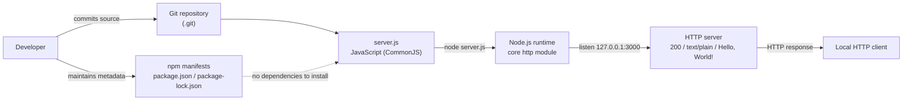

**Security implications.** The absence of CI/CD means no automated dependency or security scanning, and the absence of containerization means process isolation is only whatever the host operator provides. Loopback-only binding is the primary control limiting network exposure.

## 3.7 References

**Repository files examined**

- `server.js` - Established the sole runnable source: JavaScript (ES2015, CommonJS), `require('http')`, HTTP server bound to `127.0.0.1:3000`, static `200`/`text/plain`/`Hello, World!\n` response, and startup `console.log`.
- `package.json` - Established project metadata (`hello_world@1.0.0`, MIT license, author), the absence of `dependencies`/`devDependencies`/`engines`/build scripts, the placeholder failing `test` script, and the `main: index.js` reference to an absent file.
- `package-lock.json` - Established `lockfileVersion: 3` and a dependency graph containing only the root package (zero installed dependencies).
- `300K.js` - Established a repeated JavaScript corpus (8,498,296 bytes / 317,694 lines; approximately 19,856 duplicated server blocks) that introduces no new language or module.
- `700K.js` - Established a larger repeated JavaScript corpus (18,891,064 bytes / 706,208 lines; approximately 44,138 duplicated server blocks).
- `README.md` - Established that documentation is limited to the title `# 1000KRepo`, with no build or deployment instructions.

**Repository folders examined**

- `` (repository root) - Established the flat structure (six files, no subfolders) and the presence of a `.git` directory (Git version control); confirmed the absence of any Docker, CI, IaC, or configuration directories.

**Cross-referenced Technical Specification sections**

- 1.2 System Overview - Confirmed the component inventory, zero-dependency footprint, loopback binding, and absence of external integrations, databases, and third-party services.
- 2.4 Implementation Considerations - Confirmed technical constraints, the stateless handler, and the zero-dependency / no-build / no-CI characterization.

**Web sources**

- [web] npm Docs — package-lock.json (docs.npmjs.com) - Confirmed that `lockfileVersion: 3` is the lockfile format used by npm v9 and is backward compatible with npm v7.
- [web] npm/cli — "use v3 lockfiles by default" commit (github.com/npm/cli) - Confirmed that v3 lockfiles became the npm default beginning with npm v9.

# 4. Process Flowchart

## 4.1 System Workflows

This section documents the runtime workflows of the system exactly as implemented, grounded in the six-file repository. The only runnable artifact is `server.js` (Section 2.1, features **F-001** HTTP Server Lifecycle Management, **F-002** Static Greeting Response, and **F-003** Server Startup Logging); the large files `300K.js` and `700K.js` are inert source corpus (**F-005**) and contribute no additional workflow. Because the server performs no routing, reads no request content, and calls no external system, its entire behavior reduces to two elementary workflows: a **startup / lifecycle workflow** that binds the listener, and a **request–response workflow** that returns one static greeting to every caller. There are no multi-step business transactions, no queues, and no scheduled jobs.

A note on scope and evidentiary honesty: several workflow categories that a Process Flowchart section typically enumerates — multi-actor business processes, external system integrations, event/batch pipelines, authorization checkpoints, and persistence/transaction boundaries — are **not present** in this codebase. Where that is the case, this section states the verified absence rather than inventing behavior, consistent with the Out-of-Scope items in Section 1.3.2 and the "none defined / none implemented" findings recorded throughout Sections 2.2 and 2.4.

### 4.1.1 Core Business Processes

The single business process the system performs is *serve a static greeting over HTTP*. It comprises two cooperating flows — process startup and request handling — spanning four actors / system boundaries.

**Actors and system boundaries**

| Actor / Boundary | Role in the workflow | User touchpoint | Evidence |
|---|---|---|---|
| Developer / Operator | Starts the process; reads the startup log | CLI command `node server.js`; process `stdout` | `server.js` (L12–14); `package.json` |
| Host OS + Node.js runtime | Loads the module, runs the single event loop, binds the TCP socket | OS TCP/IP stack (loopback interface) | `server.js` (L1, L6, L12) |
| HTTP server process (`server.js`) | Listens on `127.0.0.1:3000`; dispatches each request to the inline handler | TCP port `3000` | `server.js` (L6–13) |
| HTTP client (browser / `curl`) | Sends any request; receives the greeting | `http://127.0.0.1:3000/` | Verified via `curl` (200 / text/plain) |

**End-to-end user journeys**

- **Operator startup journey (F-001, F-003):** `node server.js` → the runtime loads the CommonJS module and creates the server → it binds the loopback port → on success it runs the `listen` callback, which logs `Server running at http://127.0.0.1:3000/`. This log line is the only feedback the operator receives; there is no readiness probe, health endpoint, graceful-shutdown hook, or process-manager integration (Sections 2.4.1 and 3.6.5).
- **Client request journey (F-002):** the client opens a TCP connection to `127.0.0.1:3000` and sends any HTTP request; the server replies `200 OK`, header `Content-Type: text/plain`, body `Hello, World!\n` — identically for every method and path. This was verified empirically with `GET /`, `GET /anything?x=1`, and `POST /`, all returning the same 14-byte response.

**Decision points.** The only decision in the entire system occurs once, at bind time; request handling is unconditional.

| ID | Decision point | Location | Outcomes | Evidence |
|---|---|---|---|---|
| D1 | Is loopback port `3000` available to bind? | `server.listen(...)` | **Yes** → `listening` event → serve requests; **No** → unhandled `error` (`EADDRINUSE`) → process exits (see Section 4.3.2) | `server.js` (L12); empirical `EADDRINUSE` test |
| — | Request path / method routing | Request handler | **None** — every request is handled identically; the `req` object is never inspected (0 references to `req.url` / `req.method`) | `server.js` (L6–10) |

**High-level system workflow.** The diagram below uses swim lanes for each actor/boundary. The `Yes` branch of decision **D1** leads to normal service; the `No` branch is the sole error path (detailed in Section 4.3.2).

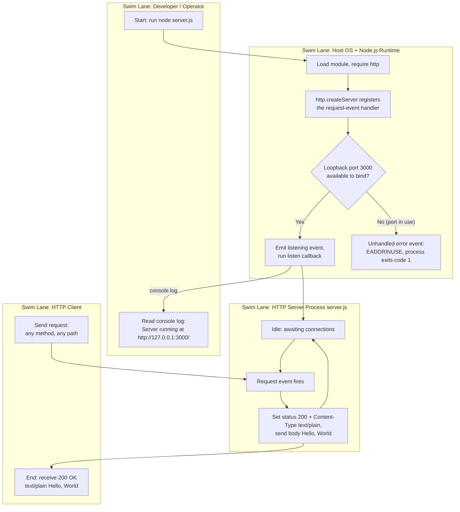

**Timing and SLA considerations.** The repository defines no service-level agreements, latency budgets, or throughput targets (Sections 1.2.3, 2.2). Startup completes in a single synchronous pass with no I/O beyond the socket bind. Observed local round-trip latency for a request was sub-millisecond (~0.4 ms in the validation environment); this is an empirical observation, **not** a committed SLA.

### 4.1.2 Integration Workflows

The system integrates with exactly one external boundary — the host operating system's TCP/IP stack, and only on the loopback interface. It has **no** databases, message brokers, third-party APIs, authentication providers, cloud services, or outbound network calls (Sections 1.2.1, 3.4, 3.5; `package-lock.json` records zero dependencies). The "integration workflows" requested for this section therefore reduce to (a) the inbound HTTP data flow across the OS boundary and (b) Node.js's internal event dispatch.

- **Data flow between systems.** A single inbound path exists: `Client → OS loopback → Node http.Server → inline handler → response → Client`. No data is persisted, transformed, forwarded, or emitted to any other system; the response body is a compile-time constant (`Hello, World!\n`).
- **API interactions.** The server exposes one implicit, catch-all HTTP "endpoint": every request, regardless of verb or path, yields the same response (requirements **F-002-RQ-001/002/003**). There are no versioned routes, no request-body parsing, no content negotiation, and no outbound API calls to integrate with.
- **Event processing flows.** The application is event-driven through Node.js's single event loop. `http.createServer(handler)` registers the inline handler as the server's `request`-event listener, and `server.listen(port, host, callback)` registers the startup `callback` as a one-time `listening`-event listener. These two events constitute the entire event surface — there are no custom `EventEmitter` instances, no publish/subscribe, and no stream pipelines.
- **Batch processing sequences.** None. There is no cron scheduler, worker pool, job queue, or background task. The high-volume corpus files (`300K.js`, `700K.js`, feature **F-005**) are inert text rather than batch jobs; executing one as a single process would attempt tens of thousands of `server.listen(3000)` calls and fail after the first bind with `EADDRINUSE` (Section 2.4.5).

**Integration sequence diagram.** The sequence below traces one request across the OS boundary and through the Node.js event dispatch to the response. The `keep-alive` note reflects a Node.js runtime default observed in the response headers, not application-configured behavior.

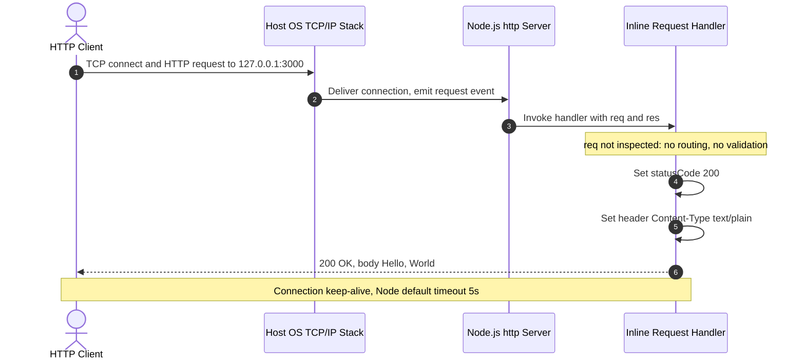

**Timing and SLA considerations.** No integration SLAs exist because there are no integrations to govern. The only timing artifact observable at this boundary is the Node.js default HTTP keep-alive socket timeout of 5 seconds (`Keep-Alive: timeout=5`, seen in the response headers); the application code sets no keep-alive, request, or socket timeouts of its own (Section 2.4.1).

## 4.2 Detailed Process Flows and Validation Rules

This section decomposes each runnable workflow into its concrete implemented steps, marks its decision diamonds, error states, and recovery paths, and then consolidates the validation, authorization, and compliance checkpoints that apply at each step. Two detailed flows exist: the **startup / lifecycle flow** (features **F-001** and **F-003**) and the **request–response flow** (feature **F-002**). Every step below is traceable to a specific line in `server.js`.

### 4.2.1 Server Startup and Lifecycle Flow (F-001, F-003)

The startup flow runs once per process. It loads the module, registers the request handler, attempts to bind the loopback socket, and — on success — logs the reachable URL. The single decision diamond is the bind outcome; its failure branch is the only error state in the whole system and has no recovery path (see Section 4.3.2).

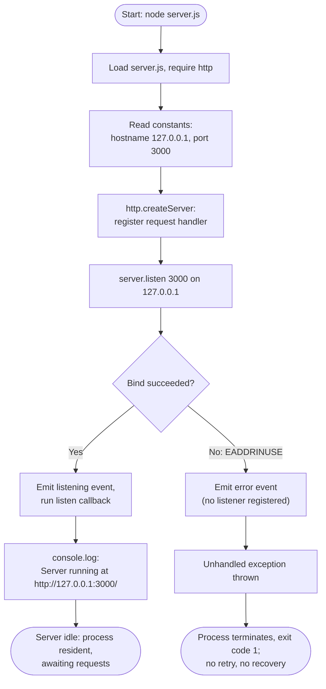

**Process steps.** (1) `require('http')` loads the core module (`server.js` L1); (2) the `hostname`/`port` literals are read (L3–4); (3) `http.createServer(handler)` creates the server and registers the request-event handler (L6); (4) `server.listen(port, hostname, callback)` requests the bind (L12); (5) on success the `listening` event fires and the callback runs `console.log` (L12–14); (6) the process then stays resident because the active server handle keeps the event loop alive.

**Timing considerations.** Startup is a single synchronous pass; the only latency is the OS bind call. No startup SLA, warm-up, or readiness gate is defined (Sections 1.2.3, 2.4.1). Requirement **F-003-RQ-001** requires the log line to appear exactly once and only after a successful bind — which the flow guarantees because the `console.log` lives inside the `listen` callback.

### 4.2.2 Request–Response Processing Flow (F-002)

The request flow is deliberately linear: there are **no** routing, method, validation, or authorization decision diamonds. The `req` object is received but never inspected, so every request follows the identical three-step response path. The only decision shown is a runtime-level one — whether the kept-alive socket receives another request before Node's default 5-second keep-alive timeout elapses.

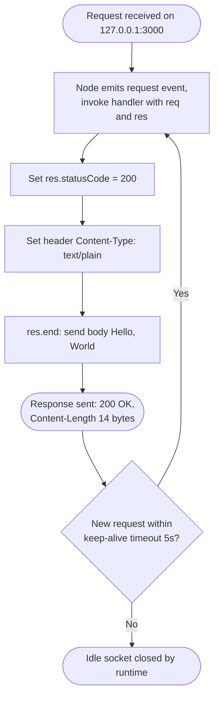

**Process steps.** (1) A request on port `3000` causes Node to emit the `request` event and invoke the inline handler (`server.js` L6); (2) `res.statusCode = 200` (L7, requirement **F-002-RQ-001**); (3) `res.setHeader('Content-Type', 'text/plain')` (L8, **F-002-RQ-002**); (4) `res.end('Hello, World!\n')` writes the 14-byte body and finishes the response (L9, **F-002-RQ-003**). The handler is synchronous and performs no I/O beyond writing the response.

**Timing and SLA considerations.** No per-request SLA is defined; observed local latency was sub-millisecond (~0.4 ms). The `Content-Length: 14` and `Date` headers, plus `Connection: keep-alive` with a 5-second timeout, are emitted by the Node.js runtime, not by application code (Section 2.4.1). Because handling is single-threaded on one event loop, concurrency is bounded by that loop; no timeout, rate limit, or back-pressure control exists in the code.

### 4.2.3 Validation Rules, Authorization, and Compliance Checkpoints

This subsection enumerates the validation, authorization, and compliance checkpoints requested for a Process Flowchart section and records their status as verified in the code. The findings mirror the per-feature Validation Rules tables in Sections 2.2.1 and 2.2.2. In short: the system enforces two implicit business rules and performs **no** input validation, authorization, or regulatory-compliance checks.

**Checkpoint categories**

| Checkpoint category | Status in this system | Evidence |
|---|---|---|
| Business rules | Two implicit rules: (1) the listener binds the loopback address `127.0.0.1` only, so it is intentionally unreachable from other hosts; (2) every request receives the same `200` / `text/plain` / greeting response | `server.js` (L3–4, L6–10); Sections 2.2.1, 2.2.2 |
| Data validation | None — the `req` object is never parsed; no query string, body, or header is read or sanitized | `server.js` (L6–10) |
| Authorization checkpoints | None — no authentication, authorization, session, token, API key, or access-control logic exists; no TLS is configured | `server.js`; Sections 2.2.2, 2.4.1 |
| Regulatory compliance | None — no personal or regulated data is handled and no audit logging exists; the only compliance-adjacent artifact is the MIT license declaration (with no `LICENSE` file present) | `package.json`, `package-lock.json`; Section 2.2.4 |

**Business rules enforced per step (mapped to functional requirements)**

| Workflow step | Business rule enforced | Requirement | Evidence |
|---|---|---|---|
| Bind listener | Bind loopback `127.0.0.1:3000` only; not reachable off-host | F-001-RQ-002 | `server.js` (L3–4, L12) |
| Startup log | Emit the URL only after a successful bind (inside the `listen` callback) | F-003-RQ-001 | `server.js` (L12–14) |
| Accept request | Accept every request regardless of method or path — no rejection or filtering | F-002-RQ-001 | `server.js` (L6) |
| Send response | Always return `200`, `Content-Type: text/plain`, body `Hello, World!\n` | F-002-RQ-001/002/003 | `server.js` (L7–9) |

Because none of the authorization or compliance checkpoints are implemented, they introduce no decision diamonds into the flows in Sections 4.2.1 and 4.2.2 — a fact that materially simplifies both diagrams and is called out here to avoid the impression that such gates were merely omitted from the illustrations.

## 4.3 Technical Implementation Flows

This section covers the two technical-implementation concerns a Process Flowchart section must address — state management and error handling — as they are actually realized in `server.js`. Both are minimal by construction: the process holds only in-memory lifecycle state, and it registers no error, retry, or recovery logic.

### 4.3.1 State Management

The application maintains a single, coarse-grained process state machine and no per-request business state. The handler is stateless: it reads nothing from the request and stores nothing between requests, so every invocation is independent.

**Process states**

| State | Meaning | Entered by | Exited by |
|---|---|---|---|
| Initializing | Module loaded, server object created, bind requested | `node server.js` | Bind result (success or failure) |
| Listening | Bound to `127.0.0.1:3000`; event loop alive; awaiting connections | Successful bind | `request` event or process termination |
| Handling | Executing the inline handler for one request | `request` event | `res.end` (response sent) |
| Terminated | Process no longer running | `EADDRINUSE` at startup, or an OS signal | — |

**State transitions.** The diagram below shows the lifecycle. The `Listening ⇄ Handling` cycle repeats for every request; there is no accumulation of state across the cycle.

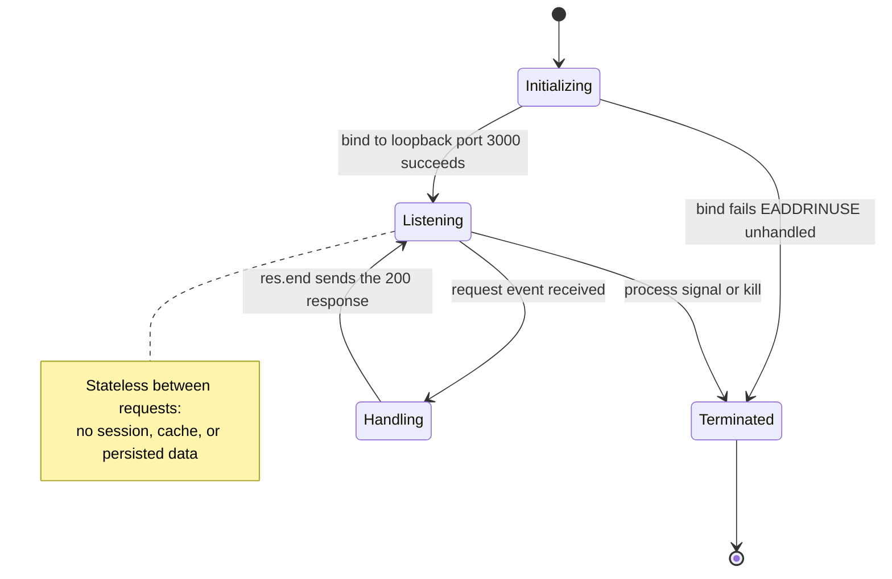

**Data persistence points, caching, and transaction boundaries.** All three are absent, consistent with Section 3.5 (no databases or storage) and the stateless handler.

| Concern | Status in this system | Evidence |
|---|---|---|
| Data persistence points | None — no database, file writes, or session store. The only in-memory state is the server object and the `hostname`/`port` constants, all lost on exit | `server.js`; Section 3.5 |
| Caching | None — no cache layer and no HTTP caching headers (no `Cache-Control`, `ETag`, or `Last-Modified`). The response is a compile-time constant, so nothing is computed to cache | `server.js` (L7–9) |
| Transaction boundaries | None — there are no database or multi-step transactions. Each request is an independent, synchronous, all-or-nothing write of one fixed response | `server.js` (L6–10) |

### 4.3.2 Error Handling

Error handling in this codebase is limited to Node.js's default behavior for an unhandled event. The application registers no `error` listener on the server, no `try`/`catch` in the handler, and no process-level `uncaughtException`/`unhandledRejection` hooks. There is therefore no application-defined retry, fallback, notification, or recovery logic.

| Mechanism | Status in this system | Evidence |
|---|---|---|
| Retry | None — a single `server.listen` call with no re-bind or reconnect attempt | `server.js` (L12); Section 2.4.1 |
| Fallback | None — no alternate port, degraded mode, or backup path | `server.js` |
| Error notification | On an unhandled `error` event, the runtime prints the stack trace and error object (`code: 'EADDRINUSE'`, `errno: -98`, `syscall: 'listen'`) to `stderr` and sets exit code `1`. There is no structured logging, alerting, or monitoring integration | Empirical `EADDRINUSE` test; Section 2.4.1 |
| Recovery | Manual only — the operator frees port `3000` and re-runs `node server.js`; no process manager, supervisor, or orchestrator is configured to auto-restart | Section 3.6.5 |

**Error-handling flow.** The only exercised error path is a startup bind failure, verified empirically: launching a second instance while the first holds port `3000` crashes the second process. The diagram contrasts the actual (no-listener) path with the absent recovery branch.

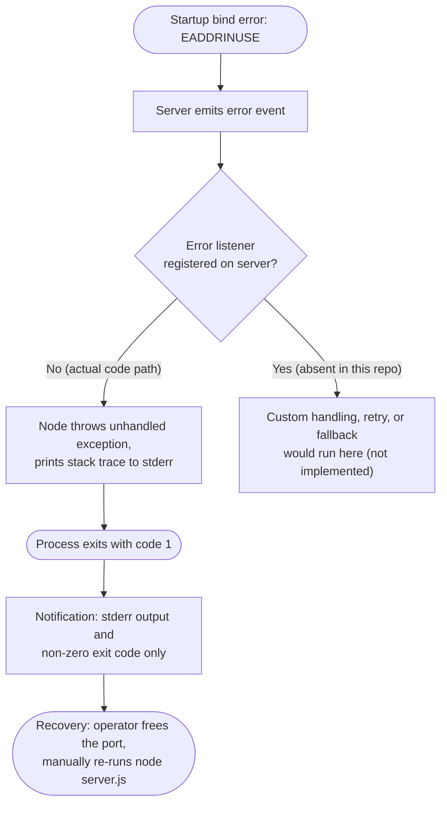

**Request-time errors.** The request handler executes only fixed, synchronous `ServerResponse` calls (`statusCode`, `setHeader`, `end`) and reads no input, so it has no failing operation under normal use; none was observed across the `GET`/`POST` probes. Should any unexpected exception ever be thrown at request time, the same absence of `try`/`catch` and process-level handlers means it would propagate as an uncaught exception and terminate the process — the identical failure mode as the startup path, with the same manual-restart recovery.

## 4.4 References

The following repository artifacts, technical-specification sections, and empirical checks were used as evidence for the workflows and diagrams in Section 4.

**Repository files and folders**

- `server.js` — The single runnable program; source of every process step, decision point, state, and the startup/request/error flows (lines 1–14: `require('http')`, `hostname`/`port` literals, `http.createServer` handler with `200` / `text/plain` / `Hello, World!\n`, and `server.listen` with the startup `console.log`).
- `300K.js` — Verified as inert, repeated boilerplate (317,694 lines; 19,855 `Repeat` markers); established that the corpus files define no additional workflow (feature F-005).
- `700K.js` — Same repeated pattern at larger scale (706,208 lines; 44,138 `Repeat` markers); confirmed no batch/scheduled-job behavior.
- `package.json` — Established zero declared dependencies, the MIT license, the placeholder `test` script, and the absent `index.js` entry point.
- `package-lock.json` — Confirmed a zero-dependency graph (`lockfileVersion` 3), corroborating the absence of external integrations.
- `README.md` — Confirmed the repository contains no additional workflow or process documentation (single line `# 1000KRepo`).
- Repository root (`/`) — Confirmed the flat, six-file structure with no subfolders, hence no service/controller/worker layers to document.

**Cross-referenced technical-specification sections**

- `1.2 System Overview` — Reused the documented capabilities, the request/response data-flow diagram (1.2.2), and the functional success criteria (1.2.3).
- `1.3 Scope` — Basis for the explicitly out-of-scope capabilities (no routing, auth, persistence, integrations).
- `2.1 Feature Catalog` — Source of feature identifiers F-001 through F-005 referenced throughout Section 4.
- `2.2 Functional Requirements` — Source of requirement identifiers (F-001-RQ-002, F-002-RQ-001/002/003, F-003-RQ-001) and the per-feature Validation Rules that Section 4.2.3 consolidates.
- `2.4 Implementation Considerations` — Confirmed the absence of an `error` listener and of keep-alive/timeout/socket tuning in code, and the single-event-loop concurrency model.
- `3.4 Third-Party Services` — Confirmed there are no external services to integrate with.
- `3.5 Databases & Storage` — Confirmed the absence of persistence and caching used in Section 4.3.1.
- `3.6 Development & Deployment` — Source of the single-process, manual `node server.js` deployment/recovery model and its deployment flowchart (3.6.5).

**Empirical verification (validation environment, Node.js v22.23.1)**

- [runtime] Ran `node server.js` and probed with `curl` — confirmed identical `200 OK` / `text/plain` / `Hello, World!\n` responses to `GET /`, `GET /anything?x=1`, and `POST /`, the `Content-Length: 14` and `Connection: keep-alive` / `Keep-Alive: timeout=5` response headers, and sub-millisecond local latency.
- [runtime] Forced `EADDRINUSE` by launching a second instance on port `3000` — confirmed the unhandled-`error` crash path (stack trace to `stderr`, exit code `1`, first instance unaffected) underpinning Section 4.3.2.

No external web sources were required for this section.

# 5. System Architecture

## 5.1 High-Level Architecture

This section describes the architecture of the `hello_world` project (repository title `1000KRepo`) exactly as implemented across its six flat files. The system is a single-process Node.js HTTP server built directly on the platform's core `http` module; there are no subfolders, no application frameworks, and no external dependencies (Sections 3.2, 3.3, 3.5). Where the prompt anticipates constructs that a larger distributed system would exhibit — external integrations, caches, data stores, message brokers, authentication tiers — this section records their **verified absence** rather than inventing them, consistent with the findings of Sections 1.2, 3.4, and 4.1.

### 5.1.1 System Overview

**Architectural style and rationale.** The system is a **single-process, single-threaded, event-driven monolith**. There is exactly one runnable artifact (`server.js`), one loaded module, and one inline request handler. Concurrency follows the Node.js event-loop model: `http.createServer(handler)` registers the inline arrow function as the server's `request`-event listener, and `server.listen(port, hostname, callback)` registers the startup callback as a one-time `listening`-event listener. These two events constitute the entire event surface of the application. The rationale is grounded in the code and restated in Section 3.2.2: for a single static response served by one process, the core `http` module fully satisfies the requirement, and introducing a web framework or additional tiers would add dependency-management, version-pinning, and CVE-patching overhead with no functional gain for this workload.

**Key architectural principles and patterns (as observed).**

- **Zero-dependency, minimal surface:** `package.json` and `package-lock.json` declare no dependencies (`lockfileVersion` 3, root package entry only); the only module referenced anywhere is the built-in `http`.
- **Stateless request handling:** the handler reads nothing from the request and stores nothing between requests, so every invocation is independent and idempotent (Section 4.3.1).
- **Static, deterministic response:** every request — regardless of HTTP method or path — yields status `200`, header `Content-Type: text/plain`, and body `Hello, World!\n` (`server.js` lines 6–10). The `req` object is received but never inspected (zero references to `req.url` / `req.method`).
- **CommonJS modularity, no build step:** modules load via `require`; there is no ESM, transpilation, bundling, or minification (Section 3.6.2).
- **Convention-over-configuration at its limit:** host (`127.0.0.1`) and port (`3000`) are hard-coded literals with no environment-variable or configuration-file override.

**System boundaries and major interfaces.**

- **Process boundary:** a single Node.js OS process started with `node server.js`. All state (the server object and the `hostname`/`port` constants) is held in memory and is lost on exit.
- **Network boundary:** one inbound TCP listener bound to the loopback interface `127.0.0.1:3000`. The loopback binding confines reachability to the local host; the endpoint is not addressable from other machines.
- **Sole external interface:** the host operating system's TCP/IP stack (Sections 1.2.1, 3.4). There is no database, cache, message broker, third-party API, authentication provider, or cloud service.
- **Outbound interfaces:** limited to the process's standard streams — `stdout` receives the single startup log line, and `stderr` receives a stack trace only on an unhandled error (Sections 4.1.1, 4.3.2).

The following context diagram depicts these boundaries. The Node.js process (and its handler) sits inside the host, and — because binding is loopback-only — every client and the operator also reside on the same local host.

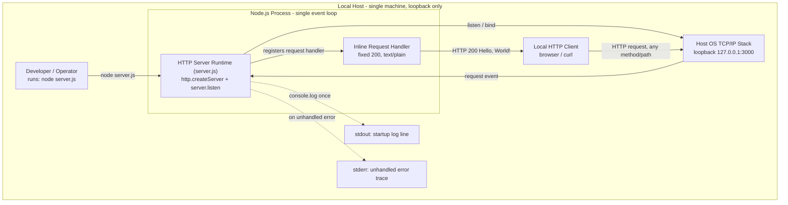

### 5.1.2 Core Components

The repository comprises one runnable component and three supporting content/metadata assets, mapped to the features catalogued in Section 2.1. Because the requested component inventory (Component, Primary Responsibility, Key Dependencies, Integration Points, Critical Considerations) exceeds the four-column limit, it is presented as two linked tables keyed on the component name.

**Table A — Responsibilities and dependencies**

| Component | Primary Responsibility | Key Dependencies |
|---|---|---|
| HTTP Server Runtime — `server.js` | Create and start the HTTP listener on `127.0.0.1:3000` and return the static greeting to every request (F-001, F-002, F-003) | Node.js runtime; core `http` module; a free TCP port `3000` on the loopback interface |
| Packaging & Metadata — `package.json`, `package-lock.json` | Declare project identity, MIT license, the `test` script, and a locked, empty dependency graph (F-004) | npm / Node package tooling; `lockfileVersion` 3 |
| High-Volume Source Corpus — `300K.js`, `700K.js` | Provide ~1,023,916 total `.js` lines of repeated server boilerplate as an inert source corpus (F-005) | None at rest — the files are inert text |
| Documentation — `README.md` | Provide a title-only readme (`# 1000KRepo`) | None |

**Table B — Integration points and critical considerations**

| Component | Integration Points | Critical Considerations |
|---|---|---|
| HTTP Server Runtime — `server.js` | Inbound HTTP over the OS TCP/IP loopback; `stdout`/`stderr` | No `error` listener is registered, so an unhandled `error` (e.g., `EADDRINUSE`) terminates the process; loopback-only reachability; hard-coded host/port |
| Packaging & Metadata | Consumed by npm tooling; does not import or invoke `server.js` | `main` names a non-existent `index.js`; the `test` script always exits `1`; no `LICENSE` file despite the MIT declaration |
| High-Volume Source Corpus | None — not referenced, imported, or required by any file | Non-runnable as an application: repeated `server.listen(3000)` would fail after the first bind with `EADDRINUSE` |
| Documentation | None | Contains no operational or architectural guidance |

### 5.1.3 Data Flow Description

**Primary data flow.** The system has exactly one data flow. A client opens a TCP connection to `127.0.0.1:3000` and sends any HTTP request; the OS delivers the connection to the Node.js process, which emits a `request` event; the inline handler sets status `200`, sets the `Content-Type: text/plain` header, and writes the fixed body `Hello, World!\n`; the response returns over the same connection. The end-to-end path is `Client → OS loopback → Node http.Server → inline handler → response → Client`. No data is persisted, forwarded, aggregated, or emitted to any other system.

**Integration patterns and protocols.** The only wire protocol is HTTP/1.1 over TCP on the loopback interface. Communication is a synchronous request/response exchange; there is no asynchronous messaging, streaming, publish/subscribe, or outbound call. The server exposes a single implicit, catch-all endpoint — every verb and path yields the identical reply — with no versioned routes, request-body parsing, or content negotiation (Section 4.1.2).

**Data transformation points.** None. The response body is a compile-time string constant in `server.js`; because the request is never read, no parsing, validation, deserialization, mapping, or serialization occurs at any point in the flow.

**Key data stores and caches.** None. The system is fully stateless (Section 3.5): there is no primary or secondary database, no ORM or driver, no caching layer (no Redis/Memcached client and no HTTP cache headers such as `Cache-Control`, `ETag`, or `Last-Modified`), and no file or object storage. The only in-memory state is the server object and the two configuration constants, all discarded at process exit.

### 5.1.4 External Integration Points

The system's only external integration surface is the host operating system's TCP/IP stack, exposed as a single inbound HTTP listener on the loopback interface. Because the requested table (System Name, Integration Type, Data Exchange Pattern, Protocol/Format, SLA Requirements) exceeds the four-column limit, the SLA dimension is documented in prose below the table.

**Active external interface**

| External Interface | Integration Type | Protocol / Format | Data Exchange Pattern |
|---|---|---|---|
| Host OS TCP/IP stack — loopback `127.0.0.1:3000` | Inbound network listener | HTTP/1.1 over TCP; response body `text/plain` | Synchronous request/response; catch-all, one static reply for all methods/paths |

**SLA requirements.** The repository defines **no** service-level agreement, latency budget, or throughput target for this interface (Sections 1.2.3, 4.1). The only timing artifact observable at the boundary is the Node.js default HTTP keep-alive socket timeout of 5 seconds (`Keep-Alive: timeout=5` in the response headers); this is a runtime default, not application-configured behavior, and is not a committed SLA.

**Integration categories checked and verified absent.** The following external-system categories were checked against the source and manifests (Section 3.4) and are not present:

| Category | Status in this system |
|---|---|
| External APIs / outbound integrations | None — no HTTP client, SDK, or outbound request; zero dependencies |
| Authentication / identity providers | None — no OAuth/JWT/session logic or auth library |
| Databases / caches / object storage | None — fully stateless, no persistence layer |
| Messaging / event brokers | None — no queue or event-bus client |
| Cloud services / monitoring / APM | None — no cloud SDK, IaC, or telemetry agent |

## 5.2 Component Details

This section details each component identified in Section 5.1.2 along the five dimensions requested — purpose and responsibilities, technologies and frameworks, key interfaces and APIs, data persistence requirements, and scaling considerations — followed by the required interaction, state, and sequence diagrams. Only one component (`server.js`) is runnable; the remaining components are supporting content or metadata, so their persistence and scaling characteristics are documented as "not applicable" where that is the accurate finding.

### 5.2.1 HTTP Server Runtime (`server.js`)

**Purpose and responsibilities.** `server.js` is the sole runnable component and the system's single point of behavior. It creates one HTTP server instance, binds it to `127.0.0.1:3000`, serves the fixed greeting to every inbound request, and logs a single startup message. It implements features F-001 (HTTP Server Lifecycle Management), F-002 (Static Greeting Response), and F-003 (Server Startup Logging).

**Technologies and frameworks.** The component uses only the Node.js core `http` module — bundled with the runtime and carrying no independent version — loaded via CommonJS `require`. The code uses ES2015 syntax (`const`, an arrow-function handler, and a template literal in the log statement). There is **no** web framework, router, middleware pipeline, templating engine, or logging library (Section 3.2.2). Node.js itself is not version-pinned (no `engines` field); the validation environment observed in Section 3.6 was Node.js v22.23.1.

```js
const server = http.createServer((req, res) => {
  res.statusCode = 200; res.setHeader('Content-Type', 'text/plain'); res.end('Hello, World!\n');
});
```

**Key interfaces and APIs.**

- **Inbound interface:** HTTP/1.1 over TCP on `127.0.0.1:3000`, exposed as a single implicit catch-all endpoint (every method and path is handled identically).
- **Node.js APIs consumed:** `http.createServer()`, `server.listen(port, hostname, callback)`, `res.statusCode`, `res.setHeader()`, and `res.end()`.
- **Outbound interface:** `console.log` to `stdout` for the startup line; `stderr` receives a stack trace only on an unhandled error.
- **Exported API:** none — the module has no `module.exports`; it executes purely for the side effect of starting a server.

**Data persistence requirements.** None. The handler is stateless: it reads nothing from the request and stores nothing between requests. The only in-memory state is the server object and the `hostname`/`port` constants, all discarded at process exit. There is no database, cache, session store, or file write (Sections 3.5, 4.3.1).

**Scaling considerations.** The component runs as a single process on a single event loop with no clustering (`cluster` / `worker_threads` are not used), no process manager, and no load balancer (Section 3.6.5). The loopback binding confines it to the local host. Node's event loop provides non-blocking concurrency, and because the handler performs a negligible, fixed synchronous write, per-request work is minimal; however, any horizontal or network scaling (binding a routable interface, adding clustering or a reverse proxy) is **not implemented** and would require code and deployment changes not present in the repository.

### 5.2.2 Project Packaging & Metadata (`package.json`, `package-lock.json`)

**Purpose and responsibilities.** These two files declare the project's identity, license, and script surface, and record a reproducible, empty dependency graph. They implement feature F-004 (Project Packaging & Dependency Management).

**Technologies and frameworks.** The npm manifest format (`package.json`) and the npm lockfile format (`package-lock.json`, `lockfileVersion` 3, which corresponds to the npm v9 default and is generated by npm v7+). No build, lint, or start tooling is configured.

**Key interfaces and APIs.** Consumed by the npm / Node package tooling. `package.json` exposes the fields `name` (`hello_world`), `version` (`1.0.0`), `description`, `main` (`index.js`), `scripts.test`, `author`, and `license` (MIT). There are no `dependencies` or `devDependencies` keys. These files do not import or invoke `server.js`.

**Data persistence requirements.** Not applicable — these are static on-disk metadata files, not a runtime persistence mechanism.

**Scaling considerations.** Not applicable. Two documented gaps affect operability rather than scale: `main` names a non-existent `index.js` (the runnable file is `server.js`), and the `test` script deliberately prints an error and exits `1`, so `npm test` always fails.

### 5.2.3 High-Volume Source Corpus (`300K.js`, `700K.js`)

**Purpose and responsibilities.** The two files provide a large, structurally uniform body of source text: `300K.js` (~8.5 MB, 317,694 lines, ~19,856 duplicated server blocks) and `700K.js` (~18.9 MB, 706,208 lines, ~44,138 duplicated server blocks). Together with `server.js`, the three `.js` files total ~1,023,916 lines, which accounts for the `1000K` in the repository title. They implement feature F-005 (High-Volume Source Corpus).

**Technologies and frameworks.** JavaScript / CommonJS source text (each block is a byte-identical copy of the `server.js` snippet, separated by literal `*************************Repeat*************************************` marker lines). At rest the files are inert; they are not executed by the application.

**Key interfaces and APIs.** None. The files contain no `module.exports`, classes, or reusable helper APIs, and they are not referenced, imported, or required by `server.js`, the manifests, or any other artifact.

**Data persistence requirements.** None — the files store no runtime data and perform no I/O at rest.

**Scaling considerations.** The files are themselves a scale artifact (line count), not a scalable runtime. They are **non-runnable as an application**: executing either in one process would call `server.listen(3000)` tens of thousands of times, so only the first bind could succeed and every subsequent bind would raise `EADDRINUSE`.

### 5.2.4 Component Interaction, State, and Sequence Diagrams

The three diagrams below satisfy the required component-interaction, state-transition, and sequence views for the runtime component. They are consistent with the workflow and state diagrams in Sections 4.1 and 4.3.

**Component interaction diagram.** This view shows how the internal pieces of `server.js` wire together at startup and at request time, including the two terminal output streams and the single bind decision.

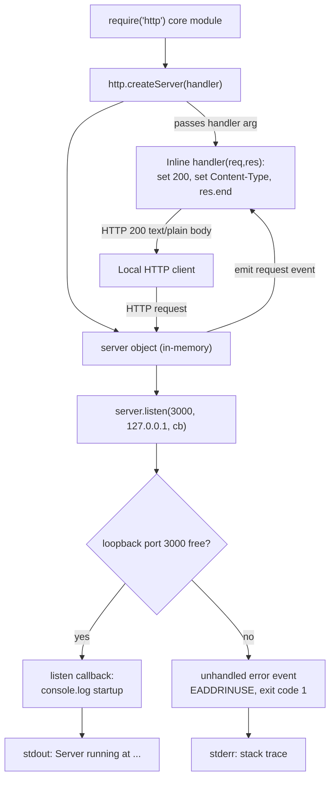

**State transition diagram.** The runtime holds a single coarse-grained process state machine and no per-request business state; the `Listening ⇄ Handling` cycle repeats for every request with no accumulation of state (Section 4.3.1).

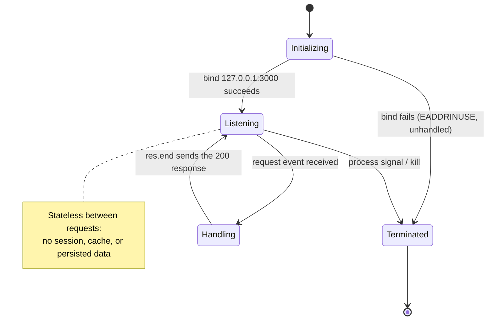

**Sequence diagram (request → response).** This traces one request across the OS boundary and through Node's event dispatch to the fixed response. The keep-alive note reflects a Node.js runtime default observed in the response headers, not application-configured behavior (Section 4.1.2).

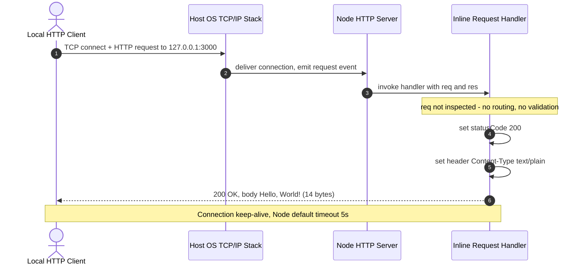

## 5.3 Technical Decisions

The repository contains no design documents or architecture-decision records; it is a single-snapshot baseline (one commit, "Add files via upload"). The decisions documented here are therefore **reconstructed from the implemented code and manifests**, and each is tied to observable evidence. The rationale statements restate justifications already made explicit in Sections 3.2.2, 3.5, and 3.6 rather than introducing new claims. The table below summarizes the decisions; the subsections that follow provide the tradeoffs, a decision tree, and formal ADRs.

| Decision Area | Decision Taken (as implemented) | Primary Rationale |
|---|---|---|
| Architecture style | Single-process, event-driven monolith on the Node.js core `http` module | Minimal surface fully satisfies a one-response workload |
| Communication pattern | Synchronous HTTP/1.1 request/response; single catch-all endpoint | No routing, negotiation, or async messaging is required |
| Data storage | None — fully stateless | The response is a compile-time constant; nothing to persist |
| Caching | None | A constant response has nothing to compute or cache |
| Security mechanism | Loopback-only network binding | Confines exposure without adding auth/TLS code |

### 5.3.1 Architecture Style Decisions and Tradeoffs

The system was built as a single-process, single-threaded, event-driven monolith directly on the core `http` module rather than on a web framework or a multi-tier design. As Section 3.2.2 states, for a single static response served by one process the core `http` module fully satisfies the requirement, while a framework would add dependency management, version pinning, and CVE-patching overhead with no functional gain.

| Dimension | Benefit of the choice | Cost / Limitation |
|---|---|---|
| Dependency surface | Zero third-party packages; no `npm install`, no supply-chain or patch cadence | No framework-provided routing, middleware, or security headers |
| Footprint & startup | Tiny file (342 B) that starts in a single synchronous pass | Hard-coded host/port; no configuration flexibility |
| Concurrency model | Event loop handles many concurrent connections without threads | Single thread/core; no built-in high availability |

### 5.3.2 Communication Pattern Choice

The sole communication pattern is synchronous HTTP/1.1 request/response over TCP, exposed as a single implicit catch-all endpoint that answers every method and path identically (Section 4.1.2). No asynchronous messaging, streaming, publish/subscribe, or outbound call pattern is used, and the `req` object is never inspected.

| Aspect | Benefit of the choice | Cost / Limitation |
|---|---|---|
| Request handling | Deterministic, trivially verifiable behavior for any client | No routing, HTTP-method differentiation, or content negotiation |
| Payload contract | Fixed 14-byte `text/plain` body; no parsing needed | No request-body handling, versioned routes, or structured payloads |

### 5.3.3 Data Storage and Caching Strategy

The system is fully stateless: it uses no database, ORM/driver, session store, file, or object storage, and no caching layer (Sections 3.5, 4.3.1). This is a direct consequence of the response being an in-source constant — there is nothing to read, write, or cache, and no HTTP cache-control headers (`Cache-Control`, `ETag`, `Last-Modified`) are set.

| Aspect | Benefit of the choice | Cost / Limitation |
|---|---|---|
| Persistence | No data-at-rest attack surface; no encryption-at-rest requirement | No dynamic, per-user, or durable content is possible |
| Caching | No cache-invalidation complexity; response is already constant | No cache headers means clients/proxies cannot cache the reply |

### 5.3.4 Security Mechanism Selection

The single implemented security control is **loopback-only network binding** (`127.0.0.1`), which confines reachability to the local host (Sections 1.2.1, 3.4). The code implements no TLS, no authentication or authorization, and no security response headers — only `Content-Type` is set (Section 3.2.2). There are no environment variables, API keys, credentials, or secrets anywhere in the repository, so there is no secret-management surface. The endpoint is therefore unauthenticated, mitigated in practice only by its loopback exposure and its static, data-free response.

| Aspect | Benefit of the choice | Cost / Limitation |
|---|---|---|
| Network exposure | Not reachable from other hosts; minimal remote attack surface | No defense-in-depth if ever bound to a routable interface |
| Credentials | No stored secrets to leak or rotate | No identity, access control, or auditing exists |

### 5.3.5 Decision Tree

The following decision tree reconstructs the design questions and the answers implied by the implemented behavior. Each "No" branch is grounded in an observable fact (e.g., zero references to `req.url`/`req.method`, a constant response body, the loopback literal, and the absence of clustering code); the "Yes" branches denote alternatives that were **not** implemented.

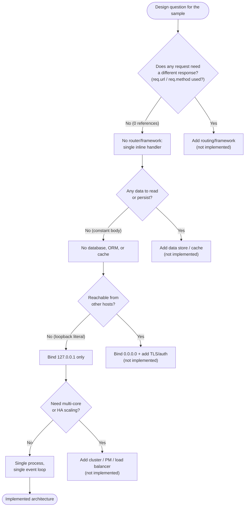

### 5.3.6 Architecture Decision Records (ADRs)

The following ADRs are recorded retrospectively; the repository holds no pre-existing ADR documents. Each records a decision the code embodies, its context, and its consequences. Status is "Accepted (as-built)" for every record because the code is a completed baseline.

**ADR-01 — Build on the Node.js core `http` module; no web framework**

| Attribute | Detail |
|---|---|
| Status | Accepted (as-built) |
| Context | A single static greeting served by one local process (F-001, F-002) |
| Decision | Use `require('http')` and an inline handler; adopt no Express/Koa/Fastify/Nest framework |
| Consequences | Zero dependency and patching overhead (Section 3.2.2); but no framework-provided routing, middleware, or security headers |

**ADR-02 — Single-process, single-event-loop runtime**

| Attribute | Detail |
|---|---|
| Status | Accepted (as-built) |
| Context | Local reference sample invoked via `node server.js` (Section 3.6.5) |
| Decision | Run one process on one event loop; no `cluster`, `worker_threads`, process manager, or load balancer |
| Consequences | Trivial operation; but no multi-core utilization, no high availability, and an unhandled `error` terminates the process |

**ADR-03 — Stateless design with no data store or cache**

| Attribute | Detail |
|---|---|
| Status | Accepted (as-built) |
| Context | The response body is a compile-time constant (F-002) |
| Decision | Persist nothing; use no database, cache, or session store |
| Consequences | No data-at-rest attack surface and no encryption-at-rest requirement (Section 3.5); but no dynamic or durable content is possible |

**ADR-04 — Loopback-only binding as the network exposure control**

| Attribute | Detail |
|---|---|
| Status | Accepted (as-built) |
| Context | No authentication or TLS is implemented (Sections 3.2.2, 3.4) |
| Decision | Bind the listener to `127.0.0.1` rather than a routable interface |
| Consequences | Endpoint is not remotely reachable — the primary control limiting exposure; remote use would require adding auth/TLS not present today |

## 5.4 Cross-Cutting Concerns

Cross-cutting concerns in this system are minimal by construction: most are realized only through Node.js runtime defaults, and several are absent entirely. Consistent with the evidentiary approach of Sections 4.1 and 4.3, each concern below is documented with its verified status, and absences are stated plainly rather than inferred or invented.

### 5.4.1 Monitoring and Observability

The only application-emitted observability signal is the single startup log line produced by feature F-003 (`Server running at http://127.0.0.1:3000/`). There is no health or readiness endpoint, no metrics exposition (e.g., Prometheus), no Application Performance Monitoring (APM) or tracing agent, and no dashboards or alerting (Sections 3.4, 4.1.1). Because the response is a fixed constant, there are also no business or request metrics to emit.

| Capability | Status in this system | Evidence |
|---|---|---|
| Startup signal | Single `console.log` line on successful bind | `server.js` L12–14 (F-003) |
| Health / readiness probe | None | `server.js`; Section 4.1.1 |
| Metrics endpoint / exporter | None | No metrics library; zero dependencies |
| APM / tracing agent | None | Section 3.4 |

### 5.4.2 Logging and Tracing

Logging is limited to one `console.log` write to `stdout` at startup; on an unhandled error, the Node.js runtime writes the error object and stack trace to `stderr`. There is no structured logging, no log levels, and no logging framework (Section 2.1.3). Because the system is a single synchronous process with no outbound calls, there is no request/access logging, no correlation or trace identifiers, and no distributed tracing.

| Concern | Status in this system | Evidence |
|---|---|---|
| Application log | One startup line to `stdout` | `server.js` L13 |
| Error output | Unhandled-error stack trace to `stderr` (runtime default) | Section 4.3.2 |
| Structured logs / levels / framework | None | `server.js`; zero dependencies |
| Correlation IDs / distributed tracing | None | Single process; no outbound calls |

### 5.4.3 Error Handling Patterns

The application registers no `error` listener on the server, no `try`/`catch` in the handler, and no process-level `uncaughtException` / `unhandledRejection` hooks (Section 4.3.2). Consequently there is no application-defined retry, fallback, notification, or recovery logic. The one exercised error path is a startup bind failure: when port `3000` is already held, `server.listen` emits an `error` event that, being unhandled, surfaces as an uncaught exception — the runtime prints the stack trace (`code: 'EADDRINUSE'`, `errno: -98`, `syscall: 'listen'`) to `stderr` and the process exits with code `1`. The request handler performs only fixed synchronous `ServerResponse` calls and reads no input, so it has no failing operation under normal use; any unexpected request-time throw would propagate identically and terminate the process.

| Mechanism | Status in this system | Evidence |
|---|---|---|
| Retry | None — a single `server.listen` call, no re-bind | `server.js` L12; Section 4.3.2 |
| Fallback | None — no alternate port or degraded mode | `server.js` |
| Error notification | `stderr` stack trace + non-zero exit code only | Section 4.3.2 |
| Recovery | Manual — operator frees the port and re-runs | Sections 3.6.5, 4.3.2 |

The following diagram shows the actual (no-listener) error path for both startup and any hypothetical request-time throw, contrasted with the absent recovery branch.

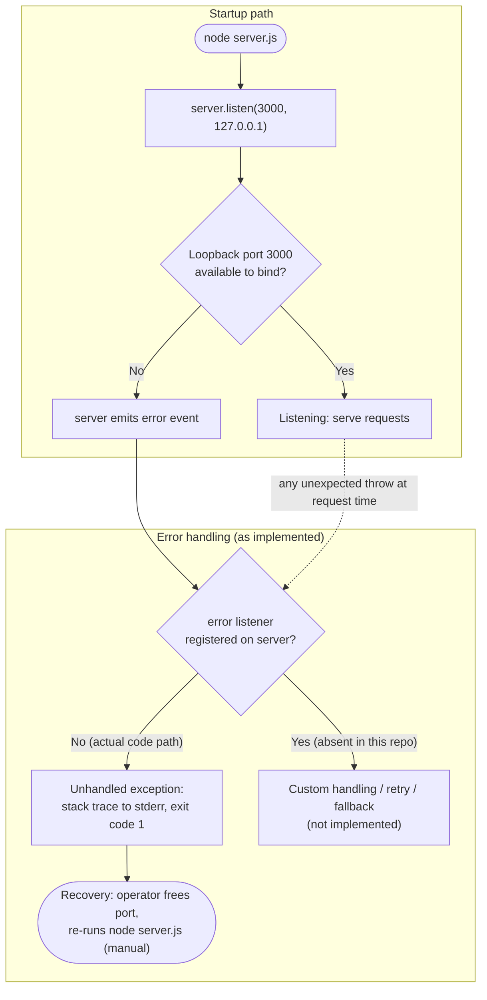

### 5.4.4 Authentication and Authorization

There is no authentication or authorization framework. The code contains no OAuth/JWT/session logic, no identity provider integration, no role- or attribute-based access control, and no API keys (Sections 3.2.2, 3.4). The single catch-all endpoint is therefore unauthenticated and accepts every request identically. The only mitigating control is the loopback-only binding (Section 5.3.4), which prevents remote access; the static, data-free response means no sensitive data is exposed even locally.

| Aspect | Status in this system | Evidence |
|---|---|---|
| Authentication | None — endpoint is open | Sections 3.2.2, 3.4 |
| Authorization / access control | None — no roles, scopes, or policies | `server.js` |
| Identity provider / secrets | None — no credentials or keys in repo | Section 3.4 |
| Compensating control | Loopback-only binding | `server.js` L3, L12 |

### 5.4.5 Performance Requirements and SLAs

The repository defines **no** service-level agreements, latency budgets, throughput targets, or KPIs (Sections 1.2.3, 4.1). The request handler is a single synchronous write of a 14-byte body, so per-request CPU work is negligible. The only timing artifact at the network boundary is the Node.js default HTTP keep-alive socket timeout of 5 seconds (`Keep-Alive: timeout=5`), a runtime default rather than application-configured behavior. A local round-trip of roughly 0.4 ms was observed in the Section 4.1 validation environment; this is an empirical observation, **not** a committed SLA. Throughput is bounded by the single event loop / single core, and the repository contains no load-testing evidence.

| Aspect | Value / Status | Source |
|---|---|---|
| Defined SLA / latency / throughput target | None | Sections 1.2.3, 4.1 |
| Keep-alive socket timeout | 5 s (Node.js runtime default, not app-set) | Section 4.1.2 |
| Observed local round-trip | ~0.4 ms (empirical, not an SLA) | Section 4.1.1 |
| Concurrency ceiling | Single event loop / single core | Section 3.6.5 |

### 5.4.6 Disaster Recovery

No disaster-recovery procedures, backups, high-availability topology, failover, or auto-restart are configured. Because the system is fully stateless (Section 3.5), there is no runtime data to back up or restore; the source itself is recoverable from Git (a single commit, "Add files via upload"). After a crash — whether an `EADDRINUSE` bind failure or any uncaught exception — recovery is manual: the operator frees port `3000` and re-runs `node server.js`. No process manager, supervisor, or orchestrator is configured to restart the process automatically (Sections 3.6.5, 4.3.2), and no Recovery Time Objective (RTO) or Recovery Point Objective (RPO) is defined.

| DR Aspect | Status in this system | Evidence |
|---|---|---|
| Data backup / restore | Not applicable — stateless, no data at rest | Section 3.5 |
| Source recoverability | Recoverable from Git history | Section 3.6.1 |
| Automated restart / failover | None — no process manager or orchestrator | Section 3.6.5 |
| Recovery procedure | Manual: free port, re-run `node server.js` | Section 4.3.2 |
| RTO / RPO | None defined | Sections 1.2.3, 4.1 |

## 5.5 References

The following repository artifacts and previously authored Technical Specification sections were examined as evidence for this System Architecture section. No external web sources were required.

**Repository files and folders**

- `server.js` — Established the sole runnable component: creation of the HTTP server via the core `http` module, loopback binding to `127.0.0.1:3000`, the static `200` / `text/plain` / `Hello, World!\n` response for every request, the inline stateless handler, and the single startup `console.log`.
- `300K.js` — Confirmed the high-volume source corpus (~8.5 MB, 317,694 lines, ~19,856 duplicated server blocks separated by `Repeat` markers) and its non-runnable, `EADDRINUSE`-inducing nature.
- `700K.js` — Confirmed the second corpus file (~18.9 MB, 706,208 lines, ~44,138 duplicated blocks); together with `server.js` the three `.js` files total ~1,023,916 lines.
- `package.json` — Established project identity (`hello_world` 1.0.0), MIT license, the `main` (`index.js`, absent) and `test` (always exits `1`) fields, and the absence of any `dependencies`/`devDependencies`.
- `package-lock.json` — Established `lockfileVersion` 3 with only a root package entry, confirming a zero-dependency graph.
- `README.md` — Confirmed a title-only readme (`# 1000KRepo`) with no operational or architectural guidance.
- Repository root (`/`) — Confirmed the flat structure of exactly six files with no subfolders and no configuration, deployment, or infrastructure artifacts.

**Cross-referenced Technical Specification sections**

- `1.2 System Overview` — System context, component inventory/metrics, and the baseline request/response flow.
- `2.1 Feature Catalog` — Feature identifiers F-001 through F-005 used throughout this section.
- `3.2 Frameworks & Libraries` — Confirmed the core-`http`-only design, absence of any framework, and absence of security headers.
- `3.4 Third-Party Services` — Confirmed the OS TCP/IP loopback stack as the only integration surface and the absence of external services, auth, monitoring, cloud, and messaging.
- `3.5 Databases & Storage` — Confirmed the fully stateless design (no database, cache, or object storage).
- `3.6 Development & Deployment` — Runtime/environment facts (Node.js v22.23.1 validation env, npm 11.1.0, `lockfileVersion` 3, Git), and the single-process deployment model with no build system, containerization, CI/CD, or process manager.
- `4.1 System Workflows` — Startup and request/response workflows, the integration sequence, timing/keep-alive default, and the observed ~0.4 ms local round-trip.
- `4.3 Technical Implementation Flows` — The process-state machine and error-handling behavior (unhandled `EADDRINUSE`, `errno -98`, exit code `1`, manual recovery).

# 6. SYSTEM COMPONENTS DESIGN

## 6.1 Core Services Architecture

### 6.1.1 Architecture Classification and Applicability Assessment

**Core Services Architecture is not applicable for this system.**

The `hello_world` project (repository title `1000KRepo`) is a single-process, single-threaded, event-driven monolith. It has exactly one runnable artifact — `server.js` — which creates one in-memory HTTP listener on the loopback address `127.0.0.1:3000` and returns a fixed response to every request (Section 5.1). There are no microservices, no distributed components, no independently deployable service units, and no inter-service communication. Consequently, the service-oriented concerns this section is meant to document — service boundaries and discovery, inter-service communication, load balancing, circuit breaking, auto-scaling, and failover — have no corresponding implementation. Following the evidentiary approach of Sections 5.1 and 5.4, this section records the **verified absence** of these constructs rather than inventing them.

The classification is grounded in the following observations, each verified directly against the repository source and manifests. Because no multi-service topology exists, the table is limited to the discriminating criteria and their evidence (three columns).

| Classification Criterion | Finding in This System | Evidence |
|---|---|---|
| Independently deployable services | One (a single Node.js process) | `server.js`; `package.json` declares a single project |
| Process / concurrency model | Single process, single event loop, single core | Section 5.1.1; no `cluster`, `child_process`, or `worker_threads` reference found |
| Inter-service communication | None | Sole `require` anywhere is core `http`; no RPC, gRPC, queue, or HTTP-client code |
| Service registry / discovery | None | Host/port hard-coded to `127.0.0.1:3000`; no Consul/etcd/ZooKeeper |
| API gateway / load balancer | None | No reverse-proxy or LB configuration (Section 3.6.5) |
| Asynchronous messaging / event broker | None | No AMQP/Kafka/Redis client; no message-bus code |
| Containerization / orchestration | None | No `Dockerfile`, Compose, or Kubernetes manifest (Sections 3.6.3–3.6.4) |
| Runtime dependencies | Zero | `package-lock.json` records only the root package (`lockfileVersion` 3) |

**Why the pattern does not apply.** A core-services (microservices / distributed) architecture exists to decompose a system into independently deployable, independently scalable units that collaborate over a network and therefore require discovery, load balancing, and failure-isolation machinery between them. This repository has a single unit of deployment and a single unit of failure: one Node.js process. The only network boundary is one inbound HTTP listener bound to the loopback interface, and the only external interface is the host operating system's TCP/IP stack (Section 5.1.4). Because the process performs no outbound calls and depends on no other runtime service (zero dependencies in `package-lock.json`), there is nothing to discover, balance, break a circuit around, or fail over to.

For completeness and to satisfy the review scope, subsections 6.1.2 through 6.1.4 still walk through each requested concern — service components, scalability design, and resilience patterns — documenting the verified status of each alongside the minimal single-process reality that stands in place of the distributed pattern. The two large files `300K.js` and `700K.js` do not alter this classification: they are inert, non-runnable source corpus consisting of the same server block repeated tens of thousands of times (19,856 and 44,138 `listen` occurrences respectively), all targeting the same port `3000`, so only the first bind in any single process could ever succeed (Sections 2.1, 5.1.2). They are not additional services.

The topology below depicts the single deployable unit alongside the distributed constructs that were checked and found absent.

**Figure 6.1.1-1 — System Topology: One Deployable Unit; Distributed Service Constructs Verified Absent**

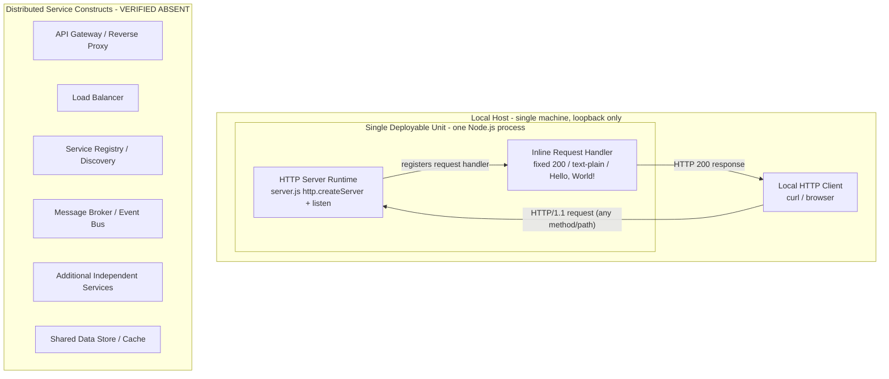


### 6.1.2 Service Components Analysis

This system exposes a single service surface. The entire application is one Node.js process whose only responsibility is to accept inbound HTTP connections on `127.0.0.1:3000` and return the fixed body `Hello, World!\n` with status `200` and header `Content-Type: text/plain` to every request, regardless of method or path (`server.js`; Sections 4.1, 5.1.3). Because there is no second service, the remaining service-component concerns in the prompt describe machinery that would sit *between* services — and none of it exists here. Each concern is addressed below with its verified status.

| Service-Component Concern | Status in This System | Basis / Evidence |
|---|---|---|
| Service boundaries & responsibilities | One boundary — the single process *is* the whole service; responsibility limited to serving one static HTTP response | `server.js` L6–14; Section 5.1.2 |
| Inter-service communication patterns | None — no second service exists to communicate with (no RPC, gRPC, queue, or outbound HTTP client) | Sole `require` is core `http`; Section 5.1.3 |
| Service discovery mechanisms | None — the endpoint is a hard-coded literal, never resolved from a registry or environment | `server.js` L3–L4, L12; no registry client |
| Load balancing strategy | None — a single instance receives all traffic directly on the loopback listener | Section 3.6.5; no proxy/LB configuration |
| Circuit breaker patterns | None — there is no downstream dependency to protect with a breaker | Section 5.4.3; no circuit-breaker library |
| Retry & fallback mechanisms | None — a single `server.listen` call, no re-bind, no alternate port, no degraded mode | `server.js` L12; Section 5.4.3 |

**Service boundary and responsibility (the one component present).** The boundary is a process boundary that coincides with a single network boundary. Inside it, `http.createServer(handler)` registers the inline arrow function as the server's `request`-event listener, and `server.listen(port, hostname, callback)` registers the startup callback as a one-time `listening`-event listener; these two events constitute the entire event surface of the service (Section 5.1.1). The handler reads nothing from the request and stores nothing between requests, so the service is fully stateless and every invocation is independent (Section 4.3.1).

**Communication, discovery, load balancing, and fault-isolation (all absent).** With no peer service, there is no request routing between services, no synchronous or asynchronous inter-service protocol, and nothing to register in or look up from a discovery mechanism — the listener address is the compile-time literal `127.0.0.1:3000`. A single instance answers every request directly, so no load-balancing algorithm (round-robin, least-connections, hashing) is configured or needed. Circuit breakers, retries, and fallbacks are patterns for tolerating failures in calls to *other* services; because the process makes no such calls, none of these patterns are implemented (Section 5.4.3).

The service-interaction sequence below shows the complete request path. Note that it contains no hop to any other service — the exchange begins and ends with the single process.

**Figure 6.1.2-1 — Service Interaction: Single Request/Response Path with No Inter-Service Hop**

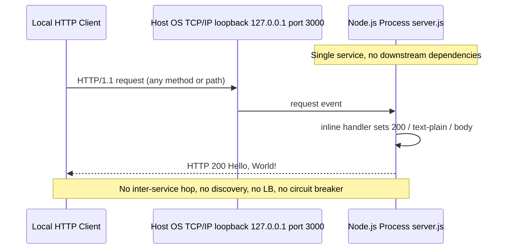


### 6.1.3 Scalability Design

No scalability mechanism is implemented. The application runs as one Node.js process on a single event loop, which — absent `cluster`, `worker_threads`, or multiple load-balanced instances — is bound to a single CPU core (Sections 3.6.5, 5.4.5). The host and port are hard-coded literals (`127.0.0.1:3000`) with no environment-variable override, so even running a second copy on the same host would require a code change to avoid an `EADDRINUSE` bind collision (Section 5.4.3). Each scalability dimension requested by the prompt is addressed below.

| Scalability Aspect | Status in This System | Basis / Evidence |
|---|---|---|
| Horizontal scaling | Not implemented — no clustering, no multi-instance deployment, no load balancer | Section 3.6.5; no `cluster`/`worker_threads` code |
| Vertical scaling | Only conceptual lever; throughput is bound by one event loop on one core and is not configured or tuned | Section 5.4.5 |
| Auto-scaling triggers & rules | None — no orchestrator or autoscaler, and no metrics endpoint to trigger on | Sections 3.6.3–3.6.4, 5.4.1 |
| Resource allocation strategy | None — no CPU/memory requests or limits; the process uses whatever the host grants | No container/orchestration configuration present |
| Performance optimization techniques | None applied — no caching, compression, or connection pooling in code; low per-request cost is inherent to the trivial workload | Sections 5.1.3, 5.4.5 |
| Capacity planning guidelines | None defined — no SLA, throughput target, or load-test evidence in the repository | Sections 1.2.3, 5.4.5 |

**Scaling approach.** Because there is a single process with no clustering or orchestration, horizontal scaling is not available and no auto-scaling triggers, thresholds, or cooldown rules exist. Vertical scaling (allocating a faster/larger host) is the only conceptual lever, but the single-threaded event-loop model means additional cores would remain idle without a `cluster`/`worker_threads` change that the code does not make. Resource allocation is therefore whatever the operating system provides to a bare `node server.js` invocation — there are no reservations, quotas, or limits.

**Performance characteristics.** The handler performs a single synchronous write of a 14-byte constant body and reads no input, so per-request CPU work is negligible and no explicit optimization technique is applied (Section 5.1.3). The only connection-level behavior observable at the boundary is the Node.js default HTTP keep-alive socket timeout of 5 seconds (`Keep-Alive: timeout=5`), which is a runtime default rather than an application-configured optimization. A local round-trip of roughly 0.4 ms was observed during Section 4.1 validation; this is an empirical measurement, **not** a committed capacity or latency target (Section 5.4.5).

The diagram contrasts the implemented single-instance/vertical-only model against the horizontal scale-out options that are not present in the repository.

**Figure 6.1.3-1 — Scalability Architecture: Implemented Single-Instance Model vs. Absent Horizontal Scale-Out**

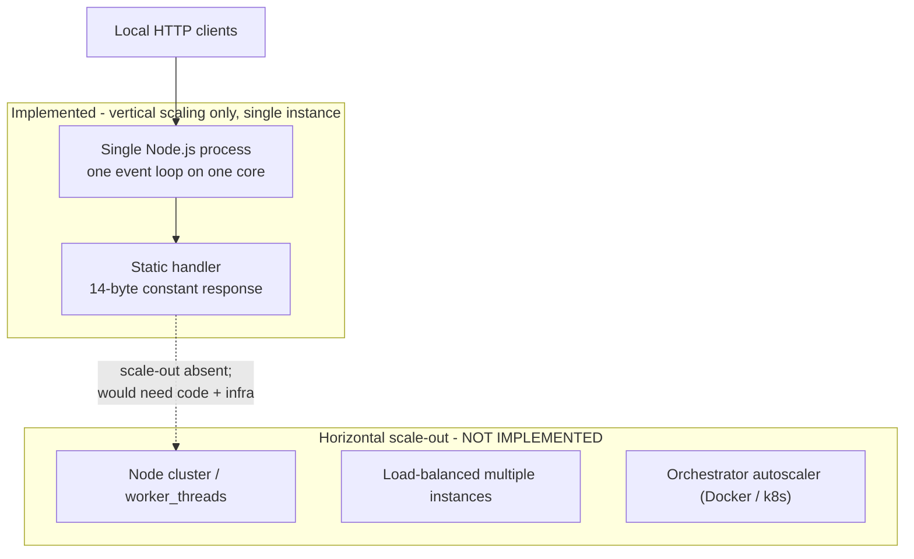


### 6.1.4 Resilience Patterns

No resilience patterns are implemented. The single process is both the only unit of work and the only point of failure. The code registers no `error` listener on the server, no `try`/`catch` in the handler, and no process-level `uncaughtException`/`unhandledRejection` hooks, so any unhandled error terminates the process (Section 5.4.3). Because the system is fully stateless, there is no runtime data to protect; and because there is a single instance with no supervisor, there is nothing to fail over to. Each requested resilience dimension is addressed below.

| Resilience Aspect | Status in This System | Basis / Evidence |
|---|---|---|
| Fault tolerance mechanisms | None — single point of failure; an unhandled error terminates the process with exit code `1` | Section 5.4.3; `server.js` has no `error` listener |
| Disaster recovery procedures | Manual only — operator frees port `3000` and re-runs `node server.js`; source recoverable from Git; no RTO/RPO defined | Section 5.4.6 |
| Data redundancy approach | Not applicable — the system is stateless with no data at rest to replicate | Sections 3.5, 5.1.3 |
| Failover configurations | None — single instance, no standby, no process manager or orchestrator to restart it | Sections 3.6.5, 5.4.6 |
| Service degradation policies | None — availability is binary (listening or not running); no graceful degradation, throttling, or partial-response mode | Section 5.4.3 |

**Fault tolerance and the exercised failure path.** The one exercised failure is a startup bind collision: when port `3000` is already held, `server.listen` emits an `error` event that, being unhandled, surfaces as an uncaught exception — the runtime prints the stack trace (`code: 'EADDRINUSE'`, `errno: -98`, `syscall: 'listen'`) to `stderr` and the process exits with code `1` (Section 5.4.3). Any unexpected throw at request time would propagate identically and terminate the process. There is no retry, no fallback endpoint or port, and no in-code recovery.

**Disaster recovery and data redundancy.** Because the system holds no persistent state (no database, cache, or file storage), there is no runtime data to back up, replicate, or restore, so a data-redundancy approach is not applicable (Sections 3.5, 5.1.3). The source itself is recoverable from Git history (a single commit, "Add files via upload"). After any crash, recovery is manual — the operator frees the port and re-runs `node server.js` — and no Recovery Time Objective (RTO) or Recovery Point Objective (RPO) is defined (Section 5.4.6).

**Failover and degradation.** No process manager (e.g., PM2, systemd unit) or orchestrator is configured to auto-restart or fail over the process (Sections 3.6.5, 5.4.6). There is likewise no service-degradation policy: the endpoint either returns its fixed `200` response or the process is not running — there is no intermediate degraded, read-only, throttled, or maintenance mode.

The diagram shows the actual failure-and-recovery path (crash to manual restart) alongside the resilience mechanisms that were checked and found absent.

**Figure 6.1.4-1 — Resilience Pattern Implementation: Actual Crash/Manual-Recovery Path; Resilience Mechanisms Absent**

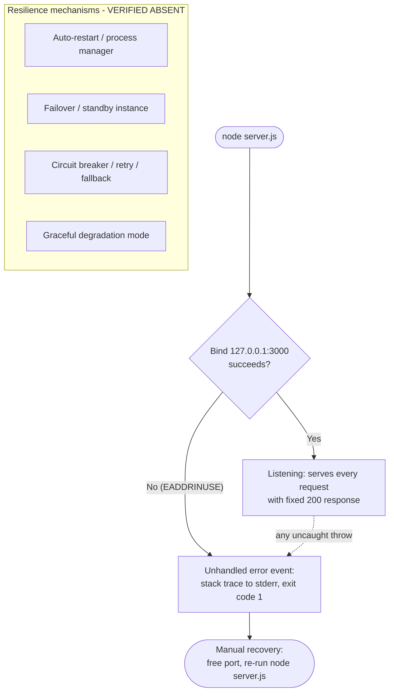


### 6.1.5 References

**Repository files and folders examined for this section**

- `server.js` - Established the single-process HTTP server that defines the entire service surface: `require('http')`, hard-coded host/port `127.0.0.1:3000`, one `http.createServer` handler returning `200` / `text/plain` / `Hello, World!\n`, and one `server.listen` call with no registered `error` listener.
- `package.json` - Confirmed project identity, MIT license, a placeholder failing `test` script, and the absence of any declared dependencies (`main` names a non-existent `index.js`).
- `package-lock.json` - Confirmed `lockfileVersion` 3 with only the root package entry — zero runtime dependencies, hence no service-discovery, load-balancing, circuit-breaker, or messaging libraries.
- `300K.js`, `700K.js` - Confirmed these are inert, non-runnable repeated source corpus (19,856 and 44,138 `listen` occurrences, all on port `3000`), not additional services.
- `README.md` - Title-only documentation (`# 1000KRepo`); contains no operational or architectural guidance.
- Repository root (flat, no subfolders) - Exhaustive artifact search confirmed the absence of any orchestration, containerization, or service-tier configuration: no `Dockerfile`, Compose file, YAML/TOML, Terraform, `Procfile`, Kubernetes manifest, reverse-proxy/`nginx` config, or process-manager (`pm2`/`ecosystem`) config.

**Cross-referenced Technical Specification sections**

- Section 1.2.3 (Success Criteria) - Confirmed no SLA, KPI, RTO, or RPO is defined for the system.
- Section 2.1 (Feature Catalog) - Feature inventory including F-005 (high-volume corpus) used to confirm the corpus files are not services.
- Section 3.5 (Databases & Storage) - Confirmed the system is stateless with no data at rest, informing the data-redundancy assessment.
- Section 3.6 (Development & Deployment) - Subsections 3.6.3–3.6.5 established the absence of containerization, CI/CD, and IaC, and the `node server.js` single-process deployment model with no process manager, clustering, or load balancer.
- Section 4.1 (System Workflows) - Established the single synchronous request/response workflow and the Node.js default keep-alive behavior.
- Section 4.3 (Technical Implementation Flows) - Established the stateless handler (4.3.1) and the unhandled-error crash path / `EADDRINUSE` behavior (4.3.2).
- Section 5.1 (High-Level Architecture) - Established the single-process, event-driven monolith classification, component inventory, data flow, and external integration points.
- Section 5.4 (Cross-Cutting Concerns) - Established the verified status of monitoring (5.4.1), error handling (5.4.3), performance/SLAs (5.4.5), and disaster recovery (5.4.6).

**External sources**

- None. All findings in this section derive from direct inspection of the repository and the cross-referenced sections above; no external references were required.

## 6.2 Database Design

### 6.2.1 Applicability Determination

**Database Design is not applicable to this system.**

The `hello_world` project (repository title `1000KRepo`) neither requires nor implements any database or persistent-storage interaction. Its single runnable artifact, `server.js`, creates one in-memory HTTP listener on `127.0.0.1:3000` and returns a fixed, in-source constant (`Hello, World!\n`) to every request; it reads from and writes to no data store of any kind. This is consistent with Section 3.5 (Databases & Storage), which records that the system "uses no database and no persistent storage of any kind" and is "fully stateless." There is therefore no schema to design, no data model to normalize, no index or constraint to define, and no migration, replication, or backup topology to describe.

This determination is grounded in direct inspection of every file in the repository together with its dependency manifests. A case-insensitive scan for database drivers, ORMs, query builders, SQL/DDL statements, connection strings, and cache clients returned **zero** matches across all source and manifest files, and the only module referenced anywhere in the codebase is the Node.js core `http` module. The table below records each persistence concern and the evidence for its status.

| Persistence Concern | Status | Basis / Evidence |
|---|---|---|
| Relational / NoSQL database | None | No DB driver or client; `package.json` declares no dependencies |
| Caching store (e.g., Redis / Memcached) | None | No cache client in source or in `package-lock.json` |
| Object / file storage | None | No `fs` write, `createWriteStream`, or storage SDK in any `.js` file |
| ORM / query builder / migration tool | None | No Sequelize/TypeORM/Prisma/Knex; no `.sql`/`.prisma`/migration files |
| Runtime dependencies | Zero | `package-lock.json` (`lockfileVersion` 3) records only the root package |
| Response data source | In-source constant | `Hello, World!\n` hard-coded in `server.js`; 14-byte body |
| Per-request / session state | None | Handler stores nothing between requests (Section 2.4.2) |

**Structure of this section.** Because persistent storage is not evident, the section prompt calls for a clear statement of non-applicability with an explanation of why — provided above. For completeness, and to satisfy the review scope, subsections 6.2.2 through 6.2.5 still walk through each requested design dimension (schema design, data management, compliance considerations, and performance optimization), recording the **verified status** of each rather than inventing constructs the code does not contain. Subsection 6.2.6 then provides the one diagram from the prompt's required set that can be drawn truthfully — the request/response data flow — which also visually documents the absence of any persistence or replication tier.

### 6.2.2 Schema Design

No schema exists in this system. There are no entities, tables, collections, or documents; consequently there are no primary keys, foreign keys, unique constraints, check constraints, or indexes of any kind. An Entity-Relationship Diagram (ERD) cannot be produced because there are zero persistent entities and zero relationships to model. Each schema-design concern enumerated by the prompt is addressed below with its verified status.

| Schema Design Concern | Status | Basis / Evidence |
|---|---|---|
| Entity relationships | None | No persistent entities exist; nothing to relate |
| Data models & structures | None | No schema/model files; response is a scalar string constant |
| Indexing strategy | None (zero indexes) | No datastore to index; no index definitions in the repository |
| Partitioning approach | None | No tables/collections to partition or shard |
| Replication configuration | None | Single stateless process; no data store to replicate |
| Backup architecture | Not applicable | No data at rest; source recoverable from Git (Section 5.4.6) |

**Indexes and constraints.** The output requirement to "document all indexes and constraints" resolves to an empty set: the repository defines **zero indexes** and **zero constraints** because it defines no schema. There are no DDL statements (`CREATE TABLE`, `CREATE INDEX`, `ALTER TABLE ... ADD CONSTRAINT`) anywhere in the repository — verified across `server.js` and both large corpus files — and no schema-definition artifacts (`.sql` files, `.prisma` schema, ORM model classes, or migration scripts).

**Entity-Relationship (ERD) and Replication-architecture diagrams.** Two of the diagrams requested by the prompt — a database schema/ERD and a replication architecture — are intentionally omitted because neither can be rendered truthfully: an ERD requires at least one entity with attributes, and a replication diagram requires at least one data store arranged in a primary/replica (or peer) topology. This system has neither. The verified absence of these constructs is instead depicted within the data-flow diagram in Section 6.2.6, whose "Persistence Layer — Verified Absent" grouping stands in for the entities and replicas that do not exist. Data redundancy is correspondingly not applicable, as recorded in Section 6.1.4.

**Backup architecture.** With no data at rest, there is nothing to snapshot, dump, or archive. The only durable asset is the source code itself, which is recoverable from Git history (a single commit, "Add files via upload"; Sections 3.6.1 and 5.4.6). No database backup schedule, retention tier, point-in-time recovery, or snapshot policy exists or is required.

### 6.2.3 Data Management

Because there is no datastore, the conventional data-management lifecycle (migrate → version → store/retrieve → cache → archive) has no runtime data to operate on. The only "data" the application handles is the fixed response body, which is a compile-time constant embedded in `server.js` rather than a managed record. Each concern is addressed below.

| Data Management Concern | Status | Basis / Evidence |
|---|---|---|
| Migration procedures | None | No schema exists; no migration tool or scripts |
| Versioning strategy | Source/package only, not data | `package.json` version `1.0.0`; Git history |
| Archival policies | None | No stored data to archive or tier |
| Storage & retrieval mechanism | In-memory constant | Handler writes a source constant; no store read/written (Section 4.3.1) |
| Caching policies | None | No cache tier; no HTTP cache headers set (Section 4.3.1) |

**Storage and retrieval.** The request handler performs no data access. On each request it writes a fixed 14-byte string to the response and returns; it neither reads from nor writes to any external store, file, cache, or session (Sections 4.3.1, 5.1.3). "Retrieval" is therefore a synchronous, in-memory emission of an in-source constant rather than a query against a persistence layer.

**Versioning.** The distinction between *data* versioning and *source* versioning matters here: no data versioning exists because there is no data, while source versioning is provided by Git (a single commit) and the npm package version (`1.0.0` in `package.json`). These version the code, not any dataset — there is no schema-version table, no record-level version column, and no event log.

**Migration, archival, and caching.** With no schema there are no forward/backward migrations, no seed data, and no migration ordering to manage. With no stored records there is no archival, tiering, or cold-storage policy. Caching is absent at every layer: there is no in-process cache, no external cache client, and the response sets no `Cache-Control`, `ETag`, or `Last-Modified` header (Section 4.3.1) — the constant is simply re-emitted from memory on each request.

### 6.2.4 Compliance Considerations

The data-compliance posture follows directly from the absence of data: a system that collects, stores, and returns no variable or personal data has a correspondingly minimal data-compliance surface. Each requested consideration is recorded below with its verified status.

| Compliance Concern | Status | Basis / Evidence |
|---|---|---|
| Data retention rules | None | No data collected or stored; startup log is ephemeral (Section 5.4.2) |
| Backup & fault tolerance | Manual, stateless | No data at rest; DR is manual re-run; no RTO/RPO (Section 5.4.6) |
| Privacy controls | Not applicable | No personal/sensitive data; fixed constant response (Section 3.5) |
| Audit mechanisms | None | No audit or access log; one startup line only (Section 5.4.2) |
| Access controls | None at data tier | No data tier; endpoint open; loopback-only binding (Section 5.4.4) |

**Data retention and privacy.** No personal data, credentials, or user-generated content is received, processed, or stored: the handler reads nothing from the incoming request and returns a fixed constant, so there is no personally identifiable information (PII) and no encryption-at-rest requirement (Section 3.5). There are consequently no retention schedules, no right-to-erasure workflow, and no data-subject records to manage.

**Audit and access controls.** The system emits no audit trail and no request/access log; the only application output is a single startup line written to `stdout` (Section 5.4.2). There is no authentication, authorization, or role-based access control at any tier, because there is no protected data or data tier to govern. The sole compensating control is that the listener binds to the loopback interface `127.0.0.1`, which prevents remote network access to the endpoint (Section 5.4.4).

**Backup and fault tolerance.** As there is no data at rest, backup and fault-tolerance obligations reduce to source recoverability (Git) and manual process restart; no data-loss window, replication lag, or recovery objective applies (Sections 5.4.6 and 6.1.4).

### 6.2.5 Performance Optimization

Database performance-optimization techniques presuppose a database; none is present, so none of the requested techniques is implemented. The single relevant runtime behavior — HTTP keep-alive — operates at the network transport layer and is a Node.js default, not a datastore optimization. Each concern is addressed below.

| Optimization Technique | Status | Basis / Evidence |
|---|---|---|
| Query optimization patterns | Not applicable | No queries; no database engine |
| Caching strategy | None | No cache tier and no cache headers (Section 4.3.1) |
| Connection pooling | Not applicable (no DB) | No DB connections; HTTP keep-alive is a runtime default (Section 5.4.5) |
| Read/write splitting | Not applicable | No reads/writes to any store; no primary/replica |
| Batch processing approach | None | Requests handled individually; no batch or scheduled jobs |

**Query optimization, read/write splitting, and connection pooling.** There are no SQL or NoSQL queries to plan, index, or profile; there is no read replica or write primary across which to split traffic; and there is no database connection pool to size or tune. The only connection-level behavior observable at the boundary is the Node.js default HTTP keep-alive socket timeout of 5 seconds (`Keep-Alive: timeout=5`), which keeps the TCP connection open for reuse between requests but is a platform default rather than an application- or database-configured optimization (Section 5.4.5). This is a network-transport behavior, explicitly distinct from database connection pooling.

**Caching and batch processing.** No caching is applied at any tier (Section 4.3.1). Each request is handled independently and synchronously by the single event loop; there is no batching, queuing, bulk-write, or scheduled/background job anywhere in the codebase. The repository defines no SLA, latency budget, or throughput target against which such optimizations would be measured (Sections 1.2.3 and 5.4.5), so there is no performance objective driving the introduction of a persistence-layer optimization.

### 6.2.6 Data Flow and State Model

Although no persistence layer exists, the system does move a small amount of *transient* data through memory on each request. The diagram below traces that flow end to end and, in doing so, documents the persistence and replication tiers that were checked and found absent. It is the one diagram from the prompt's required set that can be drawn truthfully; the database-schema/ERD and replication-architecture diagrams are omitted for the reasons given in Section 6.2.2.

**Figure 6.2.6-1 — Data Flow: Transient In-Memory Request/Response with No Persistence Tier**

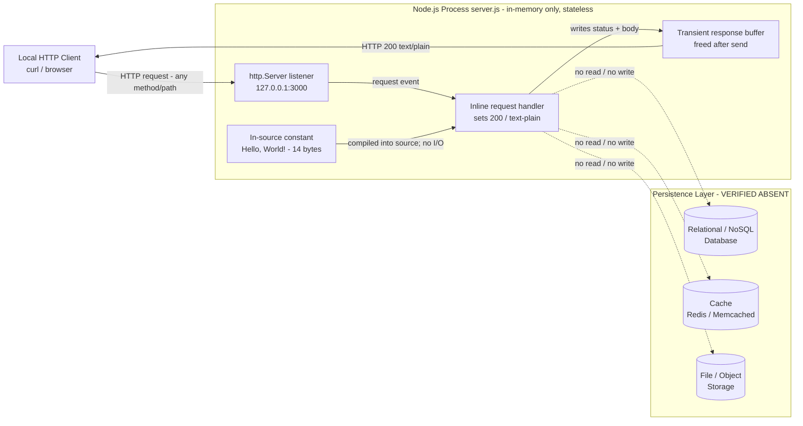

**State model.** The application is fully stateless. The only data that exists at runtime is (a) the in-source constant `Hello, World!\n`, which is fixed at author time and compiled into the process, and (b) a short-lived response buffer created while a request is being served and released immediately afterward. No value survives a request, no value is shared across requests, and no value is written outside the process (Sections 2.4.2 and 4.3.1). Every request is therefore independent and reproducible, and the only durable representation of the response "data" is the source file itself, versioned in Git rather than in any runtime datastore.

**Reading the diagram.** Solid arrows show the live request/response path: the client's HTTP request reaches the loopback listener, the listener dispatches the `request` event to the inline handler, the handler emits the in-source constant into a transient buffer, and the buffer is written back to the client as an HTTP `200 text/plain` response. The dotted arrows to the "Persistence Layer — Verified Absent" grouping denote the database, cache, and file/object-storage tiers that a data-driven application would normally read from or write to; here the handler does neither, which is why every such edge is labeled "no read / no write."

### 6.2.7 References

**Repository files and folders examined for this section**

- `server.js` - The only runnable artifact; confirmed the request handler returns a hard-coded 14-byte constant (`Hello, World!\n`) and performs no read or write against any store, file, cache, or session, and that the sole `require` is the Node.js core `http` module.
- `package.json` - Confirmed project identity (`hello_world`, version `1.0.0`, MIT) and the absence of any declared dependencies — hence no database driver, ORM, or cache client.
- `package-lock.json` - Confirmed `lockfileVersion` 3 with only the root package entry, establishing zero runtime dependencies (no persistence, migration, or caching libraries).
- `300K.js`, `700K.js` - Confirmed via keyword and token scans that these large corpus files are repeated copies of the same server block and contain no SQL/DDL, database driver, ORM, cache, or filesystem-persistence code (zero matches).
- `README.md` - Title-only documentation (`# 1000KRepo`); contains no schema, data-model, or storage guidance.
- Repository root (flat, no subfolders) - Exhaustive search confirmed the absence of any schema, migration, or datastore configuration: no `.sql`/`.prisma` files, no ORM/migration scripts, no `docker-compose`, `.env`, YAML/TOML, `knexfile`, `ormconfig`, or `*.db`/`*.sqlite` files.

**Cross-referenced Technical Specification sections**

- Section 1.2.3 (Success Criteria) - Confirmed no SLA, KPI, RTO, or RPO is defined for the system.
- Section 2.4.2 (Implementation Considerations) - Established that the request handler is stateless and retains nothing between requests.
- Section 3.5 (Databases & Storage) - Established that the system uses no database and no persistent storage of any kind and is fully stateless, with no data-at-rest attack surface and no encryption-at-rest requirement.
- Section 3.6.1 (Development & Deployment) - Established that the source is recoverable from Git history (a single commit, "Add files via upload").
- Section 4.3.1 (Technical Implementation Flows — State Management) - Established the stateless handler with no persistence, no caching, and no transaction boundaries.
- Section 5.1.3 (Data Flow Description) - Established the request/response data flow used as the basis for Figure 6.2.6-1.
- Section 5.4.2 (Logging and Tracing) - Established that the only application output is a single startup line to `stdout`, with no audit or access logging.
- Section 5.4.4 (Authentication and Authorization) - Established the absence of authentication/authorization and the loopback-only binding as the sole compensating control.
- Section 5.4.5 (Performance Requirements and SLAs) - Established that the Keep-Alive socket timeout is a Node.js runtime default and that no SLA/throughput target exists.
- Section 5.4.6 (Disaster Recovery) - Established that there is no data at rest to back up, recovery is manual, and no RTO/RPO is defined.
- Section 6.1.4 (Resilience Patterns) - Established that a data-redundancy approach is not applicable because the system is stateless with no data at rest.

**External sources**

- None. All findings in this section derive from direct inspection of the repository and the cross-referenced sections above; no external references were required.

## 6.3 Integration Architecture

### 6.3.1 Integration Scope and Applicability Assessment

**Integration Architecture is not applicable for this system** in the conventional sense of integrating with external or third-party systems and services. The `hello_world` project (repository title `1000KRepo`) neither calls nor is called by any external system: it performs no outbound requests, depends on no runtime service, and declares zero dependencies (`package-lock.json`, `lockfileVersion` 3, root package entry only). The only module referenced anywhere in the source is the Node.js core `http` module — verified as the sole `require` target across every `.js` file — so there is no HTTP client, SDK, message-broker client, database driver, or authentication library through which an integration could occur.

The system does, however, expose exactly one **inbound** network surface: a single HTTP listener bound to the loopback address `127.0.0.1:3000` (`server.js`). This is the only point at which the system meets anything outside its own process, and it is the sole "integration" in any sense of the word. Consistent with the verified-absence approach of Sections 3.4, 5.1.4, and 1.3, this section therefore does two things: (a) it records the verified absence of the external-integration concerns the prompt anticipates — external/third-party APIs, message brokers, API gateways, stream/batch pipelines, authentication providers, and legacy interfaces; and (b) it honestly documents the one inbound HTTP interface that does exist, including the standard API-design safeguards it lacks. Subsections 6.3.2 through 6.3.4 walk through each requested concern in turn.

The determination rests on the following observations, each verified directly against the source and manifests. Because there is nothing to integrate with, the table is limited to the discriminating dimensions and their evidence (three columns).

| Integration Dimension | Finding in This System | Evidence |
|---|---|---|
| Outbound calls to external systems | None | No HTTP client, SDK, `http.request`, or `fetch`; sole `require` is core `http` |
| Runtime dependencies | Zero | `package-lock.json` records only the root package (`lockfileVersion` 3) |
| Inbound network interface | One — HTTP/1.1 on loopback `127.0.0.1:3000` | `server.js` (host/port literals; `createServer` + `listen`) |
| Databases / caches / object stores | None | Stateless handler; no driver or client (Section 3.5) |
| Message brokers / queues / streams | None | No AMQP/Kafka/SQS/NATS/MQTT client (Section 5.1.4) |
| Authentication / identity providers | None | No JWT/OAuth/API-key/session logic (Section 3.4) |
| API gateway / reverse proxy | None | No gateway or proxy configuration (Section 6.1) |
| Third-party / cloud service SDKs | None | No AWS/GCP/Azure/Stripe/Twilio/etc. SDK; no secrets or keys |

**Why the pattern does not apply.** An integration architecture exists to govern how a system exchanges data with *other* systems — defining the protocols, contracts, message formats, gateways, and trust boundaries that make heterogeneous components interoperate reliably. This repository exchanges data with no other system. Its only counterpart is a local HTTP client on the same machine, and the loopback binding confines even that interaction to the local host (Sections 1.3.1, 3.4). No data is forwarded, aggregated, published, or persisted; every request — regardless of method or path — receives the same static 14-byte greeting and the exchange ends there (Section 5.1.3). Because the process makes no outbound calls and holds no state, there is nothing to authenticate to, no contract to honor with a peer, no queue to drain, and no gateway to route through.

The two large files `300K.js` and `700K.js` do not change this assessment: they are inert, non-runnable source corpus consisting of the same server block repeated tens of thousands of times, and they too reference only the core `http` module and no external system (Sections 2.1, 5.1.2).

The context diagram below depicts the single inbound HTTP interface against the external-integration constructs that were checked and found absent.

**Figure 6.3.1-1 — Integration Context: One Inbound HTTP Interface; External Integrations Verified Absent**

```mermaid
flowchart TB
    subgraph Host["Local Host - loopback only"]
        Client["Local HTTP Client<br/>curl / browser"]
        subgraph Proc["Single Node.js Process - server.js"]
            Listener["HTTP Listener<br/>http.createServer + listen<br/>127.0.0.1:3000"]
            Handler["Inline Handler<br/>fixed 200 / text-plain / Hello, World!"]
        end
    end
    Client -->|"HTTP/1.1 request (any method/path)"| Listener
    Listener -->|"request event"| Handler
    Handler -->|"HTTP 200 response - 14 bytes"| Client
    subgraph Absent["External Integrations - VERIFIED ABSENT (zero dependencies, no outbound calls)"]
        API["Third-party / External APIs"]
        Auth["Auth / Identity Providers"]
        Broker["Message Broker / Event Bus"]
        DB["Databases / Caches / Object Storage"]
        Cloud["Cloud Services / API Gateway"]
    end
```


### 6.3.2 API Design

The system's only externally reachable interface is the inbound HTTP listener on `127.0.0.1:3000`, which functions as a de facto minimal API. It is not built on an API framework (no Express/Fastify/Koa/NestJS/GraphQL/gRPC was found) and defines no formal API contract; it is a single inline handler on the Node.js core `http` server (`server.js`). This subsection specifies the interface exactly as implemented and records the standard API-design safeguards — authentication, authorization, rate limiting, versioning, and documentation — that are verifiably absent.

#### 6.3.2.1 Protocol Specification and Endpoint Contract

**Protocol.** The wire protocol is **HTTP/1.1 over TCP**, confined to the loopback interface `127.0.0.1:3000` (Section 5.1.3). The protocol version was confirmed empirically (negotiated `HTTP/1.1`). There is no HTTPS/TLS, no HTTP/2, and no WebSocket or other upgrade path. The server exposes a **single implicit, catch-all endpoint**: the handler never inspects `req.url` or `req.method`, so every path and every HTTP verb resolves to the identical response (verified with `GET /`, `POST /api/v1/anything?x=1`, and `DELETE /` all returning `200` with the same 14-byte body).

The endpoint contract is fully described by the following specification table.

| Endpoint Attribute | Specification | Evidence |
|---|---|---|
| Path pattern | Single implicit catch-all — every path handled identically | Handler does not read `req.url` |
| HTTP methods | All methods accepted and treated identically | Handler does not read `req.method`; `GET`/`POST`/`DELETE` verified |
| Request parsing | None — request line, headers, and body are never read | Zero `req.*` reads in `server.js` |
| Response status | `200 OK` (fixed for every request) | `res.statusCode = 200` |
| Response media type | `text/plain` | `res.setHeader('Content-Type', 'text/plain')` |
| Response body | `Hello, World!\n` (14 bytes, `Content-Length: 14`) | `res.end('Hello, World!\n')` |
| Transport / protocol | HTTP/1.1 over TCP, loopback only | `server.js`; negotiated `HTTP/1.1` verified |

The architecture diagram below shows the request path through the single-tier API alongside the API-edge constructs (gateway, authentication, authorization, rate limiter, versioned routers, and machine-readable specification) that a conventional API tier would provide and that this system does not implement.

**Figure 6.3.2-1 — API Architecture: Single-Tier Catch-All Endpoint; API-Edge Constructs Verified Absent**

```mermaid
flowchart TB
    Client["Local HTTP Client<br/>curl / browser"]
    subgraph Edge["API Edge Constructs - VERIFIED ABSENT"]
        GW["API Gateway / Reverse Proxy"]
        AuthN["Authentication<br/>JWT / OAuth / API key"]
        AuthZ["Authorization<br/>RBAC / scopes"]
        RL["Rate Limiter / Throttling"]
        Ver["Versioned Routers<br/>/v1, /v2"]
        Docs["OpenAPI / Swagger Spec"]
    end
    subgraph Proc["Node.js Process - server.js is the entire API tier"]
        Listen["http.Server listener<br/>127.0.0.1:3000 (HTTP/1.1)"]
        Route["Implicit catch-all route<br/>no path/method dispatch"]
        Handler["Inline handler<br/>200 / text-plain / 14-byte body"]
    end
    Client -->|"HTTP/1.1 request"| Listen
    Listen --> Route
    Route --> Handler
    Handler -->|"HTTP 200 Hello, World!"| Client
```

The end-to-end request/response flow is shown as a sequence below. Note that the handler performs no security, versioning, or downstream-dependency step at any point.

**Figure 6.3.2-2 — Sequence: Inbound HTTP Request to Static Response (Key Flow)**

```mermaid
sequenceDiagram
    participant C as Local HTTP Client
    participant OS as OS TCP/IP loopback 127.0.0.1 port 3000
    participant S as http.Server in server.js
    participant H as Inline Handler
    C->>OS: HTTP/1.1 request - any method or path
    OS->>S: deliver connection and emit request event
    S->>H: invoke handler with req and res
    Note over H: req never read - no auth rate-limit or version checks
    H->>H: set status 200 and Content-Type text/plain
    H-->>C: return body Hello World as HTTP 200 - 14 bytes
    Note over C,H: No downstream service, queue, or database call
```

#### 6.3.2.2 Authentication, Authorization, Rate Limiting, Versioning, and Documentation

Each API-design safeguard requested by the prompt was checked against the source and manifests. None is implemented; the verified status of each is recorded below.

| API Design Aspect | Status in This System | Evidence |
|---|---|---|
| Authentication method | None — the endpoint is fully unauthenticated | No JWT/OAuth/API-key/session logic; no `Authorization` handling (Section 3.4) |
| Authorization framework | None — no roles, scopes, or permission checks | Handler applies no access-control logic before responding |
| Rate limiting strategy | None — no throttling, quota, or concurrency cap | No rate-limit middleware; no `429`/`Retry-After` responses |
| Versioning approach | None — no versioned routes, media types, or headers | No `/v1` paths; no version negotiation (single catch-all) |
| Documentation standards | None — no machine-readable API description | No OpenAPI/Swagger file; `README.md` is title-only (`# 1000KRepo`) |

**Authentication and authorization.** The interface performs no identity verification and no access-control evaluation. There is no `Authorization` header parsing, no API-key check, no session or cookie handling, and no OAuth/JWT logic anywhere in the code. As Section 3.4 notes, the endpoint being unauthenticated is mitigated in practice only by its loopback-only exposure (unreachable from other hosts) and by the fact that its response contains no sensitive or user-specific data — every caller receives the same public greeting. No credentials, API keys, or secrets exist anywhere in the repository.

**Rate limiting.** No rate-limiting or throttling strategy is applied. There is no per-client quota, token bucket, or concurrency limit, and the server never returns `429 Too Many Requests` or a `Retry-After` header. Request volume is bounded only implicitly by the single event loop on a single core (Section 6.1.3), which is a capacity characteristic rather than a designed rate-limiting control.

**Versioning and documentation.** The API is unversioned: there are no version-prefixed routes (e.g., `/v1`), no version request/response headers, and no content-type versioning — a natural consequence of the single catch-all endpoint (Section 5.1.3). There is likewise no documentation standard in force: the repository contains no OpenAPI/Swagger specification, no API reference, and no schema; the only documentation artifact is `README.md`, which contains a single title line. The interface's behavior is therefore defined solely by the fourteen lines of `server.js`.


### 6.3.3 Message Processing

No message-processing subsystem exists in this repository. There is no message queue, no event broker, no stream-processing pipeline, and no batch/scheduled job. The system's only "event" model is the **internal, intra-process event surface of the Node.js `http` server** — the `request` event emitted per inbound connection and the one-time `listening` event fired at startup (Section 5.1.1). These are handled synchronously within a single event loop; no message is ever enqueued, published, streamed, or processed off-line. Each requested message-processing concern is addressed below with its verified status.

| Message-Processing Concern | Status in This System | Evidence |
|---|---|---|
| Event processing patterns | Only the internal Node.js `http` event model (`request`, `listening`); synchronous, in-process | `server.js`; Section 5.1.1 |
| Message queue architecture | None — no broker or queue client of any kind | No AMQP/RabbitMQ/Kafka/SQS/SNS/NATS/MQTT (Section 5.1.4) |
| Stream processing design | None — no stream or event-stream pipeline | No Kafka/Kinesis; response is a single synchronous write |
| Batch processing flows | None — no scheduled or batch jobs; corpus files are inert, not jobs | No cron/scheduler; `300K.js`/`700K.js` non-runnable (Section 2.1) |
| Error handling strategy | No handler-level or process-level error handling; an unhandled error terminates the process | No `error` listener or `try`/`catch` (Sections 4.3.2, 5.4.3) |

**Event processing patterns.** The application is event-driven only in the narrow sense that the Node.js runtime dispatches the inline handler on each `request` event. This is direct, in-memory callback invocation — not an event-processing pattern such as event sourcing, CQRS, or publish/subscribe, none of which appear in the code. The handler runs to completion synchronously (set status, set header, write the constant body) and produces no follow-on events, side effects, or downstream messages (Section 5.1.3).

**Message queue, stream, and batch flows.** No message-oriented middleware is present: there is no AMQP/RabbitMQ, Kafka, SQS/SNS, NATS, or MQTT client, and therefore no producers, consumers, topics, partitions, or dead-letter queues to document (Section 5.1.4). Likewise, there is no stream-processing framework and no batch or scheduled-job machinery (no cron, no job scheduler). The large files `300K.js` and `700K.js` are sometimes mistaken for bulk workloads, but they are inert source corpus — repeated copies of the same server block — and are not executed as batch jobs; running one would merely attempt to bind port `3000` tens of thousands of times, failing after the first with `EADDRINUSE` (Sections 2.1, 6.1.1).

**Error handling strategy.** Because there is no message pipeline, there are no message-level retry, redelivery, or dead-letter mechanisms. At the process level, error handling is also absent by design: the code registers no `error` listener on the server, no `try`/`catch` in the handler, and no `uncaughtException`/`unhandledRejection` hooks. The one exercised failure path is a startup bind collision — when port `3000` is occupied, `server.listen` emits an unhandled `error` event that surfaces as an uncaught exception (`code: 'EADDRINUSE'`, `errno: -98`, `syscall: 'listen'`), printing a stack trace to `stderr` and exiting with code `1` (Sections 4.3.2, 5.4.3, 6.1.4). Recovery is manual and there is no automatic retry or fallback.

The diagram below shows the only message/event flow present — the synchronous `http` event model — alongside the asynchronous messaging infrastructure that was checked and found absent.

**Figure 6.3.3-1 — Message Flow: Internal HTTP Event Model; Asynchronous Messaging Verified Absent**

```mermaid
flowchart LR
    Start(["node server.js"]) --> Listening["'listening' event<br/>startup callback logs once"]
    Client["HTTP Client"] -->|"TCP connect + HTTP request"| ReqEvt["'request' event<br/>emitted by http.Server"]
    ReqEvt --> Handler["Inline handler<br/>synchronous, stateless"]
    Handler --> Resp["res.end body<br/>HTTP 200 text-plain"]
    Resp --> Client
    subgraph Absent["Asynchronous Messaging - VERIFIED ABSENT"]
        Q["Message Queues<br/>AMQP / SQS / RabbitMQ"]
        K["Event Streams<br/>Kafka / Kinesis"]
        PS["Pub/Sub Topics"]
        Batch["Batch / Scheduled Jobs<br/>cron"]
        DLQ["Dead-letter / Retry Queues"]
    end
```


### 6.3.4 External Systems and Dependencies

The system connects to no external systems. It integrates with no third party, exposes no legacy-system adapter, sits behind no API gateway, and honors no external service contract. This subsection records the verified status of each external-system concern and then documents the complete (and minimal) dependency picture required by the output format.

| External-System Concern | Status in This System | Evidence |
|---|---|---|
| Third-party integration patterns | None — no outbound integration of any kind | No SDK or HTTP client; zero dependencies (Section 3.4) |
| Legacy system interfaces | None — greenfield sample with no legacy adapters | No SOAP/FTP/database-link/mainframe connector (Section 1.3) |
| API gateway configuration | None — no gateway or reverse proxy fronts the server | No gateway/`nginx`/proxy config (Sections 3.6.5, 6.1) |
| External service contracts | None — no contract or interface-definition artifacts | No OpenAPI/WSDL/`.proto`/Pact/JSON-Schema files |

**Third-party integration patterns.** There is no synchronous or asynchronous integration to any external party — no request/reply to a remote API, no webhook (inbound or outbound), no file exchange, and no shared database. This follows directly from the zero-dependency footprint and the absence of any HTTP client, SDK, or outbound socket in the source (Section 3.4). Consequently, integration concerns such as anti-corruption layers, adapters, retries against remote endpoints, and idempotency keys are not applicable.

**Legacy system interfaces.** The repository is a self-contained sample with no legacy-integration surface. No legacy transport or protocol adapter is present (no SOAP client, FTP/SFTP transfer, message-bus bridge, database link, or mainframe/EDI connector), and Section 1.3 confirms that external networks and third-party systems are neither present nor referenced. There is therefore no strangler-façade, gateway-translation, or data-migration bridge to document.

**API gateway configuration.** No API gateway, reverse proxy, or edge router is configured. Clients connect directly to the Node.js listener on the loopback interface; there is no `nginx`/gateway configuration file, no route/policy definition, and no TLS-termination, request-transformation, or centralized-auth layer in front of the process (Sections 3.6.5, 6.1). The single process is simultaneously the edge and the origin.

**External service contracts.** Because there is no peer system, there is no service contract to publish or consume. The repository contains no interface-definition or contract-testing artifact of any kind — no OpenAPI/Swagger document, WSDL, gRPC `.proto`, GraphQL schema, JSON-Schema, or consumer-driven contract (e.g., Pact). The only "contract" is the implicit behavioral one encoded in `server.js`: every request receives `200 text/plain Hello, World!\n`.

**Documented external dependencies.** Per the output-format requirement, the table below enumerates every dependency the system relies on. The salient finding is that there are **zero** external runtime or development package dependencies; what remains are platform and operating-system prerequisites — the environment the program runs *within*, not services it integrates *with*.

| Dependency | Category | Role / Status |
|---|---|---|
| npm registry packages | External runtime / dev packages | None — zero declared or locked (`lockfileVersion` 3, root entry only) |
| Node.js runtime | Platform runtime | Required to execute `node server.js`; version not pinned (no `engines` field) |
| Node.js core `http` module | Built-in platform module | The only module used; part of the runtime, not an external package |
| Host OS TCP/IP stack (loopback) | Operating-system service | Provides the transport for the single inbound HTTP listener |
| TCP port `3000` on `127.0.0.1` | Operating-system resource | Must be free to bind; a collision fails startup with `EADDRINUSE` |


### 6.3.5 References

**Repository files and folders examined for this section**

- `server.js` - Established the sole inbound integration surface: `require('http')`, hard-coded loopback host/port `127.0.0.1:3000`, one `http.createServer` handler returning `200` / `text/plain` / `Hello, World!\n` with no reads of `req.url`/`req.method`, and one `server.listen` call with no registered `error` listener. Basis for the protocol, catch-all endpoint, and absence of auth/authz/rate-limiting/versioning findings.
- `package.json` - Confirmed project identity, MIT license, a placeholder failing `test` script, and the absence of any declared dependencies — hence no API framework, HTTP client, auth library, or messaging client.
- `package-lock.json` - Confirmed `lockfileVersion` 3 with only the root package entry (zero external runtime/dev dependencies), the foundation of the "no external integrations" determination.
- `300K.js`, `700K.js` - Confirmed these are inert, non-runnable repeated source corpus that reference only the core `http` module and no external system or message queue; not batch jobs.
- `README.md` - Title-only documentation (`# 1000KRepo`); confirmed no OpenAPI/Swagger or API documentation standard is present.
- Repository root (flat, no subfolders) - Exhaustive keyword and artifact search confirmed the absence of any API gateway/reverse-proxy config, message-broker/queue client, third-party/cloud SDK, versioning scheme, or service-contract (OpenAPI/WSDL/`.proto`/Pact) file.

**Cross-referenced Technical Specification sections**

- Section 1.3 (Scope) - Confirmed the only in-scope integration is the Node.js core `http` module over the OS TCP/IP stack, and that databases, third-party/external APIs, authentication providers, external networks, and cloud services are out of scope.
- Section 2.1 (Feature Catalog) - Feature inventory (including F-005 high-volume corpus) used to confirm the corpus files are not batch/message workloads.
- Section 3.4 (Third-Party Services) - Established that the system integrates with no third-party or external services, that the endpoint is unauthenticated (mitigated by loopback-only exposure and a data-free response), and that no secrets/keys/credentials exist.
- Section 3.5 (Databases & Storage) - Confirmed the stateless design with no data store, cache, or object storage to integrate with.
- Section 3.6 (Development & Deployment) - Subsection 3.6.5 established the `node server.js` single-process deployment with no reverse proxy, gateway, or load balancer.
- Section 4.3 (Technical Implementation Flows) - Subsection 4.3.2 established the unhandled-error crash path and `EADDRINUSE` behavior underpinning the error-handling assessment.
- Section 5.1 (High-Level Architecture) - Subsections 5.1.1 (event surface), 5.1.3 (HTTP/1.1 synchronous request/response, catch-all endpoint, no async messaging), and 5.1.4 (external integration points verified absent) informed the protocol and message-processing findings.
- Section 5.4 (Cross-Cutting Concerns) - Subsection 5.4.3 established the absence of process-level error handling.
- Section 6.1 (Core Services Architecture) - Established the single-process monolith with no inter-service communication, API gateway, load balancer, or message broker.

**External sources**

- None. All findings in this section derive from direct inspection of the repository and the cross-referenced sections above; no external references were required.


## 6.4 Security Architecture

### 6.4.1 Security Architecture Applicability Assessment

**Detailed Security Architecture is not applicable for this system.**

The repository is a minimal, single-file Node.js `hello_world` sample (repository title `1000KRepo`). Its only runtime component, `server.js` (14 lines), creates one HTTP server on the loopback address `127.0.0.1:3000` and returns a fixed `200` / `text/plain` / `Hello, World!\n` response to every request, regardless of method or path. The project declares **zero dependencies** (`package-lock.json`, `lockfileVersion` 3, root package entry only), **reads no client input** (the request object `req` is never referenced in the handler), **persists no data** (it is fully stateless — Section 3.5), and **integrates with no external system** (Section 6.3). None of the constructs that a detailed security architecture exists to govern — an identity system, an access-control model, or a body of protected data — is present in the codebase.

Consequently, and consistent with the verified-absence approach used in Sections 6.1, 6.2, and 6.3, this section does not document authentication, authorization, and data-protection frameworks that do not exist. Instead it (a) records the verified absence of each control the prompt anticipates, (b) documents the single security control that *is* implemented — loopback-only network binding — together with the standard baseline practices the project does follow, and (c) states the compliance posture. Subsections 6.4.2 through 6.4.5 address each requested domain in turn, and every finding is tied to observable evidence in the source and manifests.

**Verified security posture.** Each security-relevant dimension was checked directly against `server.js`, `package.json`, `package-lock.json`, `README.md`, and the flat, subfolder-free repository root. A repository-wide keyword scan for cryptographic, transport-security, authentication, and secret-handling constructs returned no matches other than the substring `auth` inside `"author": "hxu"` in `package.json`.

| Security-Relevant Dimension | Finding in This System | Evidence |
|---|---|---|
| Authentication / identity | None — unauthenticated catch-all endpoint | Handler reads no `req.*`; no auth library (Sections 3.4, 5.4.4) |
| Authorization / access control | None — every caller served identically | No roles, scopes, or policy checks (Section 5.4.4) |
| Transport security (TLS / HTTPS) | None — plaintext HTTP/1.1 | Sole `require` is core `http`; no `https`/TLS or certificate files (Sections 1.3.2, 5.3.4) |
| Cryptography / key management | None — no cryptographic operations or keys | No `crypto` usage; no `*.pem`/`*.key`; zero dependencies (Section 5.3.4) |
| Secrets management | None — no secrets to manage | No environment variables, API keys, or credentials (Sections 3.4, 5.3.4) |
| Data at rest / sensitive data | None — fully stateless, no data handled | No data store; response is a source constant (Sections 3.5, 5.3.3) |
| Audit / security logging | None — one startup log line only | No request or security logging (Sections 5.4.1, 5.4.2) |
| Implemented security control | Loopback-only binding to `127.0.0.1` | `server.js` L3, L12 (Section 5.3.4, ADR-04) |

**Why a detailed security architecture does not apply.** A security architecture governs how a system authenticates principals, authorizes their actions, and protects data in transit and at rest. This system authenticates no one (it never inspects the request), makes no authorization decision (every request receives the identical response), and holds no data to protect (the 14-byte greeting is a compile-time constant with no user or sensitive content). Its exposure is confined to the local host by the loopback binding, so it is not remotely reachable in its as-built form (Sections 3.4, 5.3.4). With no identity, no protected resource, and no network reach beyond `localhost`, the frameworks the prompt enumerates have nothing to act upon.

**Standard security practices followed instead.** In place of a formal security architecture, the implementation exhibits several baseline, defense-oriented properties that arise directly from its minimalism:

- **Loopback-only network binding** — the listener binds `127.0.0.1`, not a routable interface such as `0.0.0.0`, so the endpoint is unreachable from other hosts; this is the single deliberate security control (Section 5.3.4, ADR-04).
- **Zero-dependency footprint** — with no third-party packages (`package-lock.json`), there is no external supply-chain or transitive-CVE attack surface to patch.
- **No client input is processed** — because `req.url`, `req.method`, `req.headers`, and the request body are never read, entire vulnerability classes (injection, deserialization, reflected XSS, path traversal, and application-driven request smuggling) are structurally absent.
- **No secrets in the repository** — there are no credentials, API keys, tokens, or private keys to leak, rotate, or manage (Sections 3.4, 5.3.4).
- **Data-free static response** — the reply contains only a public greeting, so even local interception exposes no sensitive information (Sections 3.4, 3.5).
- **Least functionality** — the server offers a single static response with no routing, administrative endpoints, filesystem access, or code-evaluation surface.

These practices, along with the residual risks that would matter only if the system were ever promoted beyond a local sample, are consolidated into a security control matrix and compliance statement in Section 6.4.5.

### 6.4.2 Authentication Framework

This system has **no authentication framework**. The single HTTP endpoint exposed by `server.js` is unauthenticated: the handler never inspects the request object (`req`), so it issues no authentication challenge, parses no `Authorization` header, validates no credential, and establishes no user identity (Sections 3.4, 5.4.4). Every request — from any local client, using any method or path — is treated identically. The diagram below shows the actual request path, in which no authentication gate exists between the listener and the static-response handler, alongside the authentication constructs that were checked and found absent.

**Figure 6.4.2-1 — Authentication Flow: No Authentication Gate; Authentication Framework Verified Absent**

```mermaid
flowchart TB
    Client["Local HTTP Client<br/>curl / browser"]
    subgraph Proc["Node.js Process - server.js (14 lines)"]
        Listen["http.Server listener<br/>127.0.0.1:3000"]
        Gate{"Authentication gate<br/>present in code?"}
        Handler["Inline handler<br/>reads no req.* ; returns<br/>200 / text-plain / 14 bytes"]
    end
    Client -->|"HTTP/1.1 request - any method or path"| Listen
    Listen --> Gate
    Gate -->|"No - verified: 0 auth code paths"| Handler
    Gate -.->|"Yes branch - NOT IMPLEMENTED"| Absent401["Challenge / verify identity / reject 401<br/>NOT IMPLEMENTED"]
    Handler -->|"HTTP 200 Hello, World!"| Client
    subgraph Absent["Authentication Framework - VERIFIED ABSENT"]
        IDP["Identity Store / Provider"]
        MFA["Multi-Factor Authentication"]
        Sess["Session Manager / Cookies"]
        Tok["Token Issuance and Validation - JWT / OAuth"]
        Pwd["Password Store and Hashing - bcrypt / argon2"]
    end
```

Each authentication concern requested by the prompt is recorded below with its verified status. Because no credential or identity is handled anywhere, these are statements of verified absence; the standard practice that would apply *were authentication ever introduced* is noted in the prose that follows.

| Authentication Control | Status in This System | Evidence |
|---|---|---|
| Identity management | None — no accounts, registry, or identity provider | No user store or IdP integration (Sections 3.4, 5.4.4) |
| Multi-factor authentication | None — no primary factor exists to augment | No credential of any kind is collected (`server.js`) |
| Session management | None — stateless; no session or cookie | No `Set-Cookie`; no session store (Sections 3.5, 5.4.4) |
| Token handling | None — no JWT/OAuth/API-key/bearer tokens | No token issuance/validation; no `Authorization` parsing (Section 6.3.2.2) |
| Password policies | None — no passwords or credential storage | No password field, hashing, or policy (`server.js`; zero dependencies) |

**Identity management.** No notion of a user, principal, tenant, or account exists; there is no directory, database, or identity-provider integration (Sections 3.4, 3.5). The server does not distinguish between callers in any way. If identity were ever required, the standard practice would be to delegate authentication to a vetted identity provider (for example, OpenID Connect) rather than build a bespoke user store — but no such need exists within the current scope (Section 1.3).

**Multi-factor authentication (MFA).** With no primary authentication factor, MFA is not applicable: there is no one-time-password, WebAuthn, push, or SMS second factor, because there is no first factor to strengthen. The standard practice of enforcing MFA for privileged or administrative access has no target here, as there are neither accounts nor privileged operations.

**Session management.** The service is stateless: it sets no cookies (no `Set-Cookie` header is emitted), maintains no server-side session, and has no session identifier, idle/absolute timeout, or fixation-rotation logic (Sections 3.5, 5.4.4). Each request is fully independent. Standard session-hardening practices (HttpOnly/Secure/SameSite cookie attributes, idle and absolute timeouts, and identifier rotation on privilege change) would apply only if stateful sessions were later introduced.

**Token handling.** No bearer tokens, JSON Web Tokens, OAuth access/refresh tokens, or API keys are issued, accepted, or validated; the handler never reads an `Authorization` header (Section 6.3.2.2). There is therefore no signing key, token lifetime, audience/issuer claim, or revocation list to manage. Standard token practices (short-lived signed tokens with audience/issuer/expiry validation and securely stored signing keys) would apply only upon introducing token-based authentication.

**Password policies.** The system stores and verifies no passwords: there is no credential store, no password hashing (`bcrypt`/`scrypt`/`argon2`/`pbkdf2` are all absent, confirmed by the zero-dependency manifest and the security keyword scan), and hence no password-strength, rotation, lockout, or reuse policy. Standard practice — salted adaptive hashing with modern, guideline-aligned password rules — would apply only if credential-based authentication were added.

### 6.4.3 Authorization System

This system has **no authorization system**. Because it authenticates no one and exposes a single catch-all endpoint, there is no access-control decision to make: every request receives the identical `200` / `text/plain` / `Hello, World!\n` response irrespective of caller, role, method, or path (Sections 5.4.4, 6.3.2.2). The handler contains no access-control logic of any kind. The diagram below shows the request path with no authorization gate, alongside the authorization constructs that were checked and found absent.

**Figure 6.4.3-1 — Authorization Flow: No Authorization Gate; Authorization System Verified Absent**

```mermaid
flowchart TB
    Req["Incoming request<br/>no authenticated principal exists"]
    subgraph Proc["Node.js Process - server.js"]
        Enter["Request enters inline handler"]
        Gate{"Authorization check<br/>present in code?"}
        Handler["Serve 200 / text-plain / 14 bytes<br/>identical for every caller"]
    end
    Req --> Enter
    Enter --> Gate
    Gate -->|"No - verified: 0 access-control checks"| Handler
    Gate -.->|"Yes branch - NOT IMPLEMENTED"| Deny["Evaluate role/permission; allow or 403<br/>NOT IMPLEMENTED"]
    subgraph Absent["Authorization System - VERIFIED ABSENT"]
        RBAC["Roles / RBAC"]
        Perm["Permissions / Scopes"]
        PDP["Policy Decision Point"]
        PEP["Policy Enforcement Point"]
        ACL["Resource ACL / Ownership"]
    end
```

Each authorization concern requested by the prompt is recorded below with its verified status.

| Authorization Control | Status in This System | Evidence |
|---|---|---|
| Role-based access control (RBAC) | None — no roles or role assignments | No role model or role checks (Section 5.4.4) |
| Permission management | None — no permissions, scopes, or grants | Handler applies no permission logic (`server.js`) |
| Resource authorization | None — no protected resources; one static reply | No per-resource ownership or ACL (Sections 5.1.3, 6.3.2.2) |
| Policy enforcement points | None — no gate between request and response | No middleware/guard; direct handler invocation (Sections 5.3.1, 6.1) |
| Audit logging | None — only a startup log line; no access log | No request/security/audit logging (Sections 5.4.1, 5.4.2) |

**Role-based access control (RBAC).** No roles, groups, or role-to-permission mappings exist; there is nothing to assign or evaluate (Section 5.4.4). Standard practice (least-privilege roles evaluated deny-by-default) would apply only if protected operations were introduced.

**Permission management.** There are no permissions, scopes, entitlements, or grants, and therefore no permission catalog, assignment workflow, or evaluation engine. The single action the system can perform — returning the greeting — is public by construction.

**Resource authorization.** The system exposes no addressable, protected resources. The endpoint is an implicit catch-all that ignores `req.url` and `req.method`, so there is no per-resource, per-owner, or per-operation authorization to enforce, and no object-level or field-level access control exists (Sections 5.1.3, 6.3.2.2).

**Policy enforcement points.** There is neither a policy enforcement point (PEP) nor a policy decision point (PDP). No framework middleware, guard, filter, or interceptor sits between the listener and the handler; `http.createServer` dispatches directly to the single inline handler (Sections 5.3.1, 6.1). The only enforcement of any kind at the boundary is the network-level loopback binding (Section 5.3.4), which limits *who can reach* the endpoint rather than *what an authenticated caller may do*.

**Audit logging.** No security audit logging exists. The sole log output is one `console.log` startup line to `stdout` (feature F-003); there is no per-request access log, no authentication/authorization event log, no tamper-evident audit trail, and no log aggregation or retention (Sections 5.4.1, 5.4.2). On an unhandled error the runtime writes a stack trace to `stderr`, which is diagnostic output rather than a security audit record.

### 6.4.4 Data Protection

This system handles **no data that requires protection** and implements **no data-protection controls**. It is fully stateless (Section 3.5): the only "data" is the constant, public string `Hello, World!\n` compiled into `server.js`, plus the single startup log line. There is no database, cache, file, or object storage, and no personal, sensitive, or user-supplied data is ever read, stored, or transmitted (Sections 3.4, 3.5, 5.4.4). Each data-protection concern requested by the prompt is recorded below with its verified status.

| Data-Protection Control | Status in This System | Evidence |
|---|---|---|
| Encryption in transit | None — plaintext HTTP/1.1 on loopback | `require('http')` only; no TLS/HTTPS (Sections 1.3.2, 5.3.4) |
| Encryption at rest | Not applicable — no data at rest | Stateless; no data store (Sections 3.5, 5.3.3) |
| Key management | None — no keys or certificates exist | No `crypto`; no `*.pem`/`*.key`; zero dependencies (Section 5.3.4) |
| Data masking / redaction | Not applicable — no sensitive fields | Response is a fixed public constant (Section 3.5) |
| Secure communication | Loopback-only, plaintext | Bound `127.0.0.1`; not network-exposed (Sections 3.4, 5.3.4) |
| Compliance controls | None required — no regulated data | No PII/PHI/cardholder data handled (Section 3.5) |

**Encryption standards (in transit).** Communication uses plaintext HTTP/1.1; there is no TLS/HTTPS, cipher-suite selection, or certificate configuration — the code requires only the core `http` module and never `https` (Sections 1.3.2, 5.3.4). This is acceptable within the as-built scope solely because traffic never leaves the loopback interface (Section 5.3.4). The standard practice for any network-exposed deployment would be TLS 1.2 or higher (preferably TLS 1.3) with modern cipher suites and HSTS; none of this is present because the system is not network-exposed.

**Encryption at rest.** Not applicable: the system persists nothing, so there is no data at rest to encrypt and no encryption-at-rest requirement (Sections 3.5, 5.3.3).

**Key management.** No cryptographic keys, certificates, keystores, or secrets exist anywhere in the repository, and the `crypto` module is never used; consequently there is no key generation, storage, rotation, or revocation process (Sections 3.4, 5.3.4). There is no secret-management surface to protect.

**Data masking rules.** Not applicable: the response is a single public constant and no request data is read, so there are no sensitive fields to mask, redact, or tokenize in responses or logs (Sections 3.5, 5.4.2).

**Secure communication.** The only communication channel is inbound HTTP/1.1 on `127.0.0.1:3000`. Confidentiality and integrity are provided at the network layer by loopback confinement (traffic does not traverse a shared or routable network) rather than by cryptography (Sections 3.4, 5.3.4). There are no outbound channels to secure, as the process makes no outbound calls (Section 6.3).

**Compliance controls.** The system processes no personal data (GDPR/CCPA), no health data (HIPAA), and no cardholder data (PCI-DSS), and it stores nothing; there are accordingly no data-subject, retention, or breach-notification obligations arising from the data it handles (Sections 3.5, 5.4). The only formal control artifact present in the repository is the declared **MIT license** in `package.json` and `package-lock.json`. The consolidated compliance posture is presented in Section 6.4.5.

### 6.4.5 Security Zone Architecture and Standard Practices

This subsection consolidates the system's network trust boundaries, its security control matrix, and its compliance posture. Because the system is a single process with one loopback listener, its security "zones" reduce to a single trust boundary — the local host — with the wider network verified as unreachable in the as-built configuration.

#### 6.4.5.1 Security Zones and Network Exposure

The trust model has exactly one boundary. The Node.js process binds the loopback interface `127.0.0.1:3000`, so only clients executing on the same host can reach it; remote and otherwise untrusted networks have no route to the listener because it is not bound to a routable address such as `0.0.0.0` (Sections 3.4, 5.3.4, ADR-04). There is no demilitarized zone (DMZ), reverse proxy, web application firewall, TLS-termination tier, authentication/authorization tier, or data tier — each is verified absent. The loopback binding is the sole perimeter control, and it operates at the network layer (limiting reachability) rather than the application layer.

**Figure 6.4.5-1 — Security Zone Model: Loopback Trust Boundary; Perimeter and Data Zones Verified Absent**

```mermaid
flowchart TB
    subgraph External["Untrusted Zone - Remote Network / Internet"]
        Remote["Remote Clients"]
    end
    subgraph LocalHost["Trust Boundary - Local Host (single machine)"]
        LocalClient["Local HTTP Client<br/>curl / browser"]
        Iface["Loopback interface<br/>127.0.0.1:3000 - plaintext HTTP/1.1"]
        Proc["Node.js Process - server.js<br/>static 200 / text-plain response"]
    end
    Remote -.->|"NOT REACHABLE - bound to 127.0.0.1, not 0.0.0.0"| Iface
    LocalClient -->|"HTTP/1.1 request"| Iface
    Iface --> Proc
    Proc -->|"HTTP 200 Hello, World!"| LocalClient
    subgraph Absent["Perimeter and Data Controls - VERIFIED ABSENT"]
        DMZ["DMZ / Reverse Proxy / WAF"]
        TLSt["TLS Termination - HTTPS"]
        ATier["AuthN / AuthZ Tier"]
        DTier["Data Tier - encrypted at rest"]
    end
```

| Zone / Boundary | Status | Evidence |
|---|---|---|
| Loopback zone (`127.0.0.1`) | Present — the sole reachable surface | `server.js` L3, L12 |
| Remote / public network zone | Not reachable — no routable bind | Sections 3.4, 5.3.4 |
| DMZ / reverse proxy / WAF | Absent | Sections 3.6.5, 6.1, 6.3.4 |
| TLS-termination tier | Absent — plaintext only | No `https`/TLS (Section 5.3.4) |
| Data tier | Absent — stateless, no data at rest | Section 3.5 |

#### 6.4.5.2 Security Control Matrix

The matrix below summarizes every security control domain relevant to the prompt, its status in the as-built system, and the implementing mechanism or evidence. It is the authoritative control-status reference for this section.

| Control Domain | Control | Status | Mechanism / Evidence |
|---|---|---|---|
| Network | Loopback-only binding | Implemented | `server.js` L3, L12 (Section 5.3.4) |
| Network | TLS / encryption in transit | Absent | Plaintext HTTP; core `http` only (Section 5.3.4) |
| Identity | Authentication | Absent | No `req` inspection; no auth library (Section 5.4.4) |
| Access | Authorization / RBAC | Absent | No roles, permissions, or PEP (Section 5.4.4) |
| Data | Encryption at rest | Not applicable | Stateless; no data store (Section 3.5) |
| Data | Secrets / key management | Absent (none needed) | No secrets or keys; zero dependencies (Sections 3.4, 5.3.4) |
| Input | Input validation | Not applicable | No client input is read (`server.js`) |
| Supply chain | Dependency management | Implemented by minimalism | Zero dependencies; `lockfileVersion` 3 (`package-lock.json`) |
| Logging | Security audit logging | Absent | Startup log line only (Sections 5.4.1, 5.4.2) |
| Availability | Disaster recovery / failover | Absent | Stateless; manual recovery (Section 5.4.6) |

#### 6.4.5.3 Compliance Requirements

The repository declares no regulatory or contractual compliance obligations, and because it handles no regulated data, no data-protection regime (GDPR, CCPA, HIPAA, PCI-DSS, SOC 2) is triggered by its behavior (Sections 3.5, 5.4). The only compliance-relevant artifact is licensing.

| Compliance Item | Applicability to This System | Evidence |
|---|---|---|
| Software license (MIT) | Applicable — declared, permissive | `package.json`, `package-lock.json` |
| GDPR / CCPA (personal data) | Not triggered — no personal data | Sections 3.4, 3.5 |
| HIPAA (health data) | Not triggered — no PHI | Section 3.5 |
| PCI-DSS (cardholder data) | Not triggered — no payment data | Section 3.5 |
| Data retention / breach notification | Not applicable — nothing stored | Sections 3.5, 5.4.6 |

**Forward-looking controls.** The controls below are **not implemented** today and are appropriate only if the system is ever promoted from a local sample to a network-exposed or production deployment; Section 5.3.4 (ADR-04) likewise notes that remote use would require adding authentication and TLS that are not present today. They are listed to make the baseline explicit, not to describe current behavior.

| Recommended Baseline Control | Addresses | Current Status |
|---|---|---|
| TLS 1.2+/HTTPS | Confidentiality and integrity in transit | Not implemented (loopback-only today) |
| Authentication (e.g., OIDC) | Establishing caller identity | Not implemented (no identity today) |
| Authorization (least-privilege) | Restricting actions per principal | Not implemented (single public response) |
| Input validation + security headers | Injection / XSS / clickjacking mitigation | Not implemented (no input read today) |
| Rate limiting | Abuse and denial-of-service mitigation | Not implemented (single event-loop cap only) |
| Structured audit logging | Traceability and forensics | Not implemented (startup log only) |
| Secrets management | Protecting credentials and keys | Not implemented (no secrets today) |

### 6.4.6 References

**Repository files and folders examined for this section**

- `server.js` - The sole runtime component; established the loopback-only bind (`127.0.0.1:3000`), the static `200`/`text/plain`/`Hello, World!\n` handler, the absence of any `req.*` read (no client input processed), and the absence of `https`/TLS, `crypto`, authentication, authorization, session, cookie, or token logic. Basis for nearly every finding in 6.4.1–6.4.5.
- `package.json` - Confirmed zero declared dependencies (no security libraries such as `jsonwebtoken`, `passport`, `helmet`, `cors`, `bcrypt`, or `express-rate-limit`), the MIT license, and the author field (source of the lone `auth` keyword-scan hit).
- `package-lock.json` - Confirmed `lockfileVersion` 3 with only the root package entry (zero external packages), the basis for the "no supply-chain attack surface" and "no secret-management surface" findings.
- `300K.js`, `700K.js` - Confirmed these are inert, repeated copies of the same server block that reference only the core `http` module and contain no authentication, authorization, cryptographic, or secret-handling code; they do not change the security determination.
- `README.md` - Title-only documentation (`# 1000KRepo`); confirmed no security documentation or policy is present.
- Repository root (flat, no subfolders) - Keyword and file-type scans confirmed the absence of TLS certificate/key material (`*.pem`/`*.crt`/`*.key`), `.env`/secrets files, configuration files, `Dockerfile`, and any auth/security middleware.

**Cross-referenced Technical Specification sections**

- Section 1.3 (Scope) - Subsection 1.3.2 lists "No HTTPS/TLS, authentication, authorization, sessions, or cookies" as explicitly out of scope, and lists secure transport and public/remote access as unsupported use cases.
- Section 3.4 (Third-Party Services) - Established that the system integrates with no external services, that no environment variables/API keys/credentials/secrets exist anywhere, and that the unauthenticated endpoint is mitigated only by loopback-only exposure and a data-free response.
- Section 3.5 (Databases & Storage) - Established the fully stateless design with no data at rest, no encryption-at-rest requirement, and no personal or sensitive data handling.
- Section 5.3 (Technical Decisions) - Subsections 5.3.1 (no framework-provided security headers), 5.3.3 (no data-at-rest attack surface), and 5.3.4 with ADR-04 (loopback-only binding as the single implemented security control) provided the authoritative framing for the implemented control.
- Section 5.4 (Cross-Cutting Concerns) - Subsections 5.4.1/5.4.2 (only a startup log line; no metrics/tracing, hence no audit logging), 5.4.4 (no authentication or authorization framework), and 5.4.6 (no disaster recovery, RTO, or RPO) informed the logging, auth, and availability findings.
- Section 6.1 (Core Services Architecture) - Established the single-process monolith with no gateway, reverse proxy, or policy enforcement point.
- Section 6.3 (Integration Architecture) - Subsection 6.3.2.2 confirmed the fully unauthenticated catch-all endpoint with no `Authorization` handling, no rate limiting, no CORS, and no versioning.

**External sources**

- None. All findings in this section derive from direct inspection of the repository and the cross-referenced sections above; no external references were required.

## 6.5 Monitoring and Observability

### 6.5.1 Monitoring Architecture Applicability Assessment

The repository provides no monitoring or observability tooling of any kind. Consistent with the evidence-based approach of Sections 5.4 and 6.1, and with the conditional guidance governing this section, the determination is stated plainly:

**Detailed Monitoring Architecture is not applicable for this system.**

The `hello_world` project (repository title `1000KRepo`) is a single-process, single-threaded Node.js HTTP server whose entire runnable logic is the 14 lines of `server.js`: it binds `127.0.0.1:3000`, returns a fixed `200` / `text/plain` / `Hello, World!\n` to every request, and writes exactly one startup line to `stdout` (Sections 1.2.2, 5.4.1). It declares zero dependencies (`package.json`, `package-lock.json`), so no metrics, logging, tracing, or alerting library is present; and an exhaustive artifact search found no `Dockerfile`, CI pipeline, Kubernetes manifest, process-manager unit, or monitoring configuration file anywhere in the repository (Section 3.6). There is therefore no metrics pipeline to design, no logs to aggregate beyond a single console line, no spans to trace across a single synchronous process that makes no outbound calls, and no dashboards or alert rules configured.

The table below records the verified monitoring posture, each row grounded in direct repository evidence.

| Capability | Status in This System | Evidence |
|---|---|---|
| Metrics collection / exposition | None | No metrics library; zero dependencies in `package-lock.json` |
| Log aggregation | None — one `console.log` line to `stdout` only | `server.js` L13; no log shipper or config |
| Distributed tracing | None | No tracing library; single process, no outbound calls |
| Alerting / paging | None | No alert rules, alert manager, or paging integration |
| Dashboards | None | No dashboard tooling (e.g., Grafana, Datadog) present |
| Dedicated health / readiness endpoint | None — every path returns `200` | `server.js` L6–L10; Sections 5.4.1, 6.3.2 |
| APM agent | None | Zero dependencies; Section 3.4 |
| Monitoring config (container / CI / orchestrator) | None | No `Dockerfile`, CI, k8s, or process-manager artifacts (Section 3.6) |

**Why the pattern does not apply.** A monitoring and observability architecture exists to collect telemetry (metrics, logs, traces), evaluate it against thresholds, visualize it on dashboards, and route alerts to responders. This system emits only a single startup log line and a fixed constant HTTP response; because the response carries no variable data and the process performs no outbound calls, there are no request metrics, business metrics, or trace spans to collect, and nothing to threshold or visualize (Section 5.4.1). The single process is simultaneously the only unit of work and the only unit of failure, so the observable state is effectively binary — the process is either listening or it is not running.

**Basic monitoring practices followed instead.** Because detailed monitoring is not applicable, operation relies on the minimal, platform-level signals that a bare `node server.js` invocation actually emits. The following practices require no additional code or dependency and constitute the entirety of the monitoring approach for this system.

| Practice | Mechanism (as-is, no new code) | Basis / Evidence |
|---|---|---|
| Startup confirmation | Read the `stdout` line `Server running at http://127.0.0.1:3000/` | `server.js` L13 (feature F-003) |
| Process liveness | Observe whether the `node` process is running and its exit code | Section 5.4.6; `server.js` |
| Failure capture | Read the `stderr` stack trace on crash (e.g., `EADDRINUSE`, exit code `1`) | Sections 5.4.3, 4.3.2 |
| Synthetic endpoint probe | `curl http://127.0.0.1:3000` and check for HTTP `200` | `server.js` L6–L10; Section 6.3 |

All four practices are manual and host-local: the loopback binding (`127.0.0.1`) means any probe must run on the same host (Sections 1.2.1, 6.4). None of them are automated, scheduled, or persisted by the repository, and subsections 6.5.2 through 6.5.4 walk through each requested monitoring, observability, and incident-response concern documenting the verified status of each alongside this minimal reality.

The diagram contrasts the observability signals that actually exist (left) with the monitoring infrastructure that was checked and found absent (right).

**Figure 6.5.1-1 — Monitoring Architecture: Actual Signals vs. Verified-Absent Infrastructure**

```mermaid
flowchart TB
    subgraph Host["Local Host - single machine, loopback only"]
        Client["Local HTTP client<br/>curl / browser (synthetic probe)"]
        Proc["Node.js process<br/>server.js run via node server.js"]
        Out["stdout stream<br/>startup line: Server running at http://127.0.0.1:3000/"]
        Err["stderr stream<br/>uncaught error stack trace (e.g. EADDRINUSE, exit code 1)"]
        Term["Operator terminal / console<br/>the only telemetry sink present"]
        Client -->|"HTTP GET 127.0.0.1:3000"| Proc
        Proc -->|"HTTP 200 text/plain 14 bytes"| Client
        Proc -->|"console.log once at startup"| Out
        Proc -->|"Node runtime default on crash"| Err
        Out --> Term
        Err --> Term
    end
    subgraph Absent["Monitoring infrastructure - VERIFIED ABSENT"]
        MC["Metrics collector / exporter<br/>Prometheus, StatsD"]
        LA["Log aggregator / shipper<br/>ELK, Loki, Fluentd, CloudWatch"]
        TR["Tracing backend<br/>Jaeger, Zipkin, OpenTelemetry"]
        AM["Alert manager / paging<br/>Alertmanager, PagerDuty"]
        DASH["Dashboards<br/>Grafana, Datadog"]
    end
    Term -.->|"no forwarding pipeline configured"| LA
```

### 6.5.2 Monitoring Infrastructure

Monitoring infrastructure is the tier that collects, transports, stores, and visualizes telemetry. None of these tiers is implemented in this repository. Each of the five requested infrastructure areas is documented below with its verified status; the single `stdout` startup line and the `stderr` crash trace are the only telemetry the process emits.

#### 6.5.2.1 Metrics Collection

No metrics are collected, computed, or exposed. There is no counter, gauge, histogram, or summary; no `/metrics` endpoint; no StatsD or Prometheus client; and no runtime-metrics sampling (event-loop lag, heap usage, garbage collection). Because the response is a fixed constant and the handler reads nothing from the request (no `req.url` or `req.method` usage, per Section 6.3), there are no request-level metrics such as requests-per-second, latency percentiles, or status-code distribution to derive from application code. The only quantitative signals that exist at all are OS/process-level counters an operator could read externally; the repository neither emits nor configures them.

| Metric Class | Status in This System | Availability (External Only) |
|---|---|---|
| Application / business metrics | None emitted | Not derivable — fixed, data-free response |
| Request metrics (RPS, latency, errors) | None emitted | Only via manual probe timing |
| Runtime metrics (heap, GC, event loop) | None emitted | Only via OS tools / `--inspect` (not configured) |
| Host metrics (CPU, memory, sockets) | Not emitted by the app | Only via OS tools (`ps`, `top`), operator-run |

#### 6.5.2.2 Log Aggregation

Logging consists of a single `console.log` write to `stdout` at startup and, on an unhandled error, the Node.js runtime's stack trace to `stderr` (Section 5.4.2). There is no logging framework, no log levels, no structured/JSON logs, no request/access log, and no log shipping, rotation, retention, or aggregation backend. In practice, "log aggregation" is whatever the shell or init system that launched `node server.js` does with the two standard streams.

| Concern | Status in This System | Evidence |
|---|---|---|
| Application log | One startup line to `stdout` | `server.js` L13 |
| Error log | Runtime stack trace to `stderr` on crash | Section 5.4.3 |
| Structured logs / levels / framework | None | Zero dependencies |
| Shipping / rotation / retention / backend | None | No config; streams handled by the launching shell |

#### 6.5.2.3 Distributed Tracing

No distributed tracing exists, and none would be meaningful here. There is one synchronous process with a single inbound HTTP boundary and no outbound calls, so there is no trace context to propagate, no spans to record, and no correlation identifiers (Sections 5.4.2, 6.1, 6.3). No OpenTelemetry, Jaeger, or Zipkin SDK is present.

| Tracing Element | Status in This System | Basis |
|---|---|---|
| Span instrumentation | None | No tracing library; zero dependencies |
| Context propagation (trace / correlation IDs) | None | Single process, no outbound calls |
| Trace collector / backend | None | Not configured |

#### 6.5.2.4 Alert Management

No alerts are defined, generated, or delivered. There is no rule engine, no threshold configuration, no alert manager, and no notification channel (email, chat, or paging). The only indication that something is wrong is the process exiting with a non-zero code or a synthetic probe failing to receive `200`; acting on either is a manual operator activity detailed in Section 6.5.4.

| Alerting Element | Status in This System | Basis |
|---|---|---|
| Alert rules / thresholds | None defined | No monitoring configuration |
| Alert manager / deduplication / routing | None | No alerting tooling |
| Notification channels | None | No integrations; zero dependencies |

#### 6.5.2.5 Dashboard Design

No dashboards exist. There is no visualization layer, time-series store, or UI. The closest analogue is the operator's terminal, which can surface three ad-hoc "panels": the process state, the `stdout`/`stderr` stream, and a synthetic endpoint probe.

| Board / Panel | Status in This System | Manual Substitute |
|---|---|---|
| Metric / time-series panels | None | Not applicable — no metrics pipeline |
| Log analytics UI | None | Tail `stdout` / `stderr` in the terminal |
| Trace waterfall views | None | Not applicable — no traces |
| SLO / alert status widgets | None | Not applicable — no SLOs or alerts |

Figure 6.5.2-1 depicts this minimal operator console against the rich-dashboard capabilities that are verified absent.

**Figure 6.5.2-1 — Dashboard Layout: Operator Console vs. Verified-Absent Rich Dashboards**

```mermaid
flowchart TB
    subgraph Console["Operator Console - the only dashboard available"]
        P1["Panel 1: Process status<br/>is node server.js running? (ps / job state)"]
        P2["Panel 2: stdout log tail<br/>startup line present? errors on stderr?"]
        P3["Panel 3: Endpoint probe<br/>curl 127.0.0.1:3000 returns HTTP 200?"]
    end
    subgraph AbsentD["Rich dashboards - VERIFIED ABSENT"]
        G1["Time-series metric panels<br/>latency, throughput, error rate"]
        G2["Log search / analytics UI"]
        G3["Distributed trace waterfalls"]
        G4["SLO / alert status widgets"]
    end
    P3 -.->|"no metrics or log pipeline to populate them"| G1
```

### 6.5.3 Observability Patterns

Observability patterns describe how a running system's health, performance, and business behavior are made visible. In this system they reduce to a small set of manual, host-local checks; the formal patterns requested by the prompt — defined health endpoints, metric emission, SLAs, and capacity targets — are absent. Each requested pattern is documented below with its verified status.

#### 6.5.3.1 Health Checks

No dedicated health or readiness endpoint exists (there is no `/health`, `/healthz`, `/ready`, or `/live` route). However, because the handler returns HTTP `200` to every path and method (Section 6.3), any HTTP GET doubles as a de-facto liveness probe: a `200` response confirms the process is up and the event loop is servicing requests. Readiness is indistinguishable from liveness here — the server has no dependencies to warm up and is ready the instant it binds. A complementary check is whether the process is running and holding TCP port `3000`.

| Check Type | Available Signal | Basis |
|---|---|---|
| Liveness | Any GET → HTTP `200` (de-facto probe) | `server.js` L6–L10 |
| Readiness | Same as liveness — no dependencies to warm | Section 6.1 (stateless, zero deps) |
| Startup | `stdout` line emitted on bind | `server.js` L13 (F-003) |
| Dedicated `/health` endpoint | None — no routing | `server.js`; Section 6.3 |

#### 6.5.3.2 Performance Metrics

No performance metrics are emitted or recorded. The handler performs a single synchronous 14-byte write and reads no input, so per-request CPU work is negligible (Section 5.4.5). Two timing artifacts exist at the network boundary, and both must be labeled precisely: a local round-trip of roughly 0.4 ms was observed during Section 4.1 validation (an empirical measurement, **not** a committed target), and the response carries `Keep-Alive: timeout=5` (the Node.js runtime default, **not** application-configured). Neither is collected, stored, or thresholded by the application.

| Performance Signal | Value / Status | Nature |
|---|---|---|
| Per-request latency | ~0.4 ms observed locally | Empirical, NOT an SLA (Section 5.4.5) |
| Keep-alive socket timeout | 5 s | Node.js runtime default, not app-set |
| Throughput target | None defined | Bounded by one event loop |
| Metric emission / storage | None | No metrics pipeline (Section 6.5.2) |

#### 6.5.3.3 Business Metrics

No business metrics exist. The system has no business domain, users, transactions, or variable output — every request yields the identical `Hello, World!\n` response (Sections 1.2.1, 5.4.1). There are consequently no funnels, conversion rates, usage counts, or domain KPIs to instrument, and none are defined anywhere in the repository.

| Business Observability Element | Status in This System | Basis |
|---|---|---|
| Domain / usage counters | None | Fixed, data-free response |
| Conversion / funnel metrics | None | No business workflow |
| Defined business KPIs | None | Sections 1.2.3, 5.4.1 |

#### 6.5.3.4 SLA Monitoring

The repository defines no service-level agreements (SLAs), service-level objectives (SLOs), latency budgets, throughput targets, error-budget policies, or KPIs (Sections 1.2.3, 5.4.5). There is therefore nothing to monitor against, and no SLA-tracking mechanism is present. For completeness, the SLA requirements are documented explicitly below as "None defined," with the two empirical/runtime artifacts recorded separately and clearly marked as **not** commitments.

| SLA / Objective | Defined Target | Status / Source |
|---|---|---|
| Availability (uptime) | None defined | No SLA (Section 1.2.3) |
| Latency (response time) | None defined | ~0.4 ms observed is empirical only (Section 5.4.5) |
| Throughput | None defined | Single event loop / single core (Section 6.1.3) |
| Error rate / error budget | None defined | No error tracking (Sections 5.4.3, 6.5.2) |
| RTO / RPO | None defined | Stateless; manual recovery (Section 5.4.6) |

#### 6.5.3.5 Capacity Tracking

No capacity is tracked and no capacity plan exists. Throughput is bounded by the single Node.js event loop on a single core (there is no `cluster` or `worker_threads` usage), and the host and port are hard-coded literals with no scaling configuration (Sections 6.1.3, 5.4.5). No resource ceilings (CPU/memory limits), saturation metrics, or growth projections are defined, and the repository contains no load-testing evidence. Capacity "tracking," if desired, would depend entirely on external OS observation of the process, which the repository does not automate.

| Capacity Aspect | Status in This System | Basis |
|---|---|---|
| Concurrency ceiling | Single event loop / single core | Section 6.1.3 |
| Resource limits (CPU / memory) | None set | No container / orchestration config |
| Saturation / utilization metrics | None emitted | No metrics pipeline (Section 6.5.2) |
| Capacity plan / load-test evidence | None | Sections 5.4.5, 6.1.3 |

### 6.5.4 Incident Response

Incident response covers how failures are detected, routed, escalated, remediated, and learned from. This system has no automated incident-response machinery; the entire lifecycle is manual and host-local. Each requested area is documented below with its verified status, together with the one factual recovery procedure the system's behavior supports.

#### 6.5.4.1 Alert Routing

No automated alert routing exists — there is no alert source, no router, and no destination. Detection is entirely manual: an operator notices that the process has exited with a non-zero code, that a synthetic probe no longer returns `200`, or that a stack trace has appeared on `stderr` (Sections 5.4.3, 6.5.2). Because there is no alert manager, there is no deduplication, grouping, silencing, or on-call routing.

The alert threshold matrix below expresses the only meaningful triggers as the actual binary conditions the system exhibits. These are observable states derived directly from the verified behavior (exit code `1`, `EADDRINUSE`, and the fixed `200` response) — **not** configured numeric thresholds — and none of them fires an automated notification.

| Signal | Trigger Condition (Observable) | Detected Via | Response |
|---|---|---|---|
| Process liveness | Process not running / exit code ≠ 0 | `ps` / job state | Runbook (6.5.4.3) |
| Port binding | Port 3000 not bound (`EADDRINUSE` at startup) | `stderr` trace / `ss -ltnp` | Runbook (6.5.4.3) |
| Endpoint health | Response ≠ HTTP `200`, or no response | `curl` synthetic probe | Runbook (6.5.4.3) |
| Error output | Any stack trace written to `stderr` | `stderr` tail | Runbook (6.5.4.3) |

Figure 6.5.4-1 shows the actual manual detection-and-recovery path alongside the automated alerting machinery that was checked and found absent.

**Figure 6.5.4-1 — Alert Flow: Manual Detection/Recovery vs. Verified-Absent Automated Alerting**

```mermaid
flowchart TD
    subgraph Detect["Detection - manual, human-in-the-loop"]
        D1{"Operator checks console<br/>and synthetic probe?"}
        D2["Healthy: startup line seen<br/>and HTTP 200 returned"]
        D3["Failure noticed: process exited,<br/>no HTTP 200, or stderr stack trace"]
        D1 -->|"signals nominal"| D2
        D1 -->|"anomaly observed"| D3
    end
    subgraph Respond["Response - manual only"]
        R1["Inspect stderr trace<br/>e.g. EADDRINUSE errno -98, exit code 1"]
        R2["Free TCP port 3000"]
        R3["Re-run node server.js"]
        R1 --> R2 --> R3
    end
    D3 --> R1
    subgraph AbsentA["Automated alerting - VERIFIED ABSENT"]
        A1["Threshold / rule engine"]
        A2["Alert routing and on-call"]
        A3["Escalation policy / paging"]
    end
    D3 -.->|"no automated route configured"| A2
```

#### 6.5.4.2 Escalation Procedures

No escalation procedures are defined. There are no severity tiers, on-call rotations, response-time targets, or escalation paths in the repository. With a single process and a single operator running `node server.js`, there is no second tier to escalate to — the person who runs the process is the sole responder — and no paging or hand-off mechanism exists.

| Escalation Element | Status in This System | Basis |
|---|---|---|
| Severity classification | None defined | No incident tooling |
| On-call rotation / paging | None | Single operator; no integrations |
| Response-time targets | None defined | No SLA (Sections 1.2.3, 5.4.5) |
| Escalation tiers / hand-off | None | Single point of responsibility |

#### 6.5.4.3 Runbooks

The repository contains no runbooks or operational documentation (`README.md` holds only the title `# 1000KRepo`). One recovery procedure is nonetheless well-defined by the system's verified behavior and is documented here as the de-facto runbook for the single exercised failure mode — a startup bind collision on port `3000` (Sections 5.4.3, 5.4.6, 4.3.2):

1. **Confirm the failure** — check `stderr` for `Error: listen EADDRINUSE ... 127.0.0.1:3000` and confirm the process exited with code `1`.
2. **Identify the port holder** — find the process bound to TCP `3000` (e.g., `lsof -i :3000` or `ss -ltnp`).
3. **Free the port** — stop the conflicting process (or select a different port, which requires a code edit because the port is a hard-coded literal).
4. **Restart** — re-run `node server.js` and confirm the `stdout` line `Server running at http://127.0.0.1:3000/`.
5. **Verify** — `curl http://127.0.0.1:3000` returns HTTP `200` with body `Hello, World!\n`.

Recovery is manual and un-automated: no process manager, supervisor, or orchestrator restarts the process (Sections 3.6.5, 5.4.6). Any other failure — for example, an unexpected throw at request time — would terminate the process identically and follow the same restart-and-verify steps.

| Failure Mode | Recovery Procedure | Automation |
|---|---|---|
| Startup bind collision (`EADDRINUSE`) | Free port 3000, re-run `node server.js` | Manual only |
| Unexpected request-time throw | Re-run `node server.js` | Manual only |
| Host / process termination | Re-run `node server.js` | Manual only (no auto-restart) |

#### 6.5.4.4 Post-Mortem Processes

No post-mortem or blameless-retrospective process is defined, and there is no incident record, ticketing system, or issue tracker in the repository. The only historical record of change is the Git history, which comprises a single commit ("Add files via upload", Section 3.6.1) and captures no incident or remediation history. Because the system is stateless and holds no data, an incident produces no data-loss artifact to analyze — the post-incident state is simply "process restarted."

| Post-Mortem Element | Status in This System | Basis |
|---|---|---|
| Incident record / ticketing | None | No tracker in repository |
| Blameless retrospective process | None defined | No process documentation |
| Change / audit history | Git only — single commit | Section 3.6.1 |

#### 6.5.4.5 Improvement Tracking

No improvement-tracking mechanism exists. There is no issue tracker, backlog, CI feedback loop, dependency/security scanning, or metrics baseline against which improvements could be measured (Sections 3.6.2, 3.6.4). With no monitoring data and no SLOs, there are no error budgets or trend lines to drive prioritization. Improvement, if pursued, would begin by introducing the very capabilities this section documents as absent — structured logging, a dedicated health endpoint, metrics emission, and automated restart — none of which are present today.

| Improvement Mechanism | Status in This System | Basis |
|---|---|---|
| Issue tracker / backlog | None in repository | Single commit; no tracker |
| CI feedback / quality gates | None | No CI/CD (Section 3.6.4) |
| Dependency / security scanning | None | No pipeline; zero deps (Section 3.6.4) |
| Metrics-driven trend / error budget | None | No metrics or SLOs (Sections 6.5.2, 6.5.3) |

### 6.5.5 References

**Repository files and folders examined for this section**

- `server.js` — Established the single observability primitive present: the one `console.log` startup line to `stdout` (L13, feature F-003), the fixed `200` / `text/plain` / `Hello, World!\n` response returned to every request (L6–L10), the loopback bind `127.0.0.1:3000` (L3–L4, L12), and the absence of any health endpoint, metrics, tracing, request logging, error listener, or graceful-shutdown handling.
- `package.json` — Confirmed the absence of any monitoring/observability dependency (no `dependencies`/`devDependencies`), no `start` script, and a placeholder failing `test` script; establishes the zero-dependency footprint underpinning the "no metrics/logging/tracing/alerting library" findings.
- `package-lock.json` — Confirmed `lockfileVersion` 3 with only the root package entry — zero third-party packages, hence no Prometheus/StatsD, OpenTelemetry, Winston/Pino, alerting, or APM libraries.
- `README.md` — Title-only (`# 1000KRepo`); confirmed the absence of any runbook, operational, or incident-response documentation.
- `300K.js`, `700K.js` — Confirmed these repeated-corpus files add no monitoring behavior (only `require('http')` and `console.log`, identical to `server.js`), so they do not alter the assessment.
- Repository root (flat, no subfolders) — Exhaustive artifact search confirmed the absence of any monitoring/deployment configuration: no `Dockerfile`, Compose file, CI pipeline (`.github`), Kubernetes manifest, process-manager unit (`pm2`/`ecosystem`/`.service`), `Procfile`, or `*.yml`/`*.yaml`/`*.toml`/`*.ini`/`*.conf`; Git history is a single commit ("Add files via upload").

**Cross-referenced Technical Specification sections**

- Section 1.2 (System Overview) — 1.2.1 (loopback-only binding, host-local reachability), 1.2.2 (single startup log capability), 1.2.3 (no business KPIs, SLAs, or numeric performance targets).
- Section 3.4 (Third-Party Services) — Confirmed no APM, monitoring, or paging services are integrated.
- Section 3.6 (Development & Deployment) — 3.6.1 (single Git commit), 3.6.2 (no build/test tooling), 3.6.4 (no CI/CD, dependency, or security scanning), 3.6.5 (`node server.js` single-process model; no process manager, clustering, or load balancer).
- Section 4.1 (System Workflows) — Source of the empirical ~0.4 ms local round-trip and the Node.js default keep-alive behavior (both non-SLA).
- Section 4.3 (Technical Implementation Flows) — 4.3.2 (unhandled-error crash path and `EADDRINUSE` behavior underpinning the runbook).
- Section 5.4 (Cross-Cutting Concerns) — 5.4.1 (monitoring/observability status), 5.4.2 (logging and tracing status), 5.4.3 (error handling; `EADDRINUSE` → `stderr` trace → exit code `1`), 5.4.5 (no SLA/latency/throughput target; 5 s keep-alive default; ~0.4 ms empirical), 5.4.6 (no DR/auto-restart; manual recovery; no RTO/RPO).
- Section 6.1 (Core Services Architecture) — Single-process, stateless monolith classification; 6.1.3 (single event loop / single core concurrency ceiling; no auto-scaling).
- Section 6.3 (Integration Architecture) — 6.3.2 (single catch-all endpoint; every path/method returns `200`), supporting the de-facto synthetic health probe.
- Section 6.4 (Security Architecture) — Loopback-only binding as the exposure control, informing the host-local nature of all probes.

**External sources**

- None. All findings in this section derive from direct inspection of the repository and the cross-referenced sections above; no external references were required.

## 6.6 Testing Strategy

### 6.6.1 Testing Strategy Applicability Assessment

The scope, complexity, and dependency profile of this repository were evaluated against the criteria for a comprehensive, multi-layer testing program (unit, integration, end-to-end, automated pipelines, and formal quality gates). That evaluation concluded that such a program is not warranted here.

**Detailed Testing Strategy is not applicable for this system.**

This repository is a minimal, single-file Node.js "hello_world" sample. The only functional runtime unit is `server.js` (15 lines), which uses the Node.js built-in `http` module to bind a single HTTP listener to the loopback address `127.0.0.1:3000` and return a fixed `200` / `text/plain` / `Hello, World!\n` response to every request regardless of path or method. The project declares **zero third-party dependencies**, ships **no test framework, runner, coverage, mocking, or end-to-end tooling**, contains **no test files or test directories**, and defines only the default npm placeholder `test` script, which deliberately fails. The two large files `300K.js` and `700K.js` are non-runnable, machine-generated duplicates of the same server block and expose no functions or exports (Section 2.4.5), so they are not independently testable units. Consequently there is essentially one small, stateless, deterministic behavior to verify, and the elaborate apparatus of a full testing strategy (service integration harnesses, database fixtures, browser automation, performance rigs) has nothing to act upon.

The table below records the verified as-built testing posture that supports this determination.

| Testing Dimension | As-Built Finding | Evidence |
|---|---|---|
| Test framework / runner | None installed | `package.json` declares no `dependencies`/`devDependencies`; `package-lock.json` (`lockfileVersion 3`) records only the root package |
| Test files / directories | None | Repository is flat — no `test/`, `__tests__/`, `spec/`, `e2e/`, `cypress/`, or `playwright/` directories exist |
| Configured `test` command | Placeholder that fails | `scripts.test` = `echo "Error: no test specified" && exit 1`; running `npm test` prints the message and exits code `1` |
| Code coverage tooling | None | No `nyc`/`c8`/`istanbul` dependency or configuration file (`.nycrc`, `.c8rc`) present |
| Mocking / stubbing | None | No `sinon` or equivalent library declared |
| HTTP / E2E / UI / perf tooling | None | No `supertest`, Cypress, Playwright, Selenium, `k6`, or `autocannon` present |
| CI/CD test pipeline | None | No `.github/workflows`, GitLab CI, or other pipeline configuration (Section 3.6.4) |
| Application under test | One 15-line unit | `server.js` is the sole functional source; `300K.js`/`700K.js` are non-runnable duplicates (Section 2.4.5) |

In keeping with the section's guidance for simple systems, the remainder of Section 6.6 documents the **basic unit testing approach that would be adopted** for this codebase, together with an honest accounting of the integration, end-to-end, automation, and quality-metric concerns — each documented as either the minimal practice that applies or as **verified absent / not applicable**. Throughout this section, any tool, threshold, or target that is not present in the repository today is explicitly labelled as a **recommendation** or **baseline guidance**; it is not a claim about existing, as-built behavior. The only test-related facts that are as-built are the placeholder `test` script and the empty dependency graph.

#### 6.6.1.1 Basic Testing Practices That Apply

The following minimal practices are consistent with the observed technology stack (Node.js core `http`, npm packaging, zero dependencies) and require no departure from the project's zero-dependency footprint (Section 3.3):

- **Zero-dependency test runner.** The Node.js runtime provides a built-in test runner (`node:test`) and assertion library (`node:assert`); both were confirmed available in the validation environment (Node v22.23.1). Adopting these keeps the dependency graph empty while enabling automated verification, so they are the recommended baseline over heavier third-party frameworks.
- **Replace the placeholder `test` script.** The single most valuable change is to replace `echo "Error: no test specified" && exit 1` with an executable command (for example, `node --test`), which is the remediation already noted in Section 2.4.4.
- **Black-box HTTP verification.** Because `server.js` registers its handler inline and calls `server.listen()` at module load with no `module.exports`, the handler cannot be imported in isolation; a basic test therefore either drives an HTTP request against the running loopback server or the source is first refactored to export the server/handler.
- **Dependency security scan.** `npm audit` is the built-in supply-chain check; with an empty dependency graph it currently reports `found 0 vulnerabilities` (consistent with Section 3.3, which notes there is no meaningful `npm audit` surface).

#### 6.6.1.2 Test Execution Flow

The following diagram contrasts the current as-built execution of `npm test` (a placeholder that exits `1` without running any tests) with the recommended minimal execution path using the Node.js built-in runner.

```mermaid
flowchart TD
    Dev["Developer or CI job"] --> Cmd["Run npm test"]
    Cmd --> Cur{"Which test script<br/>is configured?"}
    Cur -->|"As-built placeholder"| Ph["echo error and exit 1"]
    Ph --> Fail1["Exit code 1<br/>no tests executed"]
    Cur -->|"Recommended"| Runner["Node built-in runner<br/>node --test"]
    Runner --> Disc["Discover test files<br/>e.g. server.test.js"]
    Disc --> Exec["Execute cases<br/>drive HTTP request to server"]
    Exec --> Assert{"Assertions pass?<br/>status 200 and text-plain body"}
    Assert -->|"Yes"| Pass["Exit 0 and TAP report"]
    Assert -->|"No"| Fail2["Exit non-zero<br/>failure diagnostics"]
```

**Figure 6.6.1-1: Test Execution Flow.** The left branch reflects the repository as it exists today; the right branch is the recommended baseline flow that would apply if the placeholder script were replaced with the Node.js built-in test runner.

### 6.6.2 Testing Approach

Because the system exposes a single, stateless HTTP behavior with no dependencies, persistence, or user interface, the testing approach collapses to a small number of black-box HTTP checks. The matrix below states, for each conventional test layer, its applicability to this codebase and the recommended zero-dependency baseline. Every tool named is a recommendation — none is currently present in the repository.

| Test Layer | Applicability to This System | Recommended Baseline |
|---|---|---|
| Unit | Limited — one 15-line handler with no branching logic | `node:test` + `node:assert` (zero dependency) |
| Integration | Minimal — one inbound HTTP interface, no services or DB | `node:test` driving HTTP requests over loopback |
| End-to-End | Marginal — no UI; a single request/response scenario | `node:test` or a `curl`-based smoke check |
| Performance | Not defined — no SLA or throughput target (Section 5.4.5) | `autocannon` smoke run (optional) |
| Security | Minimal — no auth or request parsing (Section 6.4) | `npm audit` + loopback / no-reflection assertions |

The test data flow for any of these checks is deliberately trivial: a test constructs a fixed request, sends it to the loopback listener, and compares the response against compile-time constants. There are no fixtures, seed data, databases, or external test-data sources to marshal.

```mermaid
flowchart LR
    subgraph Test["Test process (recommended)"]
        TC["Test case<br/>fixed request GET /"]
        Exp["Expected constants<br/>200, text/plain, greeting"]
        AS["Assertion<br/>compare actual vs expected"]
    end
    subgraph SUT["System under test"]
        L["http.Server listener<br/>127.0.0.1:3000"]
        H["Inline handler<br/>static response"]
    end
    TC -->|"HTTP request over loopback"| L
    L --> H
    H -->|"200 text-plain 14 bytes"| AS
    Exp --> AS
    AS --> Verdict["Pass or Fail"]
    subgraph Absent["Test data sources - VERIFIED ABSENT"]
        DB[("Database fixtures")]
        Seed["Seed or factory data"]
        Files["External test data files"]
    end
```

**Figure 6.6.2-1: Test Data Flow.** The recommended test process supplies a fixed request and a set of expected constants; the system under test returns its static response, which the assertion compares. The "verified absent" subgraph records that no database fixtures, seed/factory data, or external test-data files exist or are needed.

#### 6.6.2.1 Unit Testing

**Frameworks and tools.** No unit-testing framework is installed today (`package.json` declares no dependencies). The recommended baseline is the Node.js built-in test runner `node:test` with the `node:assert` assertion module, which keeps the dependency graph empty (Section 3.3) and matches the runtime already used to run the application. Heavier third-party frameworks (Jest, Mocha + Chai, Vitest, `tap`, `ava`) are viable alternatives but would introduce dependencies that the project has so far avoided.

**Test organization structure.** With one functional source file, a single co-located test file (`server.test.js`) or a shallow `test/` directory is sufficient; no layered suite hierarchy is warranted. There is no existing structure to preserve because no tests exist.

**Mocking strategy.** There are no external collaborators, network clients, or data stores to mock (the only `require` target is the Node core `http` module). The single collaborator worth isolating is the HTTP response object: if `server.js` is refactored to export its request handler, a unit test can pass a stub `res` (an object whose `statusCode`, `setHeader`, and `end` are recorded) and assert the handler sets `200`, `Content-Type: text/plain`, and the greeting body. The `node:test` module's built-in `mock.fn()` provides this capability without any dependency.

**Code coverage requirements.** No coverage tool or configuration exists. Node.js provides built-in coverage via `node --test --experimental-test-coverage`; `c8` is the common third-party alternative. Because `server.js` contains one linear path with no conditional branches, a single test achieves near-complete line and branch coverage. Concrete coverage targets are recorded in Section 6.6.4.

**Test naming conventions.** No convention is established. The recommended baseline follows Node.js norms: test files named `*.test.js`, and behavior-oriented test titles such as `test('GET / responds 200 with text/plain greeting', ...)` that state the input and the expected observable outcome.

**Test data management.** There is no test data to manage. The sole input is a fixed HTTP request and the expected output is a compile-time constant (`Hello, World!\n`, 14 bytes), so tests are fully deterministic and require no factories, fixtures, or teardown of shared state.

A minimal illustrative pattern (recommended, zero-dependency):

```javascript
const { test } = require('node:test');
const assert = require('node:assert');
// start server on an ephemeral port, GET '/', then:
assert.strictEqual(res.statusCode, 200);
```

#### 6.6.2.2 Integration Testing

**Service integration test approach.** The system is a single-process monolith with no inter-service communication (Section 6.1), so there are no service-to-service contracts to integration-test. The only integration boundary is the inbound HTTP listener over the host TCP/IP loopback interface; "integration testing" here means exercising that listener end-to-end within one process.

**API testing strategy.** The endpoint is a single, unversioned, catch-all interface that answers every method and path identically (Section 6.3). A basic API test therefore starts the server and asserts response uniformity: `GET /` and, for example, `POST /anything` both return status `200`, header `Content-Type: text/plain`, body `Hello, World!\n`, and `Content-Length: 14`. There are no query, header, or body parameters to vary because the request object is never inspected (Section 2.4.2).

**Database integration testing.** Not applicable. The system uses no database or persistent storage of any kind and is fully stateless (Section 6.2), so there is no schema, connection, transaction, or migration to integration-test.

**External service mocking.** Not applicable. The system makes no outbound calls and integrates with no third-party or external services (Section 3.4), so there are no clients, SDKs, or endpoints to stub, record, or replay.

**Test environment management.** A basic integration test needs only a Node.js runtime and a free TCP port on loopback; no containers, brokers, or provisioned services are required. Because `server.js` hard-codes port `3000`, tests should bind an ephemeral port (`listen(0)`) or ensure `3000` is free to avoid the `EADDRINUSE` bind failure documented in Sections 2.4.1 and 5.4.3, and should stop the server in a teardown hook so no listener leaks between tests.

#### 6.6.2.3 End-to-End Testing

**E2E scenarios.** There is exactly one meaningful end-to-end scenario: start the process (`node server.js`), confirm the startup line `Server running at http://127.0.0.1:3000/` is emitted (feature F-003), issue an HTTP request to `http://127.0.0.1:3000/`, and verify the `200` / `text/plain` / `Hello, World!\n` response. No multi-step user journeys, sessions, or workflows exist to script.

**UI automation approach.** Not applicable. The system serves a plain-text HTTP body and ships no HTML, CSS, JavaScript client, or any user interface, so there is nothing for a browser-automation tool (Cypress, Playwright, Selenium) to drive.

**Test data setup / teardown.** Setup is limited to starting the server process (or importing it for its listen side effect); teardown is stopping that process/listener. No data is created, seeded, or cleaned up because the response is a static constant and no state is persisted.

**Performance testing requirements.** No performance SLA, latency budget, or throughput target is defined anywhere in the repository (Section 5.4.5); the observed sub-millisecond local round-trip is an empirical measurement, not a committed threshold. If a smoke-level load check were desired, a zero-configuration tool such as `autocannon` could measure requests-per-second against the loopback endpoint, but any resulting number would be baseline guidance only. Thresholds are consolidated in Section 6.6.4.

**Cross-browser testing strategy.** Not applicable. Because the response is `text/plain` with no browser-rendered markup or client-side code, there is no rendering behavior that varies across browsers, so cross-browser and device-matrix testing carry no value for this system.

### 6.6.3 Test Automation

There is no test automation in the repository today. As documented in Section 3.6.4, there is no `.github/workflows`, GitLab CI, or other pipeline configuration, and therefore no automated build, test, dependency-scan, or deployment stage; the only configured test command is a placeholder that exits `1`. The guidance below describes the minimal automation that would apply if a basic test suite were introduced, and each item is a recommendation rather than an as-built fact.

| Automation Aspect | As-Built Status | Recommended Baseline |
|---|---|---|
| CI/CD integration | None — no pipeline exists (Section 3.6.4) | A single CI workflow (e.g., GitHub Actions) running `node --test` |
| Automated test triggers | None | On push and on pull request to the default branch |
| Parallel test execution | Not applicable — no suite | `node --test` default file-level concurrency; negligible for one file |
| Test reporting | None | `node:test` TAP output; a JUnit reporter for CI display |
| Failed-test handling | `npm test` always exits `1` | Non-zero exit fails the job and blocks merge |
| Flaky-test management | None needed — tests are deterministic | Bind ephemeral ports to avoid `EADDRINUSE` flakiness |

**CI/CD integration.** A minimal pipeline would check out the source, set up a Node.js version, and run the test command; no dependency-install step is required because the dependency graph is empty (Section 3.3). This is the smallest addition that would convert the current manual, untested workflow into a gated one.

**Automated test triggers.** No triggers exist. The recommended baseline runs the suite on every push and pull request to the default branch, so regressions to the single greeting behavior are caught before merge.

**Parallel test execution.** With one functional file there is effectively nothing to parallelize; the `node:test` runner already executes test files concurrently by default, which is sufficient headroom should more files be added later. No custom sharding or worker configuration is warranted.

**Test reporting requirements.** No reporting exists. The `node:test` runner emits TAP-formatted results by default, which is both human-readable in logs and machine-parsable; a JUnit-style reporter can be enabled for richer CI dashboards. Coverage reporting can be produced by the runner's built-in coverage flag.

**Failed-test handling.** A failing test causes the runner to exit with a non-zero status; in a pipeline that non-zero exit should fail the job and block the merge. (Note the current asymmetry: `npm test` already exits `1` unconditionally today, so any pipeline wired to it would fail every run until the placeholder script is replaced.)

**Flaky-test management.** The behavior under test performs no I/O beyond writing a fixed response and reads no client input, so it is deterministic and carries essentially no flakiness risk. The one realistic source of intermittent failure is port contention — because `server.js` hard-codes port `3000`, concurrent or leftover listeners can trigger the `EADDRINUSE` bind failure documented in Sections 2.4.1 and 5.4.3. Binding an ephemeral port in tests and stopping the server in teardown removes this risk.

The following diagram shows the recommended test environment architecture: identical execution locally and in an optional CI runner, both exercising the loopback server in-process, with external test infrastructure confirmed absent and unnecessary.

```mermaid
flowchart TB
    subgraph Local["Local developer workstation"]
        NodeRT["Node.js runtime<br/>validation env v22.23.1"]
        Runner1["node --test<br/>node:test + node:assert"]
        SUT1["server.js under test<br/>loopback 127.0.0.1:3000"]
    end
    subgraph CI["CI runner (recommended, not present)"]
        Checkout["Checkout source"]
        NodeRT2["Setup Node.js"]
        Runner2["Run npm test"]
        Report["Publish TAP or JUnit report"]
    end
    NodeRT --> Runner1 --> SUT1
    Checkout --> NodeRT2 --> Runner2 --> Report
    subgraph Absent["External test infra - VERIFIED ABSENT"]
        Stage["Staging or QA environment"]
        Ext["External service test doubles"]
        Data[("Test database")]
    end
```

**Figure 6.6.3-1: Test Environment Architecture.** The local workstation and the recommended (not-yet-present) CI runner execute the same in-process HTTP test against the loopback server. The "verified absent" subgraph records that no staging/QA environment, external service test doubles, or test database exist or are required.

### 6.6.4 Quality Metrics

No formal quality metrics — coverage targets, success-rate thresholds, performance thresholds, or automated quality gates — are defined anywhere in the repository. The summary below states the as-built value for each metric and a recommended baseline; every recommended value is guidance for a future basic suite, not a measured or committed figure.

| Quality Metric | As-Built Value | Recommended Baseline |
|---|---|---|
| Line / branch coverage | 0% — no tests exist | 100% of `server.js` (single linear path is fully reachable) |
| Test success rate | Not applicable — `npm test` exits `1` | 100% of test cases must pass to merge |
| Performance threshold | None defined (Section 5.4.5) | None committed; optional smoke number is informational |
| Automated quality gate | None — no CI (Section 3.6.4) | Tests pass + coverage met + `npm audit` clean |
| Test documentation | None — `README.md` is one line | Document the test command and expected result |

#### 6.6.4.1 Code Coverage Targets

No coverage is measured today because no tests exist and no coverage tool is installed. Because `server.js` is a single linear execution path with no conditional branches, one request-driven test exercises 100% of its executable lines, so a recommended target of **100% line and branch coverage for `server.js`** is realistic here — stricter than the 80–90% baseline commonly applied to larger codebases only because the surface is so small. The non-runnable corpus files `300K.js` and `700K.js` (Section 2.4.5) would be excluded from any coverage scope.

#### 6.6.4.2 Test Success Rate Requirements

No success-rate requirement is defined. The recommended baseline is a binary green-build rule: **100% of test cases must pass** for a build to be accepted, and any failure blocks merge. Because the behavior under test is deterministic and performs no I/O beyond writing a fixed response, a passing suite is expected to remain passing run-to-run.

#### 6.6.4.3 Performance Test Thresholds

No performance threshold, SLA, latency budget, or throughput target is defined in the repository (Section 5.4.5). The Node.js default keep-alive socket timeout of five seconds is a runtime default rather than a tuned value, and the sub-millisecond local round-trip observed during verification is an empirical measurement, not a committed threshold. If a smoke-level throughput check were added, its result would be recorded as informational baseline guidance and would **not** act as a pass/fail gate.

#### 6.6.4.4 Quality Gates

No quality gates are enforced because no CI pipeline exists (Section 3.6.4). The recommended minimal gate set, all enforceable within a single CI job, is:

| Quality Gate | Recommended Criterion | Enforcement Point |
|---|---|---|
| Tests pass | 100% of test cases green | CI job on push / PR |
| Coverage | Meets the target for `server.js` | CI coverage check |
| Dependency security | `npm audit` reports 0 vulnerabilities | CI audit step |
| Startup smoke | Process binds and emits startup log | CI or manual smoke check |

#### 6.6.4.5 Documentation Requirements

No test documentation exists; `README.md` contains only the single heading `# 1000KRepo`. The recommended baseline is to document, at minimum, the command used to run the tests, the runtime prerequisite (a Node.js version that provides `node:test`), and the expected result. Any documentation should also note the two known packaging discrepancies relevant to running and testing the code: the `package.json` `main` field references a non-existent `index.js` (the real entry point is `server.js`), and the `test` script is currently the failing placeholder (Section 2.4.4).

#### 6.6.4.6 Security Testing Requirements

Security testing needs are minimal and follow directly from Section 6.4: the system has no authentication, authorization, request parsing, secrets, or TLS, so there are no such mechanisms to test. The applicable checks are:

| Security Check | As-Built Result | Recommended Test |
|---|---|---|
| Dependency vulnerabilities | 0 — empty dependency graph (Section 3.3) | `npm audit` in CI |
| Network exposure | Loopback-only `127.0.0.1` (Section 6.4) | Assert the bind host is `127.0.0.1` |
| Input injection surface | None — request object never read (Section 6.4) | Assert the response is invariant to method / path / body |
| Transport security (TLS) | Absent — out of scope (Section 1.3.2) | None — the feature does not exist |

The dependency-vulnerability scan is the single most valuable security test and already passes trivially (`found 0 vulnerabilities`) by virtue of the zero-dependency footprint. The loopback-binding and no-reflection assertions codify the two structural controls that Section 6.4 identifies as the system's only security posture. No penetration testing, secret-scanning, or dynamic application security testing (DAST) beyond these is warranted for a loopback-only, data-free, static-response sample.

### 6.6.5 References

**Repository files examined for this section**

- `package.json` — Established the as-built `test` script (`echo "Error: no test specified" && exit 1`), the absence of any `dependencies`/`devDependencies`/`engines` fields, and the `main` → non-existent `index.js` discrepancy.
- `package-lock.json` — Confirmed `lockfileVersion 3` with only the root package entry, i.e., an empty dependency graph (no test framework, mocking, coverage, or E2E tooling installed).
- `server.js` — The sole functional unit under test: a 15-line HTTP handler bound to `127.0.0.1:3000` returning a static `200` / `text/plain` / `Hello, World!\n` response; verified to have no `module.exports` and to bind on module load.
- `300K.js`, `700K.js` — Verified as non-runnable, machine-generated duplicates with no exports; documented as excluded from test and coverage scope.
- `README.md` — Confirmed documentation is a single heading line (`# 1000KRepo`), establishing the absence of test documentation.

**Repository structure examined**

- Repository root (`/`) — Verified flat with no subdirectories: no `test/`, `__tests__/`, `spec/`, `e2e/`, `cypress/`, or `playwright/` directories, no `.github/workflows`, and no test-runner or coverage configuration files.

**Cross-referenced Technical Specification sections**

- Section 1.3.2 (Out-of-Scope) — TLS/authentication/authorization excluded, informing the security-testing scope.
- Section 2.4 (Implementation Considerations) — 2.4.1 (no `error` handler → `EADDRINUSE`), 2.4.2 ("no automated test guards the behavior because the `test` script deliberately fails"), 2.4.4 (placeholder `test` script exits `1`; no build/lint/CI scripts), 2.4.5 (corpus files non-runnable).
- Section 3.3 (Open Source Dependencies) — Empty dependency graph; "no `npm audit` surface"; zero supply-chain risk.
- Section 3.6 (Development & Deployment) — 3.6.1 (Node not pinned; validation env Node v22.23.1 / npm 11.1.0; lockfile v3), 3.6.2 (no build system; no test framework), 3.6.4 (no CI/CD or dependency-scan pipeline; manual deployment).
- Section 5.4 (Cross-Cutting Concerns) — 5.4.3 (error handling / `EADDRINUSE`, exit `1`), 5.4.5 (no SLA/latency/throughput target; keep-alive 5s is a Node default; ~sub-ms round-trip is empirical).
- Section 6.1 (Core Services Architecture) — Single-process monolith with no inter-service communication.
- Section 6.2 (Database Design) — No database or persistent storage; fully stateless.
- Section 6.3 (Integration Architecture) — Single unversioned, catch-all HTTP endpoint answering all methods/paths identically.
- Section 6.4 (Security Architecture) — Loopback-only binding and non-reading of client input as the system's only structural controls; no auth/TLS/secrets.

**Toolchain verification (performed directly in the validation environment)**

- Node.js runtime v22.23.1 — Confirmed that `npm test` exits with code `1`, that the built-in `node:test` and `node:assert` modules are available (the zero-dependency test baseline), and that `npm audit` reports `found 0 vulnerabilities`.
- Mermaid CLI (`mmdc` 11.16.0) — Used to validate that Figures 6.6.1-1, 6.6.2-1, and 6.6.3-1 render successfully prior to inclusion.

# 7. User Interface Design

## 7.1 User Interface Applicability Assessment

The repository defines **no user interface (UI)**. The `hello_world` project (repository title `1000KRepo`) is a backend-only Node.js HTTP service whose single runnable artifact, `server.js`, creates a listener with the Node.js core `http` module and returns an identical plain-text response to every request. There is no rendered markup, no client-side application, no styling, and no interactive presentation layer anywhere in the codebase. In keeping with the documentation standard for this section, the determination is recorded as:

```
No user interface required
```

The remainder of this section documents the evidence for that determination and confirms — topic by topic — that the user-interface concerns this section would otherwise cover are not applicable to this system.

### 7.1.1 Basis for Determination

Every request handled by `server.js` produces the same reply — HTTP status `200`, header `Content-Type: text/plain`, and body `Hello, World!\n` — irrespective of the HTTP method or path. The complete request handler is three lines:

```js
res.statusCode = 200;
res.setHeader('Content-Type', 'text/plain');
res.end('Hello, World!\n');
```

Because the response media type is `text/plain` rather than `text/html`, the payload carries no markup, styling, or scripting for a client to render as an interface; a caller simply receives the literal text `Hello, World!`. The incoming request is never inspected (there are zero references to `req.url` or `req.method` across the codebase), so there is no routing to a view and no content negotiation. This is a programmatic service response, not a human-facing interface.

The following checks — performed directly against the repository files and manifests — confirm the absence of any UI. All findings are consistent with Section 3.2 (Frameworks & Libraries) and Section 5.1 (High-Level Architecture).

| Evidence Checked | Finding |
|---|---|
| Response media type | `Content-Type: text/plain` for all requests; no HTML is ever emitted (`server.js`) |
| UI frameworks / libraries | None — `package.json` declares zero dependencies (no React, Vue, Angular, Svelte, etc.) |
| Templating / view engines | None — no EJS, Pug, Handlebars, Jinja, or Thymeleaf; no view-rendering call such as `res.render` |
| Markup / stylesheet / component files | None — a repository-wide search for HTML, CSS, JSX, TSX, and Vue content returned no matches in application code |
| Front-end folders / static assets | None — the repository is flat, with no `web/`, `frontend/`, `ui/`, `client/`, `public/`, `static/`, `views/`, `templates/`, `assets/`, or `components/` directory |
| Client-side code | None — `server.js`, `300K.js`, and `700K.js` contain only server-side `http` code (`require('http')` is the sole module reference) |

### 7.1.2 Coverage of Requested UI Topics

Because no user interface exists, each topic that this section would otherwise document is not applicable. The table maps every requested UI topic to its status and the supporting evidence.

| UI Topic | Status | Rationale (evidence) |
|---|---|---|
| Core UI technologies | Not applicable | No front-end framework, templating engine, stylesheet, or markup; only the Node.js core `http` module is used (`server.js`, `package.json`) |
| UI use cases | Not applicable | There are no human-facing screens; the only interaction is a programmatic HTTP request/response |
| UI / backend interaction boundaries | Not applicable | There is no UI client to bound; the system's sole interface is one inbound HTTP endpoint on `127.0.0.1:3000` (see Section 5.1.4) |
| UI schemas | Not applicable | No forms, view models, or client-side data schemas exist; the response body is a fixed string, not a structured document |
| Screens required | None found | A repository-wide search for screen, view, and markup files returned no results (see 7.1.3) |
| User interactions | Not applicable | No buttons, forms, navigation, or input handling; the request payload is never read |
| Visual design considerations | Not applicable | No layout, typography, color, theming, responsive design, or accessibility artifacts exist in the repository |

### 7.1.3 Screens Inventory

This section is required to locate and reference the actual UI screens present in the repository. A systematic review — covering all six repository files and a content scan of the two large corpus files (`300K.js`, `700K.js`) — found no screen definitions of any kind: no HTML documents, no single-page-application views (JSX/TSX/Vue), no server-rendered templates, and no mobile screens. There are therefore no screens, wireframes, layouts, or navigation flows to document or reference.

## 7.2 References

The following repository files and previously documented specification sections were examined as evidence for this section's determination that no user interface exists.

**Repository files**

- `server.js` — The single runnable HTTP server; established that every response is `200` / `Content-Type: text/plain` / body `Hello, World!\n`, emitted with no markup, no routing, and no request inspection.
- `package.json` — npm manifest; established zero declared dependencies, confirming the absence of any UI framework, templating engine, or front-end tooling.
- `package-lock.json` — Lockfile (`lockfileVersion` 3); confirmed that no third-party packages — and therefore no UI libraries — are installed.
- `300K.js` — ~8.5 MB corpus file; content scan confirmed it contains only repeated server-side `http` code, with no markup or client-side content.
- `700K.js` — ~18.9 MB corpus file; content scan confirmed the same repeated server-side `http` code, with no UI content.
- `README.md` — Title-only readme (`# 1000KRepo`); contains no user-interface documentation.
- Repository root (flat, no subfolders) — Confirmed the absence of any front-end directory (e.g., `web/`, `frontend/`, `ui/`, `client/`, `public/`, `static/`, `views/`, `templates/`, `assets/`, `components/`).

**Cross-referenced specification sections**

- Section 1.2 System Overview — Corroborates the single static `text/plain` response and the "browser or curl" client model.
- Section 3.2 Frameworks & Libraries — Corroborates the absence of any web framework and any templating/view engine.
- Section 5.1 High-Level Architecture — Corroborates the absence of a presentation layer and the single catch-all HTTP endpoint.

# 8. Infrastructure

## 8.1 Infrastructure Applicability Assessment

This section assesses whether the `hello_world` repository (README title "1000KRepo") requires dedicated deployment infrastructure. Every statement below is grounded in direct inspection of the six tracked files that constitute the repository — `server.js`, `300K.js`, `700K.js`, `package.json`, `package-lock.json`, and `README.md` — and in the confirmed absence of any deployment-, container-, orchestration-, or pipeline-related artifacts anywhere in the repository tree.

### 8.1.1 System Classification

The repository is a single-file, standalone Node.js HTTP "Hello World" example. It is neither a deployable production service, a distributable library, nor a packaged command-line tool.

- `server.js` (342 bytes, 15 lines) requires only the Node.js built-in `http` module and creates one server that binds to the loopback address `127.0.0.1` on port `3000`, returning HTTP `200` with `Content-Type: text/plain` and the body `Hello, World!\n` for every request. It exports nothing and is launched by running `node server.js`.
- `package.json` declares name `hello_world`, version `1.0.0`, description "Hello world in Node.js", MIT license, and author `hxu`, with **no** `dependencies`, `devDependencies`, `engines`, build, or start scripts; its `main` field points at `index.js`, a file that does not exist in the repository (the runnable entry point is `server.js`).
- `package-lock.json` (lockfileVersion 3) records only the root package with zero third-party dependency entries.
- `300K.js` (~8.5 MB, 317,694 lines) and `700K.js` (~18.9 MB, 706,208 lines) are the same server boilerplate duplicated tens of thousands of times, separated by `*****Repeat*****` markers; they export nothing and are non-runnable as a single process because their repeated `server.listen(3000)` calls would collide after the first bind.
- `README.md` contains only the heading `# 1000KRepo`, and the repository root is flat with no subdirectories other than `.git/`.

| Dimension | Classification | Evidence |
|-----------|----------------|----------|
| Artifact type | Standalone local sample application | `server.js` runs directly via `node server.js`; no packaged or published artifact |
| Distribution model | Source-only via Git | Single commit "Add files via upload"; no build output, registry package, or release |
| Deployability | Not a deployable service | Loopback-only bind to `127.0.0.1`; no configuration, container, or deployment artifacts |
| Dependency footprint | Zero third-party dependencies | `package-lock.json` locks only the root package |

### 8.1.2 Applicability Determination

**Detailed Infrastructure Architecture is not applicable for this system.**

The repository contains no infrastructure-defining artifacts of any kind. A filesystem-wide search found no `Dockerfile` or Compose file, no CI/CD workflow (no `.github/workflows`, GitLab CI, or Jenkinsfile), no Infrastructure-as-Code definitions (no Terraform, Pulumi, CloudFormation, Kubernetes manifests, or Helm charts), no deployment or provisioning scripts, and no environment or configuration files. The application is executed by running `node server.js` on a host that already has a Node.js runtime; it binds to the loopback interface only, holds no state, and depends on nothing beyond the Node.js standard library. There is therefore no cloud footprint, no container image, no orchestrated cluster, and no automated pipeline to document.

Consistent with the fallback clause in the section requirements, the remainder of Section 8 documents only the minimal build and distribution requirements that genuinely apply to this system (Section 8.2) and records, for completeness and traceability, the verified-absent status of every standard infrastructure concern (Sections 8.3 through 8.5). This determination aligns with Section 3.6 (Development & Deployment), which records that the project has no build system, no containerization, and no CI/CD or IaC, and with Section 6.5 (Monitoring and Observability), which similarly concludes that a detailed monitoring architecture is not applicable.

### 8.1.3 Infrastructure Concern Assessment

The following table maps each standard infrastructure concern to its verified status in this repository. "Not present" means a targeted filesystem search confirmed the associated artifacts do not exist.

| Infrastructure Concern | Status | Evidence in Repository |
|------------------------|--------|------------------------|
| Cloud services / accounts | Not present | No cloud SDK imports, credentials, or provider configuration; `server.js` uses only `http` |
| Containerization | Not present | No `Dockerfile`, `.dockerignore`, or Compose file |
| Orchestration | Not present | No Kubernetes manifests, Helm charts, or scheduler configuration |
| Infrastructure as Code | Not present | No Terraform, Pulumi, or CloudFormation files |
| CI/CD pipeline | Not present | No `.github/workflows`, GitLab CI, or Jenkinsfile |
| Configuration / secrets management | Not present | No `.env` or config files; host and port hard-coded in `server.js` |
| Load balancing / reverse proxy | Not present | Single process binds `127.0.0.1:3000` directly |
| Monitoring / observability stack | Not present | Only a `console.log` startup line; see Section 6.5 |

The diagram below contrasts the system's actual single-process footprint with the categories of deployment infrastructure that were verified to be absent.

**Figure 8.1-1 — Infrastructure Architecture: Actual Single-Process Footprint vs. Verified-Absent Deployment Infrastructure**

```mermaid
flowchart TB
    subgraph Host["Local host - single developer/operator machine"]
        Client["Local HTTP client<br/>curl / browser (loopback only)"]
        Port["TCP listener<br/>127.0.0.1:3000 (loopback, plaintext HTTP/1.1)"]
        Proc["Node.js process<br/>node server.js - single event loop"]
        Src["Application artifact<br/>server.js (~342 bytes, zero dependencies)"]
        Client -->|"HTTP GET"| Port
        Port --> Proc
        Proc -->|"HTTP 200 text/plain 14 bytes"| Client
        Src -->|"loaded at process start"| Proc
    end
    subgraph Absent["Deployment infrastructure - VERIFIED ABSENT"]
        Cloud["Cloud account / VPC / VM"]
        Cont["Container runtime + image (Docker)"]
        Orch["Orchestrator (Kubernetes / ECS)"]
        LB["Load balancer / reverse proxy"]
        Pipe["IaC + CI/CD pipeline"]
    end
    Proc -.->|"none provisioned or configured"| Cloud
```

## 8.2 Build and Distribution Requirements

Because detailed infrastructure architecture does not apply (Section 8.1), this section documents the only requirements that genuinely apply to the system: how it is built (there is effectively no build), how its dependencies are managed (there are none), how it is version-controlled and distributed, and how it is executed at runtime.

### 8.2.1 Build Environment & Toolchain

There is no build step. The application is plain CommonJS JavaScript executed directly by the Node.js runtime; nothing is transpiled, bundled, or minified. The complete toolchain required to obtain and run the system is minimal:

| Tool | Version Constraint | Role |
|------|--------------------|------|
| Node.js | Not pinned by the repo (no `engines` field); validation env v22.23.1 | Executes `node server.js`; supplies the built-in `http` module |
| npm | Lockfile format v3 (npm v9 default; v7+); validation env 11.1.0 | Reads `package.json` / `package-lock.json`; `npm install` is an optional no-op |
| Git | Tracked in a `.git` directory | Source version control and the sole distribution channel |

Build stages that would exist in a typical service pipeline are all inapplicable here:

| Build Stage | Action Required | Status |
|-------------|-----------------|--------|
| Compile / transpile | None (plain CommonJS) | Not applicable |
| Bundle / minify | None | Not applicable |
| Dependency install | `npm install` installs nothing | Optional no-op |
| Automated tests | `npm test` placeholder | Intentionally fails (exit 1) |

### 8.2.2 Dependency Management & External Dependencies

The system has zero third-party dependencies at both build time and runtime:

- `package.json` declares no `dependencies` or `devDependencies`.
- `package-lock.json` (lockfileVersion 3) contains only the root package entry, confirming an empty dependency tree.
- `server.js` imports only Node.js's built-in `http` module; there are no other `require` targets.

| Dependency Scope | External Dependencies | Evidence |
|------------------|-----------------------|----------|
| Runtime | None beyond the Node.js standard library (`http`) | `server.js` uses `require('http')` only |
| Build-time | None | No build system; no `devDependencies` |
| Third-party packages | None | `package-lock.json` locks only the root package |

Because the dependency graph is empty, there is no dependency resolution, no lockfile drift, and no transitive-CVE surface to manage; an `npm audit` over this project reports zero vulnerabilities and `npm install` produces no `node_modules` tree. This is consistent with Section 3.3 (Open Source Dependencies).

### 8.2.3 Source Control & Artifact Characteristics

Distribution is source-only through Git. The repository is a flat working tree of six files with a single commit ("Add files via upload") on the `main` branch; there are no tags, releases, or published registry packages. No build artifacts are generated, so the distributed artifact is byte-for-byte identical to the source.

| Tracked File | Approx. Size | Role |
|--------------|--------------|------|
| `server.js` | 342 bytes (15 lines) | Runnable entry point |
| `package.json` | 251 bytes | npm manifest |
| `package-lock.json` | 247 bytes | Dependency lock (empty tree) |
| `README.md` | 11 bytes | Repository heading only |
| `300K.js` | ~8.5 MB (317,694 lines) | Duplicated boilerplate corpus (non-runnable) |
| `700K.js` | ~18.9 MB (706,208 lines) | Duplicated boilerplate corpus (non-runnable) |

The runnable footprint is dominated by a single 342-byte file; the roughly 27 MB contributed by `300K.js` and `700K.js` are duplicated source corpus (feature F-005) and play no role in execution or distribution beyond occupying space in version control.

### 8.2.4 Runtime Execution & Distribution Model

The system is distributed as source and executed with a single command, `node server.js`, which starts one operating-system process running a single Node.js event loop. The listener binds to the hard-coded address `127.0.0.1` and port `3000`; there is no environment-variable override, no process manager (such as a pm2 daemon or systemd unit), no clustering, and no load balancer. Because the bind address is the loopback interface, the server is reachable only from the same host — a remote client cannot connect. This matches the runtime and deployment model documented in Section 3.6.5.

**Figure 8.2-1 — Deployment Workflow: Manual Steps to Obtain, Run, and Verify the Server**

```mermaid
flowchart TD
    Start(["Start: obtain source"])
    A["Clone / download repository<br/>git clone or archive"]
    B["Provision Node.js runtime<br/>(version not pinned; e.g. v22.x)"]
    C{"Third-party dependencies<br/>to install?"}
    D["npm install<br/>(effectively a no-op: zero dependencies)"]
    E["Launch process:<br/>node server.js"]
    F["Bind 127.0.0.1:3000<br/>stdout: Server running..."]
    G{"curl 127.0.0.1:3000<br/>returns HTTP 200?"}
    H(["Running - deployment complete"])
    I["Read stderr (e.g. EADDRINUSE)<br/>free port 3000, then re-run"]
    Start --> A --> B --> C
    C -->|"No - built-in http module only"| E
    C -->|"Optional: npm install installs nothing"| D
    D --> E
    E --> F --> G
    G -->|"Yes"| H
    G -->|"No"| I
    I --> E
```

The network topology of a running instance is confined entirely to the local host, as shown below; standard perimeter infrastructure (DNS, TLS termination, firewalls, and gateways) is verified absent, and the loopback bind prevents any external connection.

**Figure 8.2-2 — Network Architecture: Loopback-Only Reachability**

```mermaid
flowchart TB
    subgraph LocalHost["Local host - 127.0.0.1"]
        LClient["Local client process<br/>curl / browser"]
        Iface["Loopback interface<br/>127.0.0.1:3000 (plaintext HTTP/1.1)"]
        SProc["Node.js server process<br/>server.js"]
        LClient -->|"TCP connect + HTTP GET"| Iface
        Iface --> SProc
        SProc -->|"HTTP 200 text/plain"| LClient
    end
    subgraph External["External network - NOT REACHABLE"]
        Remote["Remote client / Internet host"]
    end
    subgraph AbsentN["Network infrastructure - VERIFIED ABSENT"]
        DNS["DNS / public hostname"]
        TLS["TLS termination (HTTPS)"]
        FW["Firewall / security group"]
        GW["Load balancer / API gateway"]
    end
    Remote -.->|"bound to 127.0.0.1 not 0.0.0.0 - blocked"| Iface
```

## 8.3 Deployment Environment

Although detailed infrastructure architecture is not applicable (Section 8.1), the deployment-environment concerns enumerated by the section requirements are addressed here honestly for the single local runtime that the system actually targets.

### 8.3.1 Target Environment Assessment

**Environment type.** The only target environment is a single local host — a developer or operator workstation that already has a Node.js runtime. The system is not on-premises server infrastructure, cloud, hybrid, or multi-cloud; it has no provisioned environment at all and runs wherever `node server.js` is invoked.

**Geographic distribution.** Not applicable. The server binds to loopback `127.0.0.1`, so it serves only the host it runs on. There is no multi-region, multi-zone, or edge distribution, and no CDN.

**Resource requirements and sizing guidelines.** A running instance is a single lightweight Node.js process. Because the handler allocates no persistent state and returns a fixed 14-byte body, the footprint is dominated by the Node.js runtime baseline itself.

| Resource | Guideline (Single Instance) | Basis |
|----------|-----------------------------|-------|
| Compute | 1 vCPU / core (single event loop) | `server.js` runs one non-clustered event loop |
| Memory | Node.js baseline only (tens of MB); no per-request growth | Fixed response; no caching or state |
| Storage | < 30 MB working tree; runnable part is 342 bytes | File sizes from Section 8.2.3 |
| Network | One inbound TCP port (3000) on loopback | `server.listen(3000, '127.0.0.1')` |

The roughly 27 MB contributed by `300K.js` and `700K.js` inflate the checkout size but are never loaded at runtime; only `server.js` is executed.

**Compliance and regulatory requirements.** None are imposed or implemented by the code. The server reads no request data, collects no personal data, persists nothing, and writes only a startup line to stdout, so there is no data-residency, PII, PCI-DSS, HIPAA, or GDPR processing surface within the repository. This is consistent with the security posture documented in Section 6.4.

### 8.3.2 Environment Management & Promotion

There is no environment-management tooling and no multi-environment topology.

| Management Concern | Status | Evidence |
|--------------------|--------|----------|
| Infrastructure as Code | Not present | No Terraform/Pulumi/CloudFormation/Kubernetes manifests |
| Configuration management | Not present | No Ansible/Chef/Puppet; host and port hard-coded in `server.js` |
| Environment separation (dev/staging/prod) | Not present | Single local runtime; no per-environment configuration |
| Environment promotion | Not present | No packaging, artifact registry, or release process |

Environment promotion is therefore a single action: a developer edits `server.js` and runs it directly on the same machine. There is no dev → staging → production progression because those environments do not exist. The diagram below contrasts the actual single-runtime model with the verified-absent promotion pipeline.

**Figure 8.3-1 — Environment Promotion Flow: Single Local Runtime vs. Verified-Absent Promotion Pipeline**

```mermaid
flowchart LR
    subgraph Actual["Actual environment model - single local runtime"]
        Dev["Developer workstation<br/>edit server.js"]
        Run["Local Node.js runtime<br/>node server.js at 127.0.0.1:3000"]
        Dev -->|"run directly - no promotion"| Run
    end
    subgraph AbsentP["Environment promotion pipeline - VERIFIED ABSENT"]
        S1["Dev environment"]
        S2["Staging / QA environment"]
        S3["Production environment"]
        S1 -.->|"no promotion process"| S2
        S2 -.->|"no promotion process"| S3
    end
    Run -.->|"no packaging or promotion configured"| S1
```

### 8.3.3 Backup & Disaster Recovery

The system is stateless and has no backup or disaster-recovery mechanism defined in the repository. Because it stores no data, there is nothing to back up at runtime; the only asset requiring preservation is the source, which is recoverable from Git. There is no high availability, no failover, no auto-restart supervisor, and no defined Recovery Time Objective (RTO) or Recovery Point Objective (RPO).

| DR Concern | Status | Basis |
|------------|--------|-------|
| Runtime state to protect | None (stateless) | Fixed response; no persistence |
| Source recovery | Git checkout / re-clone | Single commit "Add files via upload" on `main` |
| Automated restart / HA / failover | Not present | No supervisor, cluster, or health-managed restart |
| RTO / RPO | None defined | No SLA or recovery target in the repository |

Recovery from a crash — for example, an `EADDRINUSE` bind failure, which surfaces as an unhandled error and exits the process — is manual: free port 3000 and re-run `node server.js`. This is consistent with the disaster-recovery assessment in Section 5.4.6.

## 8.4 Cloud Services, Containerization, and Orchestration

The section requirements make cloud services, containerization, and orchestration conditional ("if applicable"). Each was verified absent in this repository; this section states why for each and records the associated (zero) provisioned cost.

### 8.4.1 Cloud Services

The system does not use any cloud services. `server.js` imports only the Node.js built-in `http` module; there are no cloud-provider SDKs (AWS, Google Cloud, or Azure), no credentials or service-account files, no provider configuration, and no managed-service endpoints anywhere in the repository. The application runs as a local process bound to loopback, so no cloud account, region, VPC, compute instance, managed database, object store, or message queue is required or provisioned.

Because no cloud resources are provisioned, the recurring cloud-infrastructure cost for the system as it exists in the repository is effectively zero.

| Cloud Concern | Status | Monthly Cost |
|---------------|--------|--------------|
| Provider account / region | None | $0 |
| Compute (VM / serverless) | None | $0 |
| Managed data services | None | $0 |
| Networking / egress | None (loopback only) | $0 |

Any figure for hosting this sample on a cloud platform would be speculative and is not derivable from the repository; no such intent is expressed in the code or manifests.

### 8.4.2 Containerization

The system does not use containers. There is no `Dockerfile`, no `.dockerignore`, and no Compose file (`docker-compose.yml` or `compose.yaml`) in the repository, and no container-registry reference. Consequently there is no base-image strategy, no image-versioning scheme, no build-optimization technique (such as layer caching or multi-stage builds), and no image security-scanning requirement to document. The application runs as a bare Node.js process invoked directly with `node server.js`; whatever process isolation exists is only what the host operating system provides. This is consistent with Section 3.6.3.

### 8.4.3 Orchestration

The system does not require or use orchestration. It is a single, non-clustered Node.js process; there are no Kubernetes manifests, Helm charts, or scheduler/orchestrator definitions (no ECS task definitions, Nomad jobs, or Docker Swarm services). There is no cluster architecture, no service-deployment strategy, no auto-scaling configuration, and no resource-allocation policy, because the system runs as one process bound to a single loopback port with no replication or horizontal scaling. Scalability is bounded to a single event loop on a single CPU core, consistent with the concurrency model noted in Sections 5.4 and 6.5.

## 8.5 CI/CD Pipeline and Infrastructure Monitoring

This section addresses the CI/CD pipeline, infrastructure monitoring, and maintenance procedures. No automated pipeline exists in the repository; build, deployment, and monitoring are manual and host-local.

### 8.5.1 Build Pipeline

There is no build pipeline. No CI configuration of any kind is present (no `.github/workflows`, no `.gitlab-ci.yml`, and no Jenkinsfile), so no build is triggered by source-control events. Each enumerated build-pipeline concern maps as follows:

| Build Pipeline Concern | Status | Detail |
|------------------------|--------|--------|
| Source-control triggers | None | No CI workflows; commits and pushes trigger nothing |
| Build environment | None required | No compile or bundle step; `node server.js` runs the source directly |
| Dependency management | Trivial | `npm install` installs nothing (empty dependency tree) |
| Artifact generation / storage | None | No artifacts produced; the source is the deliverable |
| Quality gates | None | `npm test` placeholder exits 1; no lint, coverage, or scan gates |

This matches Section 3.6.4, which records that there is no automated build, test, dependency-scan, or deployment pipeline.

### 8.5.2 Deployment Pipeline

There is no deployment pipeline; deployment is performed manually by running `node server.js` (Figure 8.2-1). Standard progressive-delivery strategies are inapplicable because there is only a single local process, with no orchestrator or load balancer available to shift traffic.

| Deployment Concern | Status | Detail |
|--------------------|--------|--------|
| Deployment strategy (blue-green/canary/rolling) | None | Single process; manual start; no traffic shifting |
| Environment promotion workflow | None | Single local runtime (Section 8.3.2) |
| Rollback procedure | Manual | Stop process; `git checkout` prior source; re-run |
| Post-deployment validation | Manual | Startup line on stdout; optional `curl` returns HTTP 200 |
| Release management | None | No versioned releases or tags beyond `package.json` v1.0.0 |

Rollback is a manual Git operation — check out the previous source and re-run — and post-deployment validation is the manual startup and `curl` check described in Section 6.5.

### 8.5.3 Infrastructure Monitoring

There is no monitoring or observability stack: no metrics exporter, log aggregator, tracer, alerting, or dashboard. The only built-in signal is the `console.log` startup line ("Server running at http://127.0.0.1:3000/"). The basic, manual, host-local practices available without adding code — consistent with Section 6.5 — are summarized below.

| Monitoring Area | Approach | Status |
|-----------------|----------|--------|
| Resource monitoring | OS tools (e.g. `top` / `ps`) against the node process | Manual; not built in |
| Performance metrics | None collected; ~0.4 ms local latency is empirical, not an SLA | Not instrumented |
| Cost monitoring | Not applicable — $0 provisioned infrastructure | Not applicable |
| Security monitoring | `npm audit` (0 vulnerabilities); loopback bind limits exposure | Manual; trivial surface |
| Compliance auditing | None — no data processed or stored | Not applicable |

Startup confirmation, process liveness, stderr failure capture (for example `EADDRINUSE`), and a synthetic `curl` probe are the practical checks; all are manual and reachable only from the local host. Availability, latency, throughput, error-rate, RTO, and RPO targets are all "None defined" (Section 6.5).

### 8.5.4 Maintenance Procedures

Maintenance is entirely manual and consists of the following host-local operations:

- **Start:** run `node server.js` and confirm the stdout line "Server running at http://127.0.0.1:3000/".
- **Stop:** terminate the foreground process (Ctrl+C or signal); there is no daemon or service unit to manage.
- **Restart / port conflict:** if port 3000 is already in use, the process exits with `EADDRINUSE`; free the port by stopping the conflicting process, then re-run.
- **Source updates:** pull changes via Git and re-run; there are no dependencies to update and no migration steps.
- **Dependency maintenance:** none required — the dependency tree is empty (Section 8.2.2).

## 8.6 References

The following repository files and folders, cross-referenced specification sections, and external sources were examined as evidence for Section 8.

**Repository files and folders examined**

- `server.js` — established the runnable entry point: built-in `http` module only, loopback bind to `127.0.0.1:3000`, fixed HTTP 200 `text/plain` response, no exports, hard-coded host and port.
- `package.json` — established the npm manifest: name `hello_world`, version 1.0.0, MIT license, no `dependencies`/`devDependencies`/`engines`, placeholder failing `test` script, and `main` pointing at a non-existent `index.js`.
- `package-lock.json` — established lockfileVersion 3 with an empty dependency tree (root package only).
- `README.md` — established the repository heading `# 1000KRepo` and the absence of any deployment or operations documentation.
- `300K.js` — established a ~8.5 MB duplicated-boilerplate corpus file (317,694 lines), non-runnable, with no exports.
- `700K.js` — established a ~18.9 MB duplicated-boilerplate corpus file (706,208 lines), non-runnable, with no exports.
- Repository root (flat, six files) — confirmed the absence of any Dockerfile, Compose file, CI/CD workflow, IaC definition, deployment script, or configuration/environment file.
- `.git/` — established a single commit ("Add files via upload") on branch `main`, with no tags or releases.

**Cross-referenced Technical Specification sections**

- Section 2.1 (Feature Catalog) — feature identifiers, including F-005 High-Volume Source Corpus.
- Section 3.3 (Open Source Dependencies) — confirmed the empty dependency graph and absent audit surface.
- Section 3.6 (Development & Deployment) — build system, containerization, CI/CD, IaC, and runtime/deployment model (subsections 3.6.1–3.6.5).
- Section 5.4 (Cross-Cutting Concerns) — performance/SLA posture (5.4.5) and disaster-recovery assessment (5.4.6).
- Section 6.4 (Security Architecture) — loopback-only binding and the absence of any request-input surface.
- Section 6.5 (Monitoring and Observability) — non-applicability of a detailed monitoring architecture and the "None defined" SLA posture.

**External sources**

- [web] npm CLI documentation (lockfile format) — confirmed that `lockfileVersion: 3` is the default written by npm v9 and is supported by npm v7 and later.

# 9. Appendices

## 9.1 Additional Technical Information

This appendix consolidates supporting technical reference material that supplements — rather than repeats — the body of the specification. Each item below is grounded directly in the repository's six files (`server.js`, `300K.js`, `700K.js`, `package.json`, `package-lock.json`, `README.md`) and its Git metadata. Where a topic is documented in depth elsewhere, the relevant section is cross-referenced; the details reproduced here (the complete runtime source listing, the full observed HTTP response, the duplicated-block arithmetic, and the full commit hash) are precise reference artifacts that are not consolidated in a single place anywhere else in the document.

### 9.1.1 Canonical Runtime Source and Observed Response

The entire runnable behavior of the system is contained in the 14 lines of `server.js`. Because the body sections quote only fragments of this file (for example, the three-line handler in Section 7.1.1), the complete, verbatim listing is provided here as the authoritative source reference for the request/response behavior described throughout Sections 1.2, 4.1, 5.1, and 6.3. The template-literal characters on line 13 are part of the source and are reproduced exactly.

```js
const http = require('http');

const hostname = '127.0.0.1';
const port = 3000;

const server = http.createServer((req, res) => {
  res.statusCode = 200;
  res.setHeader('Content-Type', 'text/plain');
  res.end('Hello, World!\n');
});

server.listen(port, hostname, () => {
  console.log(`Server running at http://${hostname}:${port}/`);
});
```

Running the file with `node server.js` prints the single startup line `Server running at http://127.0.0.1:3000/` to `stdout`, and every request (any method, any path) returns the identical response shown below. This is the complete header block observed empirically at the network boundary; it consolidates the individual headers referenced piecemeal in Sections 5.1.4 and 6.3.

```text
HTTP/1.1 200 OK
Content-Type: text/plain
Date: <auto-generated per request>
Connection: keep-alive
Keep-Alive: timeout=5
Content-Length: 14

Hello, World!
```

Only two response attributes are set by application code; the remainder are Node.js `http`-module runtime defaults, not configured behavior. This distinction matters for any operational interpretation of the response and is classified below.

| Response Attribute | Source | Notes |
|---|---|---|
| `200` status code | Application code | `res.statusCode = 200` (`server.js` L7) |
| `Content-Type: text/plain` | Application code | `res.setHeader(...)` (`server.js` L8) |
| `Content-Length: 14` | Runtime (computed) | Byte length of `Hello, World!\n` |
| `Date`, `Connection`, `Keep-Alive: timeout=5` | Runtime defaults | Node.js default keep-alive socket timeout is 5 s (Sections 5.1.4, 6.5.3.2) |

### 9.1.2 Consolidated Repository Metrics

The repository is a flat working tree of six files with no subfolders. The table consolidates each file's approximate size, line count, and — for the duplicated corpus files — the number of `*************************Repeat*************************************` delimiter markers and the resulting count of duplicated server blocks. The marker/block figures are the additive detail here; the size and line figures corroborate Sections 1.2.2 and 8.2.3.

| File | Approx. Size | Lines | Repeat Markers (Blocks) |
|---|---|---|---|
| `server.js` | 342 bytes | 14 | 0 markers (1 block) |
| `300K.js` | ~8.5 MB (8,498,296 bytes) | 317,694 | 19,855 markers (~19,856 blocks) |
| `700K.js` | ~18.9 MB (18,891,064 bytes) | 706,208 | 44,138 markers (~44,139 blocks) |
| `package.json` | 251 bytes | 10 | Not applicable |
| `package-lock.json` | 247 bytes | 13 | Not applicable |
| `README.md` | 11 bytes | 1 | Not applicable |

The three JavaScript files together contain **1,023,916 lines** (~1.02 million), which is the origin of the repository title `1000KRepo` (`README.md`). The two corpus files (`300K.js`, `700K.js`) contribute roughly 27.4 MB of duplicated boilerplate and are catalogued as feature F-005 (Section 2.1); they are non-runnable as an application because every duplicated block calls `server.listen(3000)` on the same loopback port, so only the first bind could succeed and every subsequent bind would raise `EADDRINUSE` (Sections 2.4.5, 5.1.2).

### 9.1.3 Version Control and Toolchain Reference

The project is tracked with Git. The version-control state below extends Section 3.6.1 with the full commit hash (the body uses the abbreviated form `ffcc2f4`). The repository's remote URL is intentionally omitted from this document because it embeds an access credential.

| Attribute | Value |
|---|---|
| Branch | `main` |
| Commit (abbreviated / full) | `ffcc2f4` / `ffcc2f4392e7524cc770afc26f83d1a5d29ec20c` |
| Commit message | `Add files via upload` |
| Tags / releases | None |

The runtime and packaging toolchain is minimal and is not pinned by the repository — `package.json` declares no `engines` field. The values below record the environment used to validate the system and the external version mapping for the lockfile format; both are consistent with Sections 3.6.1 and 8.2.1.

| Toolchain Item | Value / Constraint | Basis |
|---|---|---|
| Node.js | Not pinned by repo; validated on v22.23.1 | No `engines` field; core `http` runs on any modern Node.js |
| npm | Validated on 11.1.0 | Reads `package.json` / `package-lock.json` |
| `lockfileVersion` | `3` | npm v9 default format (backward-compatible to npm v7+) |

### 9.1.4 Known Discrepancies and Notable Characteristics

Several internal discrepancies observed across the repository are noted individually in the body sections; they are consolidated here as a single reference. None of them prevents `server.js` from running, but each is a factual characteristic a reader should be aware of.

| Item | Detail | Primary Reference |
|---|---|---|
| Declared entry point absent | `package.json` `main` names `index.js`, which does not exist; the runnable file is `server.js` | Sections 1.2.1, 3.6.2, 5.1.2 |
| License file absent | MIT is declared in `package.json` / `package-lock.json`, but there is no `LICENSE` file | Sections 5.1.2, 6.4.5.3 |
| Failing test script | `scripts.test` is the default placeholder `echo "Error: no test specified" && exit 1` (exits `1`) | Sections 2.4.4, 3.6.2, 6.6 |
| Corpus non-runnable | `300K.js` / `700K.js` repeat `server.listen(3000)` tens of thousands of times → `EADDRINUSE` after the first bind | Sections 2.4.5, 5.1.2 |
| Naming variance | npm package name `hello_world` vs. README title `1000KRepo` | Sections 1.2.2, 5.1 |
| Hard-coded configuration | Host `127.0.0.1` and port `3000` are literals; no environment-variable or config override | Sections 1.2.1, 3.6.5, 8.2.4 |


## 9.2 Glossary

The following terms are used throughout this specification. Definitions are written for this system specifically: where a concept has a broad general meaning, the entry also states how (or whether) it manifests in the `hello_world` / `1000KRepo` repository. Terms are ordered alphabetically.

| Term | Definition |
|---|---|
| Boilerplate | Repeated, standardized code copied with little or no modification. In this repository, `300K.js` and `700K.js` consist of the `server.js` block duplicated thousands of times, separated by `Repeat` marker lines. |
| Catch-all endpoint | A single handler that responds to every path and HTTP method identically. `server.js` implements one because it never inspects `req.url` or `req.method`, so all requests receive the same `200` / `text/plain` / `Hello, World!\n` reply. |
| CommonJS | Node.js's traditional module system, which loads modules with `require()` and exposes them via `module.exports`. The code uses `require('http')` and defines no exports; there is no ECMAScript-module (`import`/`export`) usage. |
| ECMAScript / ES2015 | The standardized language specification underlying JavaScript. `server.js` uses ES2015 features including `const`, an arrow-function handler, and a template literal in the startup log. |
| EADDRINUSE | The error raised when a process attempts to bind a network address/port already in use. It occurs here if TCP port `3000` on `127.0.0.1` is already bound (errno `-98`, syscall `listen`) and, with no error listener, terminates the process with exit code `1`. |
| Event loop | The single-threaded scheduling mechanism of the Node.js runtime that dispatches I/O callbacks (such as the HTTP `request` event) without blocking. The system's concurrency ceiling is one event loop on a single CPU core. |
| Event-driven architecture | A design in which execution is driven by emitted events. The application's entire event surface is the `request` event (registered by `http.createServer`) and the one-time `listening` event (registered by `server.listen`). |
| Greeting server ("Hello, World!") | The canonical minimal program that returns a fixed greeting. `server.js` returns the 14-byte body `Hello, World!\n` to every caller. |
| Idempotent (request handling) | The property that repeating an operation yields the same result. Every request is independent and produces the identical response because the handler retains no state. |
| Keep-alive | An HTTP/1.1 mechanism that keeps a TCP connection open for reuse. The observed `Keep-Alive: timeout=5` header is a Node.js runtime default, not application-configured behavior. |
| Listener (HTTP) | The server object bound to a host and port that accepts inbound connections, created by `http.createServer(...)` and activated by `server.listen(port, hostname, callback)`. |
| Lockfile | A file recording the exact resolved dependency tree for reproducible installs. `package-lock.json` uses `lockfileVersion` 3 and records no dependencies beyond the root package. |
| Loopback interface / address | The `127.0.0.1` network interface reachable only from the local host. Binding to it (rather than a routable address such as `0.0.0.0`) confines the server's reachability to the same machine. |
| Media type (MIME type) | The `type/subtype` label identifying a payload's format. The server sets `Content-Type: text/plain`, so responses carry no markup, styling, or scripting. |
| Monolith | A system delivered and run as a single deployable unit. This system is a single-process, single-threaded, event-driven monolith with one runnable artifact. |
| Node.js core (built-in) module | A module shipped with the Node.js runtime that requires no installation. The only module referenced anywhere in the repository is the built-in `http`. |
| Port binding | Associating a server socket with a specific TCP port (`3000`) on an interface (`127.0.0.1`). A failed bind raises `EADDRINUSE`. |
| Readiness / liveness probe | Health checks indicating whether a process is ready to serve or is alive. No dedicated endpoint exists, but any GET returning `200` acts as a de-facto liveness probe (Section 6.5.3.1). |
| Request handler | The callback invoked for each inbound request. Here it is a single inline arrow function `(req, res) => { ... }` that sets the status code, one header, and the body. |
| Semantic versioning | The `MAJOR.MINOR.PATCH` version convention. The project is declared at version `1.0.0` in `package.json` and `package-lock.json`. |
| Single-page application (SPA) | A client-rendered web application. Recorded as verified-absent because the system emits no markup or client-side code (Section 7.1). |
| Source corpus | A body of source text used as bulk content. `300K.js` and `700K.js` form an inert, duplicated-source corpus (feature F-005) that plays no role in execution. |
| Standard streams (stdout / stderr) | The process output streams. `stdout` receives the single startup log line; `stderr` receives a stack trace only on an unhandled error. |
| Stateless | Retaining no data between requests. The handler reads nothing from the request and persists nothing, so every request is fully independent and no data is held beyond process memory. |
| Synthetic probe | An externally issued test request used to confirm availability, for example `curl http://127.0.0.1:3000` checking for an HTTP `200` response (Section 6.5). |
| Verified absence | The documentation convention used throughout this specification of explicitly recording, with supporting evidence, that an anticipated capability is not present — rather than inventing behavior. |
| Zero-dependency footprint | Having no third-party packages. `package.json` declares none and `package-lock.json` locks only the root package, eliminating the external supply-chain and transitive-CVE attack surface. |


## 9.3 Acronyms

The acronyms below are expanded for reference. Many appear in this specification in the course of documenting capabilities that were *verified absent* from the repository — particularly the security (Section 6.4), monitoring (Section 6.5), user-interface (Section 7), and infrastructure (Section 8) concerns — rather than capabilities the system implements. The expansion of an acronym here does not imply the corresponding technology is present. Entries are ordered alphabetically.

| Acronym | Expanded Form |
|---|---|
| ACL | Access Control List |
| ADR | Architecture Decision Record |
| APM | Application Performance Monitoring |
| AWS | Amazon Web Services |
| CCPA | California Consumer Privacy Act |
| CI/CD | Continuous Integration / Continuous Delivery (Deployment) |
| CORS | Cross-Origin Resource Sharing |
| CPU | Central Processing Unit |
| CSS | Cascading Style Sheets |
| CVE | Common Vulnerabilities and Exposures |
| DMZ | Demilitarized Zone |
| DNS | Domain Name System |
| DR | Disaster Recovery |
| E2E | End-to-End (testing) |
| ECS | Elastic Container Service (Amazon) |
| ERD | Entity-Relationship Diagram |
| ES2015 | ECMAScript 2015 (also known as ES6) |
| ESM | ECMAScript Modules |
| GC | Garbage Collection |
| GDPR | General Data Protection Regulation |
| HA | High Availability |
| HIPAA | Health Insurance Portability and Accountability Act |
| HSTS | HTTP Strict Transport Security |
| HTML | HyperText Markup Language |
| HTTP | HyperText Transfer Protocol |
| HTTPS | HyperText Transfer Protocol Secure |
| IaC | Infrastructure as Code |
| IdP | Identity Provider |
| IP | Internet Protocol |
| JS | JavaScript (as in the `.js` file extension) |
| JSON | JavaScript Object Notation |
| JSX | JavaScript XML (syntax extension) |
| JWT | JSON Web Token |
| k8s | Kubernetes |
| KPI | Key Performance Indicator |
| MFA | Multi-Factor Authentication |
| MIME | Multipurpose Internet Mail Extensions (as in a media type) |
| MIT | Massachusetts Institute of Technology (as in the MIT License) |
| npm | Node Package Manager |
| OAuth | Open Authorization |
| OIDC | OpenID Connect |
| ORM | Object-Relational Mapping |
| OS | Operating System |
| PCI-DSS | Payment Card Industry Data Security Standard |
| PDP | Policy Decision Point |
| PEP | Policy Enforcement Point |
| PHI | Protected Health Information |
| PII | Personally Identifiable Information |
| PM2 | Process Manager 2 (a Node.js process manager) |
| RBAC | Role-Based Access Control |
| RPO | Recovery Point Objective |
| RPS | Requests Per Second |
| RTO | Recovery Time Objective |
| SDK | Software Development Kit |
| SLA | Service-Level Agreement |
| SLO | Service-Level Objective |
| SOC 2 | System and Organization Controls 2 |
| SPA | Single-Page Application |
| TAP | Test Anything Protocol |
| TCP | Transmission Control Protocol |
| TLS | Transport Layer Security (successor to SSL) |
| TSX | TypeScript XML (TypeScript with JSX) |
| UI | User Interface |
| URL | Uniform Resource Locator |
| VM | Virtual Machine |
| VPC | Virtual Private Cloud |
| WAF | Web Application Firewall |
| XSS | Cross-Site Scripting |


## 9.4 References

**Repository files and folders examined for this section**

- `server.js` - The sole runnable artifact; source of the complete 14-line canonical listing (9.1.1), the observed HTTP response and app-set-vs-runtime-default header classification, and the loopback bind / stateless-handler terminology used in the Glossary.
- `300K.js`, `700K.js` - The duplicated-boilerplate corpus; source of the `Repeat` marker counts (19,855 and 44,138), the derived block counts, and the ~1.02-million-line / ~27.4 MB totals in 9.1.2.
- `package.json` - Established the `hello_world` name, version `1.0.0`, MIT license, the `main` → `index.js` discrepancy, the placeholder failing `test` script, and the absence of any declared dependencies.
- `package-lock.json` - Established `lockfileVersion` 3 with only the root package entry (zero third-party dependencies), referenced for the toolchain and zero-dependency-footprint entries.
- `README.md` - Title-only content (`# 1000KRepo`); source of the naming-variance note in 9.1.4.
- Repository root and `.git` metadata (flat working tree, no subfolders) - Confirmed the six-file inventory, the branch `main`, the single commit `ffcc2f4392e7524cc770afc26f83d1a5d29ec20c` ("Add files via upload"), and the absence of tags. The remote URL was deliberately excluded because it embeds an access credential.

**Cross-referenced Technical Specification sections**

- Section 1.2 (System Overview) - File inventory, primary capabilities, and the `1000KRepo` naming; basis for several Glossary entries and 9.1.2.
- Section 2.1 (Feature Catalog) and Section 2.4 (Implementation Considerations) - Feature F-005 (source corpus) and the as-built notes on the failing `test` script (2.4.4) and non-runnable corpus (2.4.5).
- Section 3.6 (Development & Deployment) - Validation toolchain (Node.js v22.23.1, npm 11.1.0), the `lockfileVersion` → npm-version mapping, and the no-build-system finding referenced in 9.1.3 and 9.1.4.
- Section 5.1 (High-Level Architecture) - Single-process, single-threaded, event-driven monolith terminology and the component-level discrepancy notes.
- Section 6.3 (Integration Architecture) - The single catch-all inbound HTTP endpoint underpinning the observed-response reference.
- Section 6.4 (Security Architecture) - Source of the security/compliance acronyms (RBAC, ACL, PDP, PEP, MFA, JWT, OAuth, OIDC, TLS, HSTS, XSS, DMZ, WAF, PII, PHI, GDPR, CCPA, HIPAA, PCI-DSS, SOC 2, ADR) and the MIT-license / no-`LICENSE`-file observation.
- Section 6.5 (Monitoring and Observability) - Source of the monitoring/ops acronyms (APM, SLA, SLO, RTO, RPO, RPS, GC, KPI) and the probe/liveness terminology.
- Section 6.6 (Testing Strategy) - Source of the E2E and TAP acronyms and the failing-`test`-script reference.
- Section 7.1 (User Interface Applicability Assessment) - Source of the UI acronyms (UI, HTML, CSS, JSX, TSX, SPA) documented as verified absent.
- Section 8.2 (Build and Distribution Requirements) - Git distribution state (branch, single commit, no tags), the toolchain table, and the network-infrastructure diagram (DNS, TLS) referenced for acronyms.
- Section 8.4 (Cloud Services, Containerization, and Orchestration) - Source of the cloud/orchestration acronyms (AWS, VPC, VM, ECS, k8s) documented as verified absent.

**External sources**

- [web] npm CLI documentation (`docs.npmjs.com`, `package-lock.json`) - Confirmed the `lockfileVersion` mapping cited in 9.1.3: version `3` is the format made default by npm v9 and is backward-compatible to npm v7+. This is the only external fact used in this section; all other content derives from direct inspection of the repository and the cross-referenced sections above.


